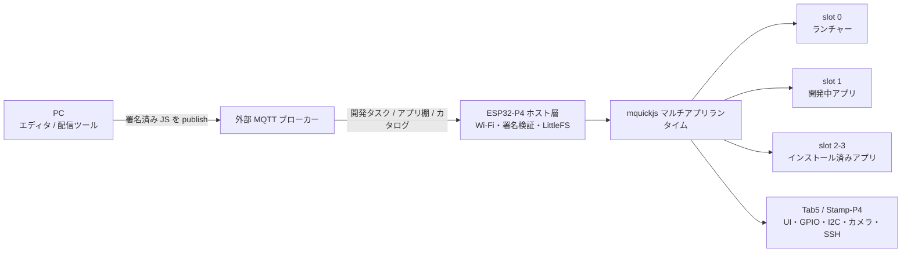
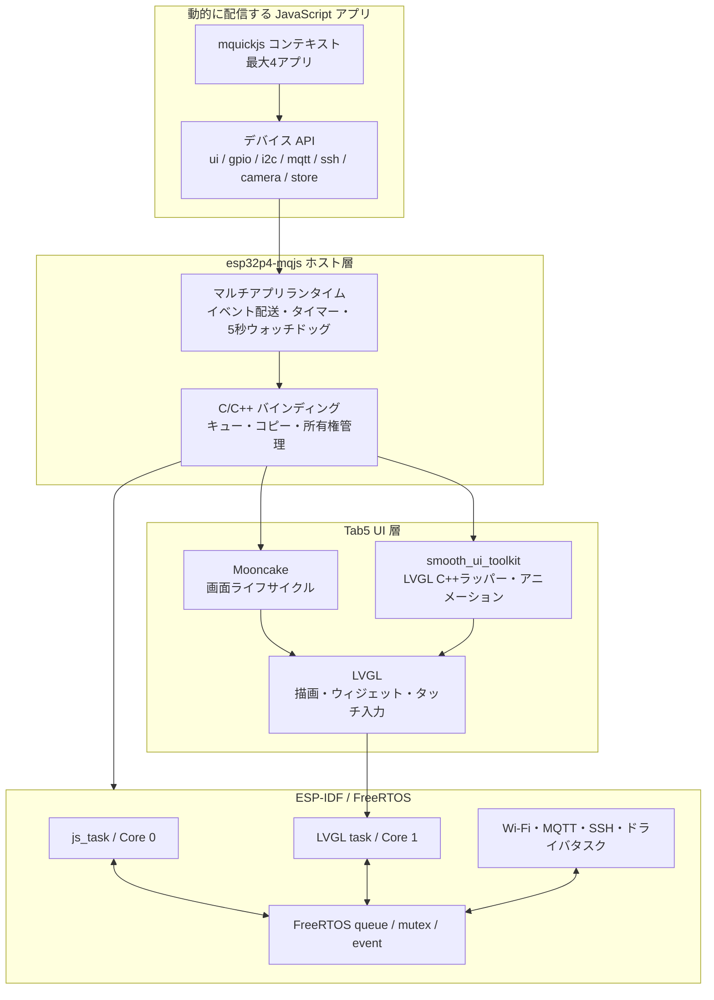
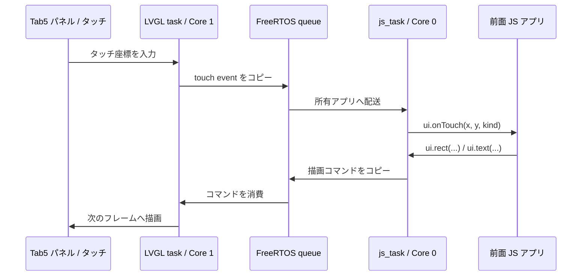

# esp32p4-mqjs

**M5Stack Tab5 / Stamp-P4 を、JavaScript で何度でも作り替えられる端末にするファームウェア。**

通常の組み込み開発では、動作を変えるたびに C/C++ をビルドしてファームウェア全体を書き込みます。
esp32p4-mqjs は、ESP32-P4 上に軽量 JavaScript エンジン
[mquickjs](https://github.com/bellard/mquickjs) とマルチアプリランタイムを常駐させ、
アプリだけを MQTT 経由で追加・更新・実行します。

Tab5 なら、画面、タッチ、オンスクリーンキーボード、カメラ、Wi-Fi、GPIO、I2C などを
JavaScript から扱えます。小さなアイデアを短いスクリプトにして送り、すぐ実機で試せます。

> このプロジェクトは開発中です。API や保存形式は今後変わる可能性があります。

## これは何か

esp32p4-mqjs は、単に「マイコンで JavaScript を動かす」ためのプロジェクトではありません。
目標は、Tab5 / Stamp-P4 を **用途が固定されていない、小さなアプリ実行環境** にすることです。

- **ファームウェアは土台、JavaScript はアプリ**

  デバイスドライバ、通信、署名検証、アプリ管理は C/C++ 側に置きます。
  日々変更したい振る舞いや UI は JavaScript で書きます。
- **複数のアプリが同居する**

  ランチャー、開発中アプリ、インストール済みアプリを最大 4 スロットで動かします。
  背景アプリもタイマーや MQTT 処理を継続できます。
- **MQTT ブローカーを外部の制御面として使う**

  開発中コードの即時配信、アプリカタログ、インストール済みアプリの更新を
  retained message で表現します。
- **届いたコードを無条件には実行しない**

  配信するアプリを Ed25519 で署名し、ファームウェアに埋め込んだ公開鍵で検証します。
- **面白いものを作るための高水準 API を用意する**

  GPIO や I2C だけでなく、Tab5 の UI、SSH 端末、バーコード読み取り、
  HTTP GET、NVS 永続化、アプリ間通信まで JavaScript から利用できます。

## 何が作れるか

`examples/` には、そのまま試せるアプリが入っています。

| アイデア | サンプル | 使っている機能 |
|---|---|---|
| タッチ操作できる L チカ | `blink_button.js` | GPIO、タイマー、ウィジェット UI |
| お絵かきアプリ | `touch_demo.js` | タッチ、キャンバス描画、設定画面 |
| Tab5 を SSH 端末にする | `ssh_vt.js` | Wi-Fi、SSH、端末描画、キーボード、クリップボード |
| 本の読書進捗を記録する | `reading.js` | UI、NVS、HTTP/MQTT、ISBN バーコード |
| 回路の合成抵抗を計算する | `circuit.js` | タッチ UI、式評価、NVS |
| カメラで EAN-13 / ISBN を読む | `cam_demo.js` | MIPI-CSI カメラ、バーコード認識 |
| MQTT センサーや遠隔操作端末を作る | `mqtt_demo.js` | MQTT publish / subscribe |
| I2C デバイスを調査する | `i2c_scan.js` | I2C、動的リスト UI |
| ライフゲームやマンデルブロ集合を表示する | `life.js`, `mandelbrot.js` | JavaScript、ANSI コンソール |

全サンプルの説明と JavaScript の制約は [examples/README.md](examples/README.md) を参照してください。

## 全体像



### プラットフォームを支える技術

このファームウェアは、役割の異なる複数のランタイムと UI ライブラリを重ねて作っています。
JavaScript アプリから見ると単純な `ui.*` や `mqtt.*` API ですが、その下では
FreeRTOS、mquickjs、Mooncake、smooth_ui_toolkit がそれぞれ別の責務を持ちます。



#### FreeRTOS: 並行処理と安全な境界

FreeRTOS は ESP-IDF の土台となるリアルタイム OS です。このプロジェクトでは、
JavaScript、画面、ネットワーク、デバイスドライバを別々のタスクで動かします。

- `js_task` は Core 0 で動き、すべての mquickjs コンテキストを所有します
- LVGL のタスクは Core 1 で動き、Tab5 の描画とタッチ入力を処理します
- Wi-Fi、MQTT、SSH、カメラなどは専用タスクや ESP-IDF のドライバ上で動きます
- タスク間では FreeRTOS queue、mutex、イベントを使い、JS オブジェクトを直接共有しません

たとえばタッチ入力は UI タスクからイベントキューへコピーされ、`js_task` が
対象アプリの `ui.onTouch()` を呼びます。逆方向の `ui.rect()` なども描画コマンドとして
UI 側へ渡されます。この境界により、JavaScript アプリは並行処理のロックを意識せずに書けます。



#### mquickjs: 動的アプリを動かす小さな JavaScript エンジン

[mquickjs](https://github.com/bellard/mquickjs) は、組み込み用途を想定した軽量 JavaScript
エンジンです。各アプリは独立した mquickjs コンテキストと 256 KiB のメモリアリーナを持ちます。

本プロジェクトのマルチアプリ機能は mquickjs 自体の機能ではなく、
`components/mqjs/mqjs_runtime.c` が複数コンテキストを協調的にスケジュールして実現しています。
タイマー、MQTT、GPIO、タッチなどのイベントは、必ずコンテキストを所有する `js_task` 上で
直列にコールバックされます。

mquickjs は ES5 ベースの stricter mode です。小さく予測可能に動く一方、
`let`、`const`、アロー関数、Promise、`async` などは使えません。

#### Mooncake: Tab5 UI 内部の画面ライフサイクル

[Mooncake](components/mooncake/README.md) は、マイコン向けのマルチ App 管理・
ライフサイクルフレームワークです。このプロジェクトでは用途を限定し、
Tab5 UI 内部の `StatusBar`、`ConsoleApp`、`CanvasApp` を更新するために使っています。

Mooncake が管理する C++ の UI Ability と、mquickjs が管理する JavaScript アプリは別物です。
JavaScript アプリの slot、起動、停止、背景イベントは esp32p4-mqjs 独自ランタイムが管理し、
Mooncake は画面側の「いつ開くか、いつ更新するか」というライフサイクルだけを担当します。

#### smooth_ui_toolkit: LVGL を扱いやすく、滑らかにする道具箱

[smooth_ui_toolkit](components/smooth_ui_toolkit/README.md) は、LVGL の C++ ラッパー、
Spring / Easing アニメーション、色・数値補間、UI 用ユーティリティを提供します。

このプロジェクトでは、JavaScript の `ui.screen()` が作るボタン、ラベル、入力欄などの
実装と、ステータス表示のアニメーションに利用しています。描画の最終的な実行と
タッチ処理は LVGL が担当し、smooth_ui_toolkit はその上の扱いやすい部品として機能します。

### アプリの実行モデル

1 本の FreeRTOS タスクが、最大 4 個の独立した mquickjs コンテキストを管理します。
タイマーやイベントは所有アプリへ直列に配送されるため、アプリ側でロックを扱う必要はありません。

アプリの公開識別子は名前です。`sys.start(name)` / `sys.open(name)` /
`sys.focus(name)` / `sys.stop(name)` で起動・前面化・停止できます
(`sys.open` は「動いていれば前面化、止まっていれば起動して前面化」)。
内部の実行枠 (worker) は次の固定構成です。

| 実行枠 | 役割 |
|---|---|
| ランチャー | 常駐 (`kind: "system"`)。停止できず、終了しても自動再起動します |
| 開発タスク | MQTT で送ったスクリプトへ即時に差し替わります (`kind: "dev"`) |
| 汎用 ×2 | インストール済みアプリ。ランチャーまたは `sys.open()` から起動します |

Tab5 の画面は前面アプリだけが所有します。背景アプリのタイマー、MQTT、SSH は動き続けますが、
背景からの描画は無視されます。画面を持つアプリは `sys.onForeground()` で UI を再構築します。

## 必要なもの

### ハードウェア

- 推奨: **M5Stack Tab5**
- または: **M5Stamp-P4 + Stamp-AddOn C6**
- データ通信対応 USB ケーブル
- PC と同じネットワークから到達できる MQTT ブローカー

ESP32-P4 自体には Wi-Fi がありません。Tab5 内蔵 C6 または Stamp-AddOn C6 を
SDIO 接続の無線コプロセッサとして使います。

### 開発環境

- ESP-IDF 6.0 系
- Python 3 と [`cryptography`](https://cryptography.io/) パッケージ
- MQTT ブローカー。開発時は LAN 内の Mosquitto が扱いやすいです
- 任意: WSL / Linux と GCC。PC 上でのスクリプト試験やバイトコード生成に使います

ESP-IDF の導入と `idf.py` が使えるシェルの準備は、
[ESP-IDF Programming Guide](https://docs.espressif.com/projects/esp-idf/en/latest/esp32p4/get-started/) を参照してください。

## クイックスタート: Tab5

以下では PowerShell を使い、MQTT ブローカーを `192.168.1.2:1883`、
Tab5 のシリアルポートを `COM7` と仮定します。自分の環境に合わせて置き換えてください。

### 1. Tab5 用設定を作る

秘密情報を含まないテンプレートをコピーします。

```powershell
Copy-Item sdkconfig.tab5.defaults.example sdkconfig.tab5.defaults
```

`sdkconfig.tab5.defaults` を開き、最低限この 3 項目を設定します。
このファイルは `.gitignore` 対象です。

```ini
CONFIG_MQJS_WIFI_SSID="your-wifi-ssid"
CONFIG_MQJS_WIFI_PASSWORD="your-wifi-password"
CONFIG_MQJS_TASK_BROKER="mqtt://192.168.1.2"
```

タスクトピックも端末ごとに推測しにくい値へ変更してください。

```powershell
idf.py -B build_tab5 "-DSDKCONFIG=sdkconfig.tab5" "-DSDKCONFIG_DEFAULTS=sdkconfig.defaults;sdkconfig.tab5.defaults" menuconfig
```

`mqjs platform` → `Task source topic` の例:

```text
esp32p4-mqjs/task/my-tab5-a8f31c
```

以後のコマンドで使えるよう、同じ値を PowerShell 変数へ入れます。

```powershell
$TASK_TOPIC = "esp32p4-mqjs/task/my-tab5-a8f31c"
```

> EIM で ESP-IDF を有効化した環境では、ビルド前に
> `$env:ESP_IDF_VERSION='6.0'` が必要な場合があります。

### 2. 署名鍵を作る

デバイスが受理するコードを署名するための Ed25519 鍵ペアを作ります。

```powershell
uv run --with cryptography python tools/mqjs_keygen.py
```

- 秘密鍵: `tools/task_signing_key.pem`。Git 管理せず、安全に保管します
- 公開鍵: `main/task_pubkey.h`。ファームウェアへ埋め込みます

鍵を作り直すと、以前に書き込んだデバイスは新しい署名を検証できません。

### 3. ビルドして書き込む

```powershell
idf.py -B build_tab5 "-DSDKCONFIG=sdkconfig.tab5" "-DSDKCONFIG_DEFAULTS=sdkconfig.defaults;sdkconfig.tab5.defaults" -p COM7 build flash monitor
```

初回起動では、ランチャーと開発スロットの `blink_button.js` が動きます。
Tab5 は USB の DTR/RTS リセットが効かない場合があるため、書き込み後に反応しなければ
本体の電源ボタンで再起動してください。

古いパーティション構成を書き込んだことがある端末では、最初に一度だけ
`idf.py ... erase-flash` が必要です。LittleFS と NVS の保存内容は消えます。

### 4. JavaScript を送る

別のターミナルから、署名済みスクリプトを開発トピックへ送ります。

```powershell
uv run --with cryptography python tools/mqjs_push.py 192.168.1.2 $TASK_TOPIC examples/touch_demo.js
```

署名が正しければ、実行中の開発アプリが停止し、`touch_demo.js` へ即座に切り替わります。
受理された開発タスクは LittleFS に保存され、再起動後も実行されます。

ここまでで、以後の試行錯誤にファームウェアの再書き込みは不要です。

## 自分のアプリを作る

最小のアプリは通常の `.js` ファイルです。mquickjs は ES5 ベースなので、
`var` と `function` を使い、`let`、`const`、アロー関数、Promise、`async` は使いません。

```js
// hello.js
"use strict";
sys.setAppName("hello");

var count = 0;

function draw() {
    var s = ui.screen("Hello, Tab5");
    s.label("MQTT で届いた JavaScript が動いています");
    s.button("押した回数: " + count, function () {
        count++;
        sys.notify("button: " + count);
        draw();
    });
}

if (ui.size()[0] !== 0) {
    draw();
    sys.onForeground(draw);
}

setInterval(function () {
    print("hello", Date.now());
}, 5000);
```

送信します。

```powershell
uv run --with cryptography python tools/mqjs_push.py 192.168.1.2 $TASK_TOPIC hello.js
```

### インストール可能なアプリにする

開発スロットを置き換えず、ランチャーから起動できるアプリとして配布するには、
ファイル先頭へマニフェストを付けます。

```js
// @app hello
// @title Hello Tab5
// @icon 
// @desc 最初のインストール可能アプリ
// @perm ui,mqtt
"use strict";
sys.setAppName("hello");
// ...
```

`@app` は必須で、ファイル名や MQTT トピック上の名前と一致させます。
アプリ名に使える文字は英数字、`_`、`-` です。`@perm` は現時点では表示用で、
権限を強制する仕組みではありません。

## MQTT による配信

MQTT ブローカーは、次の 3 種類の情報を保持します。

| トピック | 用途 | 動作 |
|---|---|---|
| `TASK_TOPIC` | 開発タスク | 署名検証後、slot 1 を即時置換して LittleFS に保存 |
| `TASK_TOPIC/store/<name>` | アプリカタログ | ランチャーのストアに説明を表示 |
| `TASK_TOPIC/apps/<name>` | 署名済みアプリ本体 | 選択した端末へインストール・更新 |
| `TASK_TOPIC/status` | デバイス状態 | `ready`、`accepted`、署名エラーなどを通知 |

### アプリをストアへ置く

`--shelf` は、カタログ行と署名済みアプリ本体を retained message として登録します。

```powershell
uv run --with cryptography python tools/mqjs_push.py 192.168.1.2 $TASK_TOPIC examples/circuit.js --shelf
```

Tab5 のランチャーで「ストア」を開くと、アプリを選んでインストールできます。
すでにインストール済みのアプリは再接続時に更新を受け取りますが、実行中のアプリは
勝手に差し替わりません。

棚から削除するには tombstone を送ります。

```powershell
uv run --with cryptography python tools/mqjs_push.py 192.168.1.2 $TASK_TOPIC circuit --shelf --delete
```

### ローカル Web UI を使う

ブラウザ上のエディタから、サンプル読込、PC スモークテスト、署名、配信、
デバイス状態の確認ができます。署名鍵を扱うため `127.0.0.1` だけで待ち受けます。

```powershell
wsl python3 tools/mqjs_webui.py --broker 192.168.1.2 --topic esp32p4-mqjs/task/my-tab5-a8f31c --port 8799
```

ブラウザで `http://localhost:8799` を開きます。WSL 側に Python `cryptography` と GCC が必要です。

## Stamp-P4 で使う

Stamp-P4 では画面、タッチ、内蔵カメラはありませんが、同じ JavaScript ランタイム、
GPIO、I2C、MQTT、アプリ配信を利用できます。`ui.*` は no-op になるため、
`ui.size()` で画面の有無を判定したスクリプトは Tab5 と共用できます。

Wi-Fi には Stamp-AddOn C6 が必要です。

```powershell
idf.py menuconfig
idf.py -p COM7 build flash monitor
```

`menuconfig` の `mqjs platform` で Wi-Fi、MQTT ブローカー、タスクトピックを設定します。
ビルドへ別の開発タスクを埋め込みたい場合は次のように指定します。

```powershell
idf.py "-DMQJS_SCRIPT=life.js" build flash monitor
```

## JavaScript API 概要

詳細な使用例は `examples/` が実質的な API リファレンスです。

| 名前空間 | 主な機能 |
|---|---|
| `gpio` | ピンモード、読み書き、エッジイベント |
| `i2c` | バス初期化、スキャン、レジスタ読み書き |
| `mqtt` | アプリごとの接続、publish、subscribe |
| `ui` | キャンバス描画、タッチ、キーボード、ウィジェット画面 |
| `ssh` | 最大 3 セッションの SSH クライアント |
| `camera` | Tab5 カメラによる EAN-13 / ISBN 読み取り |
| `http` | 非同期の one-shot HTTP/HTTPS GET |
| `store` | 全アプリ共有の NVS キーバリュー保存 |
| `vault` | アプリ単位の秘密保存 (`put/has/del`、値の読み戻し不可) |
| `clipboard` | アプリ間で共有され、再起動後も残るクリップボード |
| `sys` | アプリ管理、前面切替、通知、アプリ間シグナル、ストア |
| グローバル | `print`、`console.log`、タイマー、`Date`、`performance.now` |

代表例:

```js
gpio.setMode(2, gpio.OUT);
gpio.write(2, 1);

mqtt.subscribe("demo/command", function (topic, payload) {
    print(topic, payload);
});
mqtt.connect("mqtt://192.168.1.2");

store.set("counter", "42");
vault.put("login", "password"); // 利用は ssh.connect() 等の C API 経由
http.get("https://example.com/data.json", function (body, status) {
    print(status, body);
});
```

### UI の選び方

- **ウィジェット UI**: フォーム、設定、一覧には `ui.screen()` を使います
- **キャンバス UI**: ゲーム、端末、グラフなど高頻度描画には `ui.rect()`、`ui.cells()` などを使います
- **ハイブリッド**: 通常表示はキャンバス、設定だけウィジェット画面にします

設計と詳細は [docs/widget-framework-design.md](docs/widget-framework-design.md) を参照してください。

## ランタイムの重要な制約

- mquickjs は ES5 ベースの stricter mode です。現代的な JavaScript 構文の多くは使えません
- 各アプリの JavaScript メモリアリーナは 256 KiB です
- 1 回のトップレベル実行またはコールバックが 5 秒を超えるとウォッチドッグで中断されます
- 重い処理は `setTimeout()` で分割し、イベントループへ制御を返してください
- `delay()` は全アプリのイベント処理を止めるため、原則として使わないでください
- タイマー粒度は約 10 ms です。高精度な信号生成は C 側の高水準 API として実装してください
- MQTT で配信できるスクリプトは最大 64 KiB です
- 署名はコードの出所を検証しますが、アプリごとの権限制御はまだ実装されていません

より詳しい JavaScript サブセットと上限値は [examples/README.md](examples/README.md) を参照してください。

## PC だけでスクリプトを試す

Linux / WSL と GCC があれば、実機へ送る前にスクリプトをスモークテストできます。
GPIO や UI などはスタブですが、構文、タイマー、計算ロジック、ウォッチドッグを確認できます。

```bash
cd components/mqjs
gcc -O2 -I mquickjs -o /tmp/stdlib_tool device_stdlib.c mquickjs/mquickjs_build.c
mkdir -p gen_pc
/tmp/stdlib_tool -a -m64 > gen_pc/mquickjs_atom.h
/tmp/stdlib_tool -m64 > gen_pc/device_stdlib.h
gcc -O2 -I. -Igen_pc -Imquickjs -o /tmp/run_pc tools/run_pc.c \
  mqjs_runtime.c mquickjs/mquickjs.c mquickjs/cutils.c \
  mquickjs/dtoa.c mquickjs/libm.c -lm

/tmp/run_pc ../../examples/bench.js
timeout 3 /tmp/run_pc ../../examples/life.js
```

## セキュリティモデル

- 開発タスクとアプリ本体は、Ed25519 署名の検証に成功した場合だけ保存・実行されます
- 秘密鍵 `tools/task_signing_key.pem` を持つ人は、デバイス上で任意の JavaScript を実行できます
- 保存済みタスクは起動時に再検証しません。フラッシュと NVS / LittleFS は信頼済みとみなします
- Vault は不変なアプリ起動名で分離され、秘密値を JavaScript へ読み戻せません
- ストアのカタログ情報と削除用 tombstone は署名されません
- 現在の `@perm` は説明用で、API アクセスを制限しません
- MQTT ブローカーは LAN 内に置き、認証、ACL、ファイアウォールを設定してください
- 公開ブローカーを本番用途や秘密情報を扱う用途に使わないでください

## トラブルシューティング

### Wi-Fi が起動しない

- Tab5 は `CONFIG_MQJS_TAB5_POWER=y` が必要です
- SSID とパスワードを確認してください
- ESP32-P4 自体には Wi-Fi がないため、C6 が必要です
- EIM 環境ではビルド前に `$env:ESP_IDF_VERSION='6.0'` を試してください

### `requires chip revision` で書き込めない

M5Stamp-P4 / Tab5 の ESP32-P4 は rev v1.x です。設定には以下が必要です。
同梱の defaults では設定済みです。

```ini
CONFIG_ESP32P4_SELECTS_REV_LESS_V3=y
CONFIG_ESP32P4_REV_MIN_100=y
```

### 配信してもアプリが変わらない

- ブローカー、ポート、`TASK_TOPIC` がデバイス設定と一致しているか確認してください
- `TASK_TOPIC/status` を購読し、`accepted` またはエラーを確認してください
- `// @app ...` で始まるファイルは開発スロットを置換せず、インストール済みアプリになります
- 鍵生成後にファームウェアを書き直していない場合、署名検証に失敗します

### Windows のビルドがパス関連で失敗する

プロジェクトパスに日本語などの非 ASCII 文字があると binutils が失敗することがあります。
ASCII のビルドディレクトリを指定してください。

```powershell
idf.py -B C:\esp-build\esp32p4-mqjs -p COM7 build flash monitor
```

## リポジトリ構成

```text
main/                    ESP-IDF エントリポイント、Wi-Fi、署名付きタスク配信、LittleFS
components/mqjs/         mquickjs、本体 API、マルチアプリランタイム、PC ツール
components/ui_tab5/      Tab5 の LVGL UI、パネル・タッチ対応
components/mooncake/     Tab5 UI 内部の画面ライフサイクル管理
components/smooth_ui_toolkit/ LVGL C++ ラッパー、アニメーション、UI ユーティリティ
components/cam_tab5/     Tab5 カメラとバーコード認識
components/sshc/         wolfSSH クライアント
examples/                配信して試せる JavaScript アプリ
tools/                   鍵生成、MQTT 配信、Web UI、検証ツール
docs/                    UI、ランチャー、SSH 端末などの設計文書
```

実装を拡張するときは、まず以下を参照してください。

- [examples/README.md](examples/README.md): サンプル一覧、JavaScript のルール、ランタイム制約
- [docs/launcher-multiapp-design.md](docs/launcher-multiapp-design.md): マルチアプリと MQTT ストア
- [docs/app-manager-migration.md](docs/app-manager-migration.md): slotを隠蔽する次世代App Managerへの移行設計
- [docs/widget-framework-design.md](docs/widget-framework-design.md): ウィジェット UI
- [docs/tab5-ui-design.md](docs/tab5-ui-design.md): Tab5 UI の構成
- [docs/ssh-terminal-design.md](docs/ssh-terminal-design.md): SSH 端末

## ライセンス

mquickjs は Fabrice Bellard / Charlie Gordon による MIT License のソフトウェアです。
詳細は [components/mqjs/mquickjs/LICENSE](components/mqjs/mquickjs/LICENSE) を参照してください。
