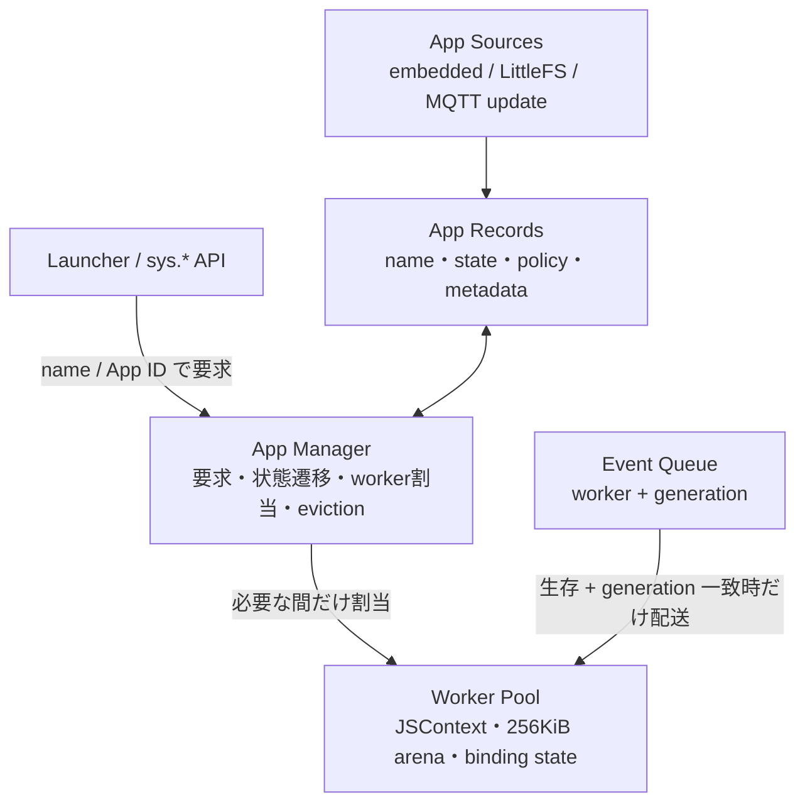
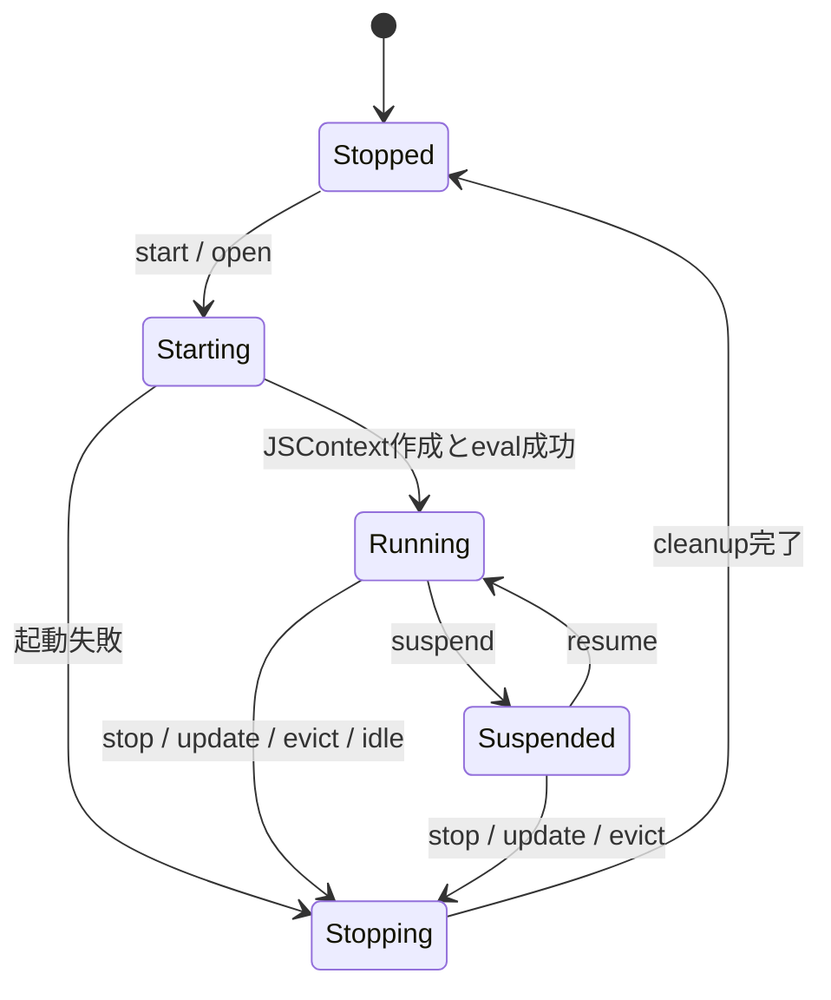
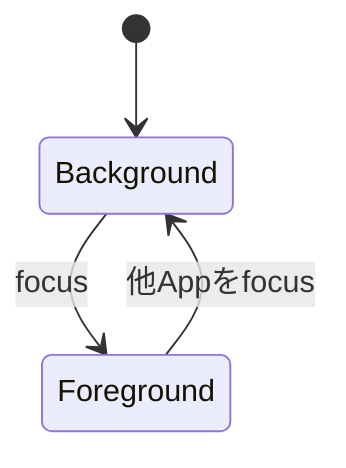
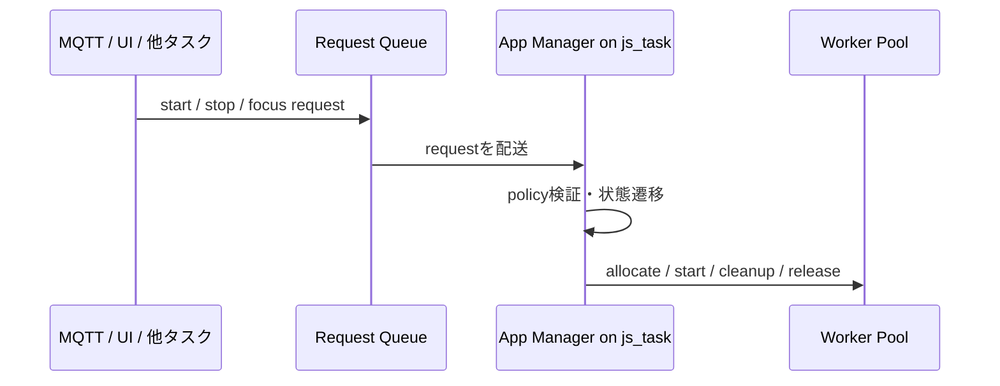

# App Manager 移行設計

Status: Phase 0-3 実装済み・実機 E2E 確認 2026-06-13 (Phase 4 以降は未着手)

- Phase 0: `app/mqjs_app_manager.h` 追加済み
- Phase 1: `sys.start/open/focus/stop(name)` 追加、`sys.apps()` に `kind`
  ("system" / "dev" / "app")、launcher / examples から slot 参照を削除。
  旧 slot API は互換のため受理を継続 (`sys.launch` / 数値 focus/stop)。
  実機 E2E: 名前での start→focus→stop→復帰、未知名は false、self-stop
  (reaper 経路) まで確認。worker 満杯時の start は false (eviction は
  Phase 4 のスコープ)。
- Phase 2: 内部から slot 語を排除 — `AppSlot` → `MqjsWorker`、
  `MQJS_SLOT_*` → `MQJS_WORKER_*`、イベントの stale 判定は文字どおり
  `worker + generation` に。App record テーブルを `app/mqjs_app_manager.c`
  に新設し、start/stop/setAppName/foreground 切替から js_task 上で更新
  (single-writer 維持)。停止後もレコードは STOPPED で残存 (Phase 4 の
  LRU 基盤: `last_active_ms`、満杯時は最古の STOPPED を回収)。
  `sys.apps()` の `kind` はレコード由来に切替済み (出力は不変)。
  ホスト単体テスト `components/mqjs/tools/app_manager_test.c` ALL PASS、
  実機 E2E は Phase 1 プローブで回帰なし。worker 内の name は実行中
  キャッシュとして残置 — 権威の移転は Phase 3 (policy / dev の通常 App
  化) と同時に行う。
- Phase 3: launcher / dev / autostart の特別扱いを policy へ移した。
  レコード生成時に kind プロファイルの既定 policy が付く (SYSTEM =
  `AUTOSTART|RESTART_ON_EXIT|KEEP_ALIVE`、APP = `EVICTABLE|STOPPABLE`)。
  - `sys.stop` の停止可否は `STOPPABLE` 判定 (launcher の worker 番号
    特例を撤去。dev worker だけは名前衝突対策で常に停止可)
  - launcher 常駐ループは record の `RESTART_ON_EXIT` を参照 (bit を
    消せば常駐が止まる; worker 0 固定は割当規則として残置)
  - `s_dev_hold` フラグを廃止 — dev の自然終了リランは dev レコードの
    `RESTART_ON_EXIT` が権威 (`dev_held()`/`dev_rearm()`)。明示 stop が
    bit を消し、push / `sys.start("dev")` が再武装する
  - autostart の opt-in/revoke が record の `AUTOSTART` bit にミラー
    される (リブートを跨ぐ正本は従来どおり NVS roster)
  - `sys.apps()` 行に `evictable` を追加 (Phase 4 の UI/挙動の布石)
  実機 E2E: stop("launcher") が TypeError、evictable = launcher のみ
  false、既存ロースター回帰なし。残課題: dev の「source 更新で置換」
  を要求キュー (`request_*`) 経由へ移すのは Phase 4 以降、サービス
  (KIND_SERVICE) の実プロファイル適用は @service 相当のマニフェスト
  導入時。

## 目的

現在のマルチアプリランタイムは、固定配列 `AppSlot s_apps[4]` の位置を
アプリの識別子、実行リソース、ユーザー向け API として兼用している。

この構造は最初のマルチアプリ実装として単純だったが、次の問題がある。

- `slot 0 = launcher`、`slot 1 = dev` のような内部事情が利用者へ露出する
- 通常アプリが同時に二つしか起動できない
- 停止中のアプリと実行中のアプリを同じ一覧で自然に扱えない
- launcher、開発タスク、サービスの性質が slot 番号の条件分岐になる
- 空き slot がない場合、アプリを終了して実行枠を再利用できない
- `stop`、`suspend`、`background`、`foreground` の意味が整理されていない

移行後は、利用者が扱う **App** と、mquickjs を実行する内部リソース
**Worker** を分離する。

## 専用ディレクトリ

新しい管理層は `components/mqjs/app/` に置く。

```text
components/mqjs/app/
  mqjs_app_manager.h     App Manager の最小契約。今回追加
  mqjs_app_manager.c     App 状態、policy、要求適用。後続
  mqjs_app_worker.c      JSContext、arena、binding 状態。後続
  mqjs_app_events.c      worker + generation のイベント配送。後続
```

独立した ESP-IDF component にはしない。App Manager は mquickjs の
`JSContext`、GCRef、device binding と強く結合するため、
`components/mqjs` 内部のモジュールとして扱う。

最初からファイルを細分化しすぎず、責務を移せる段階になったファイルだけ追加する。

## 用語

| 用語 | 意味 | 外部公開 |
|---|---|---|
| App | 名前、状態、policy、インストール情報を持つ論理アプリ | 公開 |
| App ID | App の実行位置に依存しない識別子 | 公開候補 |
| Worker | JSContext、固定 arena、callback、MQTT 等を持つ実行枠 | 非公開 |
| Worker index | 現在の slot 番号に相当する固定配列位置 | 非公開 |
| Generation | Worker 再利用後の stale event を破棄する世代番号 | 非公開 |
| Policy | 自動起動、再起動、eviction 可否等の管理規則 | 一部公開 |

`slot` という語は、移行完了後の JavaScript API、ランチャー、README では使わない。
内部実装でも、固定実行枠を意味する場合は `worker` と呼ぶ。

## アーキテクチャ



App は停止しても存在する。Worker は App が実行中の間だけ割り当てる。
Worker 数は固定のままでよいが、launcher や開発タスク専用の Worker は持たない。

## 状態モデル

実行状態と画面状態は別軸にする。

### 実行状態



| 状態 | JSContext | イベント・タイマー | Worker |
|---|---:|---:|---:|
| `STOPPED` | なし | なし | 未割当 |
| `STARTING` | 作成中 | なし | 割当済み |
| `RUNNING` | あり | 処理する | 割当済み |
| `SUSPENDED` | あり | 保留または制限 | 割当済み |
| `STOPPING` | 解放中 | 新規配送しない | 解放処理後に返却 |

`SUSPENDED` は Worker と arena を保持するため、メモリ枯渇対策にはならない。
実行枠が必要な場合は eviction により App を `STOPPED` へ移す。

### 画面状態



- `FOREGROUND`: UI とタッチ入力を所有する
- `BACKGROUND`: 実行は継続するが UI を所有しない
- headless App は常に画面状態を持たない

現在の `sys.onForeground` / `sys.onBackground` の意味は維持する。

## Policy

launcher、サービス、通常アプリの違いは Worker index ではなく policy で表す。

| Policy | 意味 |
|---|---|
| `AUTOSTART` | 起動時に開始を要求する |
| `RESTART_ON_EXIT` | 自然終了または異常終了後に再起動する |
| `KEEP_ALIVE` | idle でも自然終了させない |
| `EVICTABLE` | Worker 不足時に自動停止してよい |
| `HEADLESS` | foreground を取得しない |
| `STOPPABLE` | ユーザー操作で停止してよい |

推奨プロファイル:

| 種類 | 例 | Policy |
|---|---|---|
| system | launcher | `AUTOSTART`, `RESTART_ON_EXIT`, `KEEP_ALIVE`, 非evictable, 非stoppable |
| service | clipboard sync | `AUTOSTART`, `RESTART_ON_EXIT`, `KEEP_ALIVE`, `HEADLESS` |
| app | circuit | `EVICTABLE`, `STOPPABLE` |
| development | MQTTで更新するアプリ | 通常App + source更新時のreplace要求 |

`development` は専用 Worker や特殊な実行状態ではない。
MQTT の開発トピックからソースが更新される App というだけにする。

署名済みマニフェストが `KEEP_ALIVE` を宣言できるようにしても、
端末側の許可なしに非evictableへ昇格させてはならない。

## 状態変更の所有者

App Manager の状態を書き換えるのは `js_task` だけとする。



- 他タスクからの API は要求をコピーして queue へ積むだけ
- Manager 本体へ mutex を掛けない
- JSContext の作成、破棄、callback 呼び出しは引き続き `js_task` 限定
- UI 等へ状態を公開するときは、小さな snapshot をコピーする

この single-writer 原則は現在の協調マルチコンテキスト設計を維持する。

## Eviction

Worker が不足した状態で App の起動要求を受けた場合、Manager は
evictable な App を一つ停止し、Worker を再利用できる。

最低限の候補除外:

- foreground App
- `EVICTABLE` でない App
- `STARTING` / `STOPPING` 中の App
- ユーザーが明示的に保護した App

最初の実装は LRU で十分。`last_active_ms` は、foreground 化、
イベント処理、ユーザー操作などで更新する。

```text
空きWorkerあり     -> そのまま割当
空きWorkerなし     -> evictableなbackground AppからLRUを選択
候補あり           -> stop(reason=EVICTED)後にWorkerを再割当
候補なし           -> 起動要求を失敗させる
```

将来 priority や active resource penalty を追加できるが、最初から
複雑なスコアリングは導入しない。

## ライフサイクル

Mooncake の読みやすさを、C の明示的な名前付き処理として取り込む。

```text
app_start()
  worker_allocate()
  runtime_create()
  runtime_eval()

app_enter_foreground()
  outgoing onBackground
  UI teardown
  incoming onForeground

app_stop(reason)
  onStop(reason)
  runtime_release_resources()
  runtime_destroy()
  worker_release()
```

C++ 継承や汎用 Ability 階層は導入しない。現在は実行方式が mquickjs
一種類だけなので、関数テーブルも導入しない。別の実行方式が実際に
必要になった時点で、Worker operations の関数テーブルを検討する。

## JavaScript API の移行

slot 番号を受け渡す API を名前ベースへ移行する。

| 現在 | 移行先 |
|---|---|
| `sys.launch(name)` | `sys.start(name)` |
| `sys.launch(name)` + `sys.focus(slot)` | `sys.open(name)` |
| `sys.focus(slot)` | `sys.focus(name)` |
| `sys.stop(slot)` | `sys.stop(name)` |
| `sys.apps()` の `{slot,name,running}` | `{name,state,view,kind,evictable}` |

`sys.open(name)` は「停止中なら起動し、その後 foreground にする」という
ランチャーで頻出する操作を一つにまとめる。

互換期間は旧 API も受理するが、ランチャーと examples は先に名前ベースへ移す。
worker index は新 API の戻り値や `sys.apps()` に含めない。

## 開発タスクの移行

現在の dev slot が提供している機能を、App と source update に分解する。

| 現在のdev slot機能 | 移行先 |
|---|---|
| 埋め込みスクリプトを起動 | 通常の App source |
| MQTT pushで置換 | source更新 + `stop(UPDATED)` + start |
| LittleFSへ永続化 | App source storage |
| 自然終了後1秒で再実行 | `RESTART_ON_EXIT` policy |
| 明示停止後は再実行しない | stop時にrestart要求を解除 |
| slot 1固定 | 廃止。任意のWorkerを使用 |

最初は互換用の論理 App 名を `dev` としてもよい。ただし `dev` は
Manager が特別扱いする種別ではなく、上記 policy を持つ App record とする。

## 段階的な移行

### Phase 0: 契約を固定する

- この文書と `app/mqjs_app_manager.h` を追加する
- 新ヘッダはまだ既存ランタイムへ接続しない
- slot / dev slot の新規依存を増やさない

### Phase 1: 名前ベースAPI

- `sys.open/start/focus/stop(name)` を追加する
- 旧 slot API の内部でも名前解決を使う
- launcher と examples から slot 参照を削除する

### Phase 2: App record と Worker を分離

- `AppSlot` を App record と Worker state に分割する
- `slot + generation` を `worker + generation` へ名称変更する
- イベント配送の安全性と固定 arena は維持する

### Phase 3: Policy 化

- launcher の常駐・停止不可を policy へ移す
- dev の再起動・更新動作を policy と source update へ移す
- autostart とサービス App を同じ管理経路へ統合する

### Phase 4: Eviction

- LRU 情報を記録する
- Worker 不足時に evictable background App を停止する
- `onStop(reason)` と状態復元パターンを追加する

### Phase 5: Suspend

実際のユースケースが確認できてから追加する。Suspend は Worker を
解放しないため、eviction の代替として実装しない。

## 維持する不変条件

移行中も次を崩してはならない。

1. JSContext に触れるのは `js_task` だけ
2. binding は現在実行中の Worker を一意に参照できる
3. イベントは `worker + generation` で stale 判定する
4. 停止時は、その App が所有するリソースだけを解放する
5. foreground App だけが UI と入力を所有する
6. 一つの JS 実行はウォッチドッグで制限する
7. PC runner でも同じ App Manager の状態遷移を試験できる

## 完了条件

- README、ランチャー、examples に slot 番号が露出しない
- launcher と開発タスクの特殊性が policy で説明できる
- 停止中 App と実行中 App を同じ App ID / 名前で扱える
- Worker 不足時に通常 App を安全に eviction できる
- 非evictable なサービス App は背景で継続動作できる
- 旧マルチアプリ、イベント世代検査、PC スモークテストが維持される
