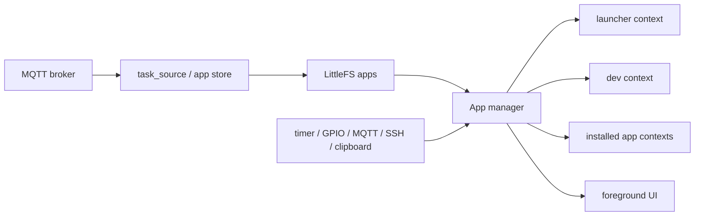
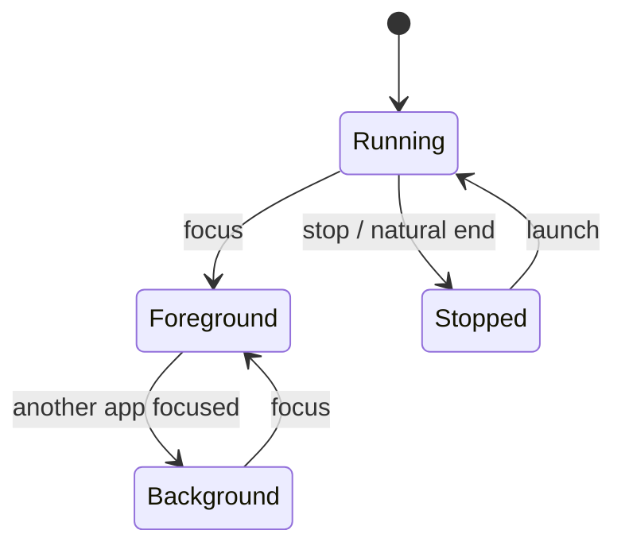
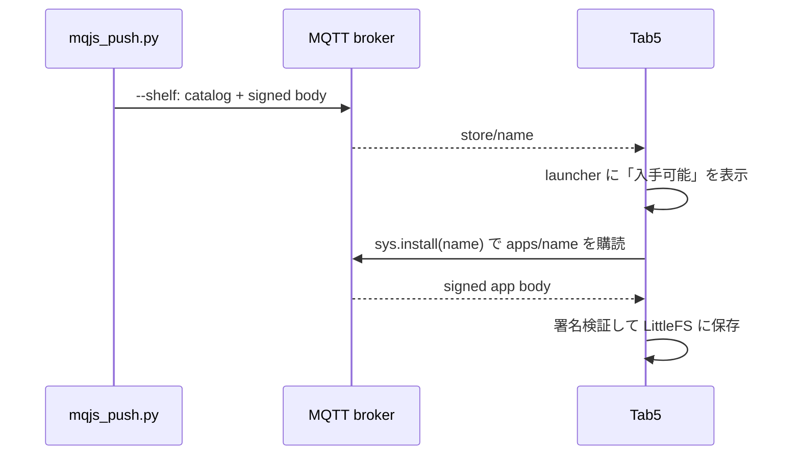

# マルチアプリランタイムと MQTT App Store

この文書は、現在のマルチアプリ実装を使う人と、ランタイムを変更する人のための
ガイドです。固定 slot を廃止する次期設計は
[`app-manager-migration.md`](app-manager-migration.md) に分離しています。

## 全体像

1 個の FreeRTOS `js_task` が、複数の mquickjs context を協調実行します。
JavaScript は同時並行には走らず、タイマーや MQTT などのイベントを 1 件ずつ
所有 app へ配送します。



この方式には、JS binding を呼ぶスレッドが 1 本だけでよく、app 間の mutex を
ほぼ不要にできる利点があります。一方、1 app の重い callback は他 app も
待たせます。各 callback は短く保ってください。

## 現在の app slot

現在は最大 4 app の固定 slot です。

| slot | 用途 | 挙動 |
|---:|---|---|
| 0 | launcher | 常駐。停止不可 |
| 1 | dev app | dev topic の push で置換。自然終了後は再実行 |
| 2–3 | installed app | ランチャー、`sys.launch()`、autostart から起動 |

これは現行仕様であり、望ましい最終形ではありません。slot の意味を利用者へ
露出せず、重要度とリソース状況で app を管理する移行案は
[`app-manager-migration.md`](app-manager-migration.md) を参照してください。

## app の状態と UI 所有権

現在、app は主に running / stopped と foreground / background の組み合わせで
管理されます。



- foreground app だけが UI、タッチ、キー入力を所有する。
- background app でも timer、MQTT、SSH、clipboard callback は動く。
- foreground 切替時に、旧 app の画面とキャンバスは破棄される。
- app は `sys.onForeground()` で画面を再構築する。
- `sys.onBackground()` では、必要ならモデル保存や更新頻度の低下を行う。

```js
var value = 0;

function build() {
    var s = ui.screen("Example");
    s.label("value = " + value);
}

sys.onForeground(build);
sys.onBackground(function () {
    print("background");
});
build();
```

## app 間連携

### 小さな制御メッセージ

`sys.signal(name, value)` と `sys.onSignal(fn)` を使います。送信先 app の起動や、
配送保証を自動で行う RPC ではありません。

### 共有データ

`clipboard` は型付きの共有値を 1 個保持します。app 切替と再起動をまたいで
保持され、`clipboard.onChange()` で変更を受け取れます。

```js
clipboard.set("1,2,3", "text/csv");
var clip = clipboard.get();
```

### 通知

`sys.notify(text)` はステータスバーとランチャーへ通知を出します。background
サービスが利用者の操作を必要とするときに使います。

## MQTT app store

ブローカーは app の配布と更新に使います。インストール後の app は LittleFS に
保存されるため、ブローカーが停止しても起動できます。

| topic | 内容 | 信頼性 |
|---|---|---|
| `<TASK_TOPIC>` | dev app の push | 署名付き |
| `<TASK_TOPIC>/store/<name>` | ストアに表示する manifest | unsigned retained |
| `<TASK_TOPIC>/apps/<name>` | app 本体 | 署名付き retained |
| `<TASK_TOPIC>/status` | デバイスの受理・拒否・更新状態 | status |



app source の先頭には manifest を書きます。

```js
// @app clip_mirror
// @title Clipboard Mirror
// @icon C
// @desc クリップボードを MQTT と同期する
// @perm mqtt,clipboard
// @autostart
```

- `@app`: app ID。topic suffix と一致する必要がある。
- `@title`、`@icon`、`@desc`: ランチャー表示用。
- `@perm`: 現在は表示用であり、アクセス制御ではない。
- `@autostart`: 一度ローカルで起動して opt-in した後、boot 時に起動する。

## 主な管理 API

| API | 用途 |
|---|---|
| `sys.setAppName(name)` | 実行中 app の名前を設定 |
| `sys.apps()` | 実行中 app 一覧 |
| `sys.installed()` | インストール済み app 一覧 |
| `sys.store()` | app store のカタログ |
| `sys.launch(name)` | app を起動 |
| `sys.focus(slot)` | 実行中 app を foreground にする |
| `sys.stop(slot)` | app を停止 |
| `sys.install(name)` | app 本体の購読とインストールを要求 |
| `sys.uninstall(name)` | app を削除し購読を解除 |
| `sys.notify(text)` | システム通知 |

## セキュリティ境界

- app 本体と dev task は Ed25519 署名を検証する。
- catalog は表示情報であり unsigned。catalog が改ざんされても、署名されていない
  app 本体は実行されない。
- `@perm` は現在、利用者への説明だけで強制されない。
- `store.*` は app ごとに分離されていない。
- MQTT broker と SSH は信頼できる LAN で使う前提が残っている。

## 運用時の注意

- dev topic は app store ではなく、素早く差し替えるための開発用経路。
- store へ置く app は `// @app` から始め、`--shelf` を使う。
- 常駐サービスへ `@autostart` を付けても、配布だけでは自動実行されない。
- 1 app の長い callback は全 app を止める。処理は timer で分割する。
- SSH セッションは全 app 合計 3 本。
- 現在は user app slot が 2 個しかない。サービス増加を前提にする変更は
  App Manager 移行案と整合させる。
