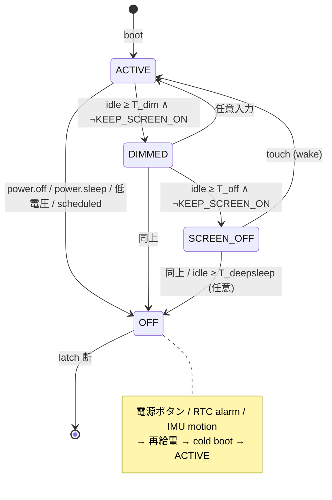

# 電源ステート設計

Status: 2026-06-13 起案。**P0 screen slice（ACTIVE/DIMMED/SCREEN_OFF +
backlight + idle clock + wake-touch 食い + monitor ログ）実装済**
（`mqjs_power.{c,h}`、TEST しきい値 `T_dim`=5s/`T_off`=10s）。
**P0 全項目デバイス検証済 2026-06-13 COM8**（App 11bfddc）: idle 進行
(init→ACTIVE、+5.04s DIMMED bl10%、+10.03s SCREEN_OFF)、wake-on-touch
(タップで SCREEN_OFF→ACTIVE を3回、再 dim/off サイクルも正常)。タップ食いは
目視確認。BEEP(SELFTEST)無効化も同ビルドで確認(WAV のみ再生)。
本番しきい値(60s/180s)への復帰は未(現状 TEST 5s/10s)。SUSPEND・OFF・
INA226・wake-lock は未実装（P1 以降）。

ESP-IDF の `esp_pm`（DFS / 自動 light-sleep）を**前提にしない**。
M5Tab5-UserDemo 公式も `CONFIG_PM_ENABLE is not set` で、電源 UX は
ハード電源プリミティブ（バックライト・INA226 計測・poweroff ラッチ・
RTC/IMU wake）の組み合わせで作っている。本設計もそれに倣い、esp_pm DFS は
最後の実験項目として後回しにする（[後回し] タグ）。

タブレットの最大消費源は**バックライト**。よって「効く順」は
バックライト調光 > poweroff+wake > DFS > 自動 light-sleep。
self-pm の旨味は CPU が本当に idle に落ちた時だけ出るので、DFS を活かす
前提条件は **app の SUSPEND（background のタイマー停止）**である。

---

## 状態定義

| 状態 | バックライト | CPU | アプリ | 復帰条件 | 備考 |
|---|---|---|---|---|---|
| **ACTIVE** | ユーザー値 | 360MHz | foreground 動作 | — | 通常運転。idle clock 計時中 |
| **DIMMED** | dim 値(例10%) | 360MHz | 動作継続 | 任意入力 | screen-off 前の猶予。まだ操作可 |
| **SCREEN_OFF** | 0 | 360MHz ([後回し] DFS で min_freq) | background=SUSPEND foreground=SUSPEND(*) | touch | CPU は給電のまま。M5 の「Sleep」相当 |
| **OFF** | 0(断) | 断 | 全停止(cold boot) | 電源ボタン / RTC / IMU | ハード電源ラッチ断。復帰=コールドブート |

(*) foreground は `KEEP_SCREEN_ON` wake-lock を持つアプリ（動画・読書・
ナビ等）だけ SUSPEND しない。

**OFF への2フレーバ**（同一ハード状態。武装した wake source だけが違う）:

- **Shutdown** (`power.off()`): wake source = 電源ボタンのみ
- **Deep-sleep** (`power.sleep({rtcMs?, shake?})`): 電源ボタン + RTC アラーム
  および/または IMU motion を武装してからラッチ断

---

## 状態遷移図

`KEEP_AWAKE` wake-lock（音声再生中・SSH/MQTT 進行中・充電中など）は
自動 OFF を抑止する（screen-off は許可）。

---

## Wake-lock / inhibit レジストリ［新規］

device グローバルな抑止トークンの集合。idle 進行を段階的にブロックする。

| ロック | ブロックする遷移 | 主なソース |
|---|---|---|
| `KEEP_SCREEN_ON` | ACTIVE→DIMMED→SCREEN_OFF | 動画 / 読書 / ナビ / プレゼン |
| `KEEP_AWAKE` | 自動 OFF（および [後回し] DFS の freq 降下） | 音声再生中 (`audio_tab5_wav_playing()`/`s_running`)、SSH/MQTT 進行中、充電中 |

- JS API: `power.wakeLock("screen"|"awake")` → ハンドル、`.release()`
- C 内部ソース（audio 等）は自動で取得/解放
- アプリ stop 時に保有ロックを強制解放（リーク防止）

## idle clock［新規］

device グローバルの idle clock。**`mqjs_post_touch()` がリセット点**
（将来キーボード等の入力源も同じ関数 or 同じ更新を通す）。
power 評価は **`mqjs_runtime_run` のメインループ tick に相乗り**
（≤50ms 周期、js_task single-writer）。※ 当初 `mqjs_apps_update(now_ms)`
を想定したが、これは設計のみで未配線（呼び出し元なし）だったため実ループに接続。

しきい値（確定 2026-06-13、後で調整可）: `T_dim`=60s, `T_off`=180s,
`T_deepsleep`=任意(既定 off)。

---

## 各遷移の工程

タグ: ［既存］動くものがある / ［新規］新規実装 / ［移植］M5 BSP から移植 /
［後回し］esp_pm 導入時。

### ACTIVE → DIMMED
- Trigger: `now - last_input_ms ≥ T_dim` ∧ `KEEP_SCREEN_ON` 無し
- 工程:
  1. ［新規］現在の brightness を退避
  2. ［新規API/既存HW］バックライトを dim 値へ（LEDC GPIO22 の duty setter を公開）
  3. ［新規］power state-change イベント発火（status bar 等が反応）

### DIMMED → ACTIVE
- Trigger: 任意入力（`mqjs_post_touch` 発火 = idle clock リセット）
- 工程:
  1. ［新規］退避した brightness を復元
  2. ［新規］`last_input_ms` リセット
  3. 画面は点いたままだったので**この入力はアプリにも通常配送**（食わない）

### DIMMED → SCREEN_OFF
- Trigger: `now - last_input_ms ≥ T_off` ∧ `KEEP_SCREEN_ON` 無し
- 工程:
  1. ［新規API］バックライト 0
  2. ［新規:Phase5］background アプリを SUSPEND（タイマー/イベント配送停止、
     JSContext+arena は保持）= `mqjs_apps_request_suspend` を各 background へ
  3. ［新規］foreground: `KEEP_SCREEN_ON` 無しなら SUSPEND し `sys.onPause` 発火
  4. ［新規］「次の wake touch を食う」フラグを立てる（screen-off からの
     復帰タップをアプリに渡さない）
     - 注: wake 検出自体は LVGL indev のポーリングが**アプリ状態に依らず
       回り続ける**ため、M5 のような busy-poll ループは不要。`mqjs_post_touch`
       が来れば次 tick で復帰する
  5. ［後回し］`ESP_PM_CPU_FREQ_MAX` ロック解放 → freq 降下を許可（esp_pm 導入後）

### SCREEN_OFF → ACTIVE
- Trigger: touch（indev ポーリングが押下を検出 → `mqjs_post_touch`）
- 工程:
  1. ［後回し］CPU freq ロック再取得（360 へ）
  2. ［新規API］brightness 復元
  3. ［新規:Phase5］foreground を先に RESUME し `sys.onResume`、その後 background
  4. ［新規］`last_input_ms` リセット
  5. ［新規］「wake touch を食う」フラグを消費（この1ジェスチャは配送しない）

### (ACTIVE|DIMMED|SCREEN_OFF) → OFF
- Trigger:
  - user: 電源メニュー確定 → `power.off()` / `power.sleep(opts)`
  - 自動: 低電圧（INA226 busVoltage < しきい値）［要 battery service］
  - scheduled: アプリが `power.sleep({rtcMs})`
- 工程（ラッチ断の前に）:
  1. ［新規］system shutdown ブロードキャスト: 全 running アプリへ
     `sys.onStop(reason)`（または新設 `sys.onPowerOff`）で store.set 退避を促す。
     reason = "user" / "battery" / "sleep"
  2. ［新規］NVS / store write-behind の drain 待ち
  3. ［既存］音声 idle 待ち（クリップ途中で切らない）= `audio_tab5_wav_playing()`
     を polling（M5 と同じ作法）
  4. ［移植］shutdown SFX（任意）
  5. ［新規API］バックライト 0
  6. ［移植］deep-sleep の場合のみ wake source 武装:
     - RTC アラーム: ［移植 rx8130］N ms 先にセット
     - IMU motion: ［移植 BMI270］motion IRQ 武装
     - 電源ボタンはハードで常時 wake source
  7. ［移植/新規］`bsp_generate_poweroff_signal()` = PI4IOE2 bit4 を×3トグル。
     **このチップは既に `board_tab5_power_init()` で叩いているので追加は容易**

### OFF → boot (→ ACTIVE)
- Trigger: 電源ボタン / RTC alarm / IMU motion → 再給電 → cold boot
- 工程:
  1. ［既存］通常ブート（`board_tab5_power_init` レール ON → `app_main`）
  2. ［新規］wake 理由判定: rx8130 アラームフラグ / BMI270 IRQ フラグ /
     RTC RAM マーカを読み、cold-boot か wake-from-sleep を分類
  3. ［新規］wake-from-sleep なら NVS から状態復元、autostart roster 再武装
     ［既存: NVS roster］
  4. ［新規］wake-source フラグclear（`clearRtcIrq`/`clearImuIrq` 相当）で
     再トリガ防止

---

## 前提インフラ（フェーズ順）

| Phase | 項目 | タグ | 備考 |
|---|---|---|---|
| **P0** | バックライト duty setter 公開 | ［新規API/既存HW］ | LEDC GPIO22。`power.brightness(n)` |
| **P0** | idle clock（`mqjs_post_touch` でリセット）+ tick 評価 | ［新規］ | `mqjs_apps_update` に相乗り |
| **P0** | wake-lock レジストリ | ［新規］ | `KEEP_SCREEN_ON` / `KEEP_AWAKE` |
| **P0** | poweroff signal + charge/QC/usb5v/ext5v ビット | ［移植/新規］ | 同一 PI4IOE2。trivial |
| **P0** | INA226 計測 | ［移植］ | `power.battery()` 電圧/電流/電力 |
| **P1** | app SUSPEND/RESUME 実体化（Phase 5） | ［新規］ | 現状スタブ。SCREEN_OFF の前提 |
| **P1** | rx8130 RTC ドライバ | ［移植］ | deep-sleep wake。off 中 ESP 無給電なので外部 RTC 必須 |
| **P1** | 低電圧 → 自動 OFF | ［新規］ | INA226 しきい値監視 |
| **P2** | esp_pm DFS（`CONFIG_PM_ENABLE` + min_freq, light_sleep=false） | ［後回し］ | 半日で計測。SUSPEND 後に効果測定 |
| **P3** | 自動 light-sleep（tickless） | ［後回し/見送り］ | I2S/LCD/SDIO/USB-JTAG が敵。割に合わない見込み |

---

## 既存コードのフック点

- `mqjs_post_touch(x,y,kind)`（`mqjs_runtime.c`、`ui_tab5.cpp` から呼ばれる）—
  `mqjs_power_note_input(kind)` で idle clock リセット / wake-touch 食い
- `mqjs_runtime_run` メインループ（`mqjs_runtime.c`）— `mqjs_power_update(time_ms())`
  の周期 tick（≤50ms）
- `mqjs_power.c` / `mqjs_power.h`（`components/mqjs/`）— 状態機械本体（P0 screen slice 実装済）
- `ui_tab5_backlight_apply(pct)` / `ui_tab5_backlight_user()`（`ui_tab5.cpp`）—
  power 用 backlight overlay（user 値を退避して dim/blank→復元）
- `mqjs_apps_request_suspend/resume`（現状 `return false` スタブ）— Phase 5 実体化対象
- `sys.onStop(reason)`（Phase 4 済）— shutdown 時の状態退避フックに転用
- `audio_tab5_wav_playing()` / `s_running`（`audio_tab5.c`）— `KEEP_AWAKE` 自動ソース
- `board_tab5_power_init()` の PI4IOE2(0x44) — poweroff/charge/QC/5V ビットの追加先
- NVS roster（autostart）— wake-from-sleep の復元元

## 移植元（M5Tab5-UserDemo）

- `platforms/tab5/main/hal/components/hal_power.cpp` — powerOff / sleepAndTouchWakeup /
  sleepAndRtcWakeup、INA226 計測
- `platforms/tab5/main/hal/components/hal_imu.cpp` — sleepAndShakeWakeup（BMI270 motion IRQ）
- `platforms/tab5/components/m5stack_tab5/m5stack_tab5.c` — `bsp_set_charge_en/qc/usb_5v/ext_5v`、
  `bsp_generate_poweroff_signal`（PI4IOE bit 位置: charge=7, QC=5(active-low), usb5v=3, poweroff=4, ext5v=PI4IOE1 bit2）
- `platforms/tab5/components/power_monitor_ina226/` — INA226 ドライバ
- `platforms/tab5/main/hal/utils/rx8130/` — 外部 RTC ドライバ

---

## 確定事項（2026-06-13）

1. **DIMMED 中間状態を入れる**（ACTIVE→DIMMED→SCREEN_OFF）。消灯前の猶予を設ける
2. **SCREEN_OFF で foreground も SUSPEND する**（`KEEP_SCREEN_ON` 無しの場合）。
   `sys.onPause`/`onResume` を新設し、CPU を遊ばせて DFS/省電力効果を最大化
3. **wake-touch は食う**（M5 方式）。復帰の最初のタップはアプリに配送しない
4. しきい値: `T_dim`=60s, `T_off`=180s, `T_deepsleep`=既定 off（手動のみ）

## 未確定（要相談）

1. 低電圧自動 OFF のしきい値（INA226 busVoltage）と段階（警告→強制）
