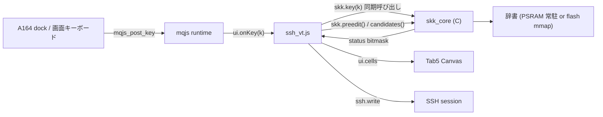
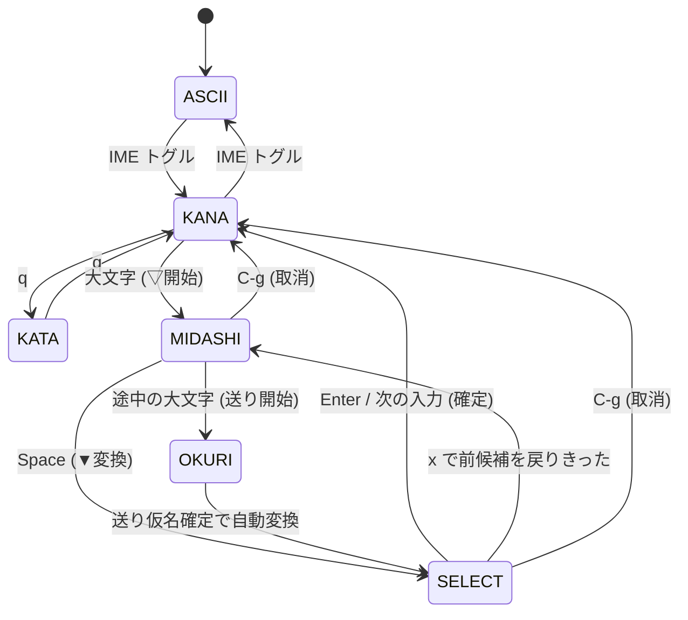

# SKK 日本語入力 (skk_core + mqjs フロントエンド)

Tab5 でローカル完結の日本語入力を実現します。変換エンジンは C native、
入力の受け取りと候補の描画と確定先の決定は mqjs app が担当します。

この文書は実装前の設計です。数値には **実測** と **概算** を明示的に分けて
書いてあります。概算は実装中に実測へ置き換えてください。

## 1. 目的とスコープ

SSH 越しに日本語を打てるようにするのが第一目的です。リモート側に IME を
用意する運用 (uim-fep / ddskk など) も選択肢ですが、それは端末フォントに
CJK が入っていれば成立する別の話で、この文書はデバイス内で変換を完結させる
ほうを扱います。

方式は **SKK** です。形態素解析も文節解析もせず、「どこを変換するか」「送り
仮名がどこか」をユーザーがシフトキーで明示するため、エンジンの仕事が
「見出し語 → 候補リストの辞書引き」に還元されます。連文節変換 (mozc 相当) は
品詞接続コスト表と Viterbi 探索が必要で、辞書もモデルも桁が違うため P4 では
採りません。

段階目標は次のとおりです。

| 段階 | 辞書 | 置き場所 | 状況 |
|---|---|---|---|
| **梅** | SKK-JISYO.M (UTF-8 195 KB) | flash rodata (`.incbin`) | **完了**。image 303,297 B |
| **竹** | SKK-JISYO.ML (UTF-8 1.31 MB) | `jisyo` パーティションを mmap | **完了・実機検証済み (S8)**。image 1,949,758 B |
| **松** | SKK-JISYO.L (UTF-8 6.16 MB) | 同上 | image 8,464,771 B。**テーブル変更なしで実機動作を確認済み** — 159,794 + 15,996 見出し、変換 77 µs (竹と同じ)、`skk.open()` は 826 ms |

`skk.open()` は引数なしで **`jisyo` パーティション → 埋め込み梅 → ファイル**
の順に試します。だから辞書を上げるのに**アプリの変更は要らず**、パーティション
を消すと梅へ落ちるだけで壊れません (両方向とも実機で確認済み)。

**辞書は 2 か所とも menuconfig の選択です** (`components/skk_core/Kconfig`)。
`CONFIG_MQJS_SKK_DICT_SOURCE_DIR` に SKK-JISYO.* の置き場を指すと、ビルドが
`tools/skk_prep.py` を回して両方の image を作り (UTF-8 再ソート + 全件検証
込み)、`esptool_py_flash_to_partition` 経由で **`idf.py flash` が `jisyo` まで
書きます** — オフセットはパーティションテーブルから読まれるので、数字を
二重に書く場所がありません。空なら生成済みの .bin をそのまま使い、どちらも
無ければ黙って飛ばしてビルドは通ります (新規クローンが焼けなくなるのは
辞書が理由として重すぎる)。

| 選択 | 埋め込み (`factory` 6 MB の残り) | パーティション (8.5 MB) |
|---|---|---|
| none | 33.0% | `jisyo` を触らない |
| S (117 KB) | 28.5% | — |
| **M (303 KB)** | **27.8% ← 埋め込み既定** | 埋め込みが none のときだけ意味がある |
| ML (1.86 MB) | **2%** — リンクは通るが次の機能で破綻する | **← パーティション既定** |
| L (8.07 MB) | 入らない (ビルドが落ちる) | 入る。`idf.py flash` +34 秒、`skk.open()` 826 ms |

**既定は「埋め込み M + パーティション ML」**です。埋め込みは
パーティションが空のときの受け皿で、語彙はパーティション側で決まります。
埋め込みを `none` にすると 303 KB 戻りますが、`erase-flash` した端末で
IME が使えなくなります。

⚠️ 表示するのは **menuconfig の選択ではなく image のヘッダから読んだ実際の
見出し数**です。再生成しない場合その2つはズレるので、古い `.bin` に別の
辞書名が付くと「どの辞書をデバッグしているのか」がわからなくなります
(実際にやりました)。

梅を第一目標にしたのは、**partitions.csv を触らずに済むから**でした。`storage`
(littlefs) はオフセットが空欄で `factory` の直後に置かれるため、`factory` の
サイズを変えると littlefs が移動し、インストール済み JS app と設定と app store
の棚がすべて消えます。

**竹で partitions.csv を触るときに、その罠自体を潰しました。** `jisyo` は末尾の
空きに足すだけなので既存は 1 バイトも動きませんが、あわせて `storage` と
`coredump` の**オフセットを明示的に書きました**。以後 `factory` のサイズを
変えると、静かにデータが消えるのではなく `gen_esp32part.py` が overlap で
ビルドを落とします。

**フラッシュの実測 (2026-07-29、パーティションテーブルバイナリをデコード):**

| 領域 | 開始 | サイズ | 状況 |
|---|---|---:|---|
| `factory` | 0x010000 | 6.00 MB | 使用 **4,538,032 B** (S0/S3/S4/S6 + 梅埋め込み + 索引ツリー) / **空き 1,753,424 B = 1.67 MB (27.9%)** |
| `storage` (littlefs) | 0x610000 | 1.00 MB | **明示オフセット** |
| `coredump` | 0x710000 | 64 KB | **明示オフセット** |
| **`jisyo`** | **0x720000** | **8.5 MB** | **S8 で追加**。data / subtype 0x40、mmap 用 |
| 未割り当て | 0xFA0000 | 384 KB | |

**`jisyo` は松 (image 8,464,771 B) を見越して 8.5 MB 取ってあります。** 竹
(1,949,758 B) しか焼かない今は無駄に見えますが、`jisyo` は最後のパーティション
でその下は空きなので**書かない限りコストはゼロ**、一方あとで広げるとなれば
全デバイスでテーブルを焼き直すことになります。松へ上げるのは**イメージを
差し替えるだけ**です。

梅と竹の差は辞書の置き場所だけで、**探索コードは同一**です (§6.7)。実機で確認
したとおり、竹は `esp_partition_mmap` した領域をそのまま読むので**アロケーション
ゼロ・ロードゼロ**、梅の flash rodata 直読みと同じ性質を保ちます。

## 2. アーキテクチャ



キーは既存の `mqjs_post_key()` → `ui.onKey` 経路をそのまま流れます。**C 層が
キーを横取りする仕組みは作りません。** app が自分の `ui.onKey` の中で
`skk.key()` を呼ぶかどうかを決めます。

## 3. 層の分割 — なぜこの境界か

### C 層 (`components/skk_core`) が持つもの

- ローマ字 → かな変換表と促音・撥音処理
- SKK 状態機械 (かな / ▽ / ▼ / カタカナ、送り仮名の切り出し)
- 辞書探索
- 個人辞書 (MRU 並べ替え)

### JS 層 (`examples/ssh_vt.js` ほか) が持つもの

- preedit と候補バーの描画 (`ui.cells`)
- **確定文字列の宛先の決定** — ssh_vt なら `ssh.write()` (bracketed paste の
  判断込み)、将来のエディタなら別

### 根拠

**状態機械を C に置く理由が3つあります。**

第一に、純粋ロジックなので **ホスト側で単体テストできる**。
[`kbd_core`](../components/kbd_core/include/kbd_core.h) が「Pure logic: no I/O,
no LVGL」と明記して同じ形をしているのが先例です。実機に載せる前に変換の
正しさを潰しきれます。プロジェクトの既定手順 (新しい primitive はホストで
単体テスト → 最小の実機スモーク → UI 統合) にそのまま乗ります。

第二に、mquickjs の文字列処理を毎打鍵の経路に置きたくない。

第三に、ssh_vt 以外の app にもそのまま効きます。

**フロントエンドを JS に置く理由**は、確定文字列の宛先が app 固有だからです。
ここを C に持つと、C が app の都合を知る羽目になります。

### この分割で守れない要件

`mqjs_post_key()` のキーイベントは
[`char text[8]`](../components/mqjs/mqjs_runtime.c) 固定長です。**確定文字列を
キーイベント経路に流すことはできません。** したがって IME は非同期イベントでは
なく **同期呼び出し API** にします (§8)。これは制約ですが、結果的に
「app が呼ばない限り何も起きない」という良い性質を生みます。

## 4. 性能設計

CPU は 360 MHz の RISC-V、内部 SRAM は逼迫しており (実測で largest contiguous
34–43 KB 程度)、大きなデータは PSRAM (HEX / 200 MHz) か flash に置くことに
なります。ここを外すと体感に直結するので、先に予算を切ります。

### 4.1 ホットパスの同定と時間予算

**入力経路には2種類しかありません。**

| 経路 | 頻度 | 予算 | 実際の仕事 |
|---|---|---|---|
| **打鍵ごと** | 最大 ~18 回/秒 | **55 ms/回** | ローマ字1文字の状態遷移 + preedit 1行の再描画 |
| **変換ごと** | Space 押下時のみ | 実質数十 ms 許容 | 辞書の二分探索 + 候補バーの描画 |

18 回/秒という上限は推測ではなく、キーボードドックの typematic レートが
`KB_REPEAT_TICK_MS 55` (≒18 cps) だからです
([kbd_tab5.c](../components/kbd_tab5/kbd_tab5.c))。**人間の連打はこれを超えません。**

つまり打鍵あたり 55 ms の予算に対して、実際の仕事はローマ字テーブル引き
(数十サイクル) と 1 行分の `ui.cells` 描画だけです。参考として、キーボード全体の
再描画が実測 6.9 ms、1行はその数十分の一です。**予算は3桁余っています。**

辞書探索は Space 押下時にしか走りません。二分探索のプローブ回数は
log₂(見出し数) で、梅 (8,346 見出し) なら **13 回**、竹 (48,750) で **15.6 回**、
松 (175,791) でも **17.4 回**です。辞書サイズは探索時間にほぼ効きません。

**結論: 素朴に書いても速度は問題になりません。注意すべきなのは速度ではなく
「余計なことをしない」ことです。** 以下はその設計です。

### 4.2 JS / C 境界 — 毎打鍵のアロケーションを作らない

素直に設計すると `skk.key(k)` が `{preedit, candidates, commit}` のような
オブジェクトを返したくなりますが、**これは毎打鍵で JS オブジェクト1個と文字列
数個を確保します**。mquickjs は moving GC なので、この経路には
「`JS_SetPropertyStr(ref.val, …)` の引数に `JS_NewString` をネストすると GC が
下で動いて壊れる」という既知の罠もあります。

そこで **status bitmask + 遅延アクセサ** にします。

```c
/* skk.key(k) の戻り値。JS には int を1つ返すだけ = アロケーションなし */
#define SKK_ST_PASSTHROUGH  0        /* IME が消費しなかった。app は従来経路へ */
#define SKK_ST_CONSUMED     (1 << 0) /* 消費した。以下のビットで何が変わったか */
#define SKK_ST_PREEDIT      (1 << 1) /* preedit が変化 → skk.preedit() を引く */
#define SKK_ST_CANDS        (1 << 2) /* 候補集合が変化 → skk.candidates() を引く */
#define SKK_ST_SEL          (1 << 3) /* 選択位置だけ変化 → skk.sel() を引く */
#define SKK_ST_COMMIT       (1 << 4) /* 確定文字列あり → skk.commit() を引く */
#define SKK_ST_MODE         (1 << 5) /* モード表示が変化 */
```

これで得られる性質は3つです。

- **素通し時のコストが厳密にゼロ。** IME オフ、あるいは ASCII をそのまま
  流す場合、`skk.key()` は int を返すだけで JS 側は既存経路に落ちます。
  文字列も配列もオブジェクトも作りません。
- **候補配列は ▼ モードに入った瞬間の1回だけ確保される。** 候補選択中に
  Space を連打しても `SKK_ST_SEL` だけが立ち、JS は整数1つを読むだけです。
- **GC ネストの罠を構造的に回避できる。** オブジェクトを組み立てないので、
  そもそも `JS_SetPropertyStr` の入れ子が発生しません。

さらに **IME がオフのときは JS が `skk.key()` を呼ばない**設計にします。
app 側に `imeOn` フラグを持ち、オフなら既存の `ui.onKey` の中身がそのまま
走ります。**日本語を使わないユーザーへのオーバーヘッドは、C 関数呼び出し1回
ぶんすら発生しません。**

### 4.3 メモリ配置

| データ | 置き場所 | サイズ | 根拠 |
|---|---|---|---|
| ローマ字テーブル | flash rodata (const) | 数 KB | 読み取り専用、キャッシュに載る |
| **辞書 + 索引 (梅)** | **flash rodata (埋め込み)** | 295 KB | **アロケーションゼロ、ロードゼロ** (§6.6) |
| **辞書 + 索引 (竹・松)** | **flash mmap** | 1.9 MB / 8.3 MB | **同上**。PSRAM に載せる意味がない |
| 状態バッファ | 静的 (固定長) | 1–2 KB | malloc しない |
| **個人辞書** | **PSRAM + littlefs** | **4.7 KB (ファイルは実測 39 B)** | 小さく、唯一の可変領域。**端末に 1 個**で、開いている IME ハンドル全部で共有する — 学習はアプリではなくユーザーのものなので、`store.*` (端末全体で 1 名前空間) に倣い `vault.*` (所有者ごとに隔離) には倣わない。書き換えるものを共有できるのは **mqjs のワーカーが全部 1 つの `mqjs` タスクの上で動く**から (`app_main.c`)。だから `skk_core` はここでもロックしない |

**`skk_core` は内部 SRAM を要求しません。** 内部 SRAM は lwIP と SDIO が
握っていて largest contiguous が 34–43 KB しかないことが実測でわかっており、
ここを取り合うと WiFi か SSH が壊れます。

### 4.4 候補はゼロコピーで持つ

辞書を引いた結果の候補は、**文字列をコピーせず辞書バッファ上のオフセットと
長さだけを持ちます**。

```c
typedef struct { uint32_t off; uint16_t len; } skk_cand_t;
```

候補は多くても十数個なので、`skk_cand_t` の固定長配列 (たとえば 64 個) を
静的に持てば足ります。文字列の実体化は **JS が `skk.candidates()` を呼んだ
時点で初めて** `JS_NewStringLen` します。しかもそれは ▼ モードに入る1回だけです。

### 4.5 やらないこと (明示的な YAGNI)

- **先頭文字バケツ索引は入れません — サンプリング木に吸収されました (§6.5)。**
  yaskkserv2 と x16-jedit が両方採用している設計で、当初は「松で初めて入れる」
  としていました。実際に竹へ進むときに実装したのは**サンプリング木**のほうで、
  これは「1段だけの、しかも先頭文字が空間を均等に割ると仮定したバケツ索引」を
  全段に一般化したものです。**両方入れる意味はありません。**
- **辞書をバイナリ形式へ丸ごと変換はしません。** 本文は SKK 標準のテキストの
  ままにします。ただし **UTF-8 バイト順への再ソートは必須**で (§6.1、これを
  やらないと二分探索が静かに誤答します)、packed key 索引もそこで一緒に作る
  ので、`tools/` に軽い準備スクリプトは持ちます。本文がテキストのままなので、
  辞書の更新は「落としてきて再ソートし直す」だけで済みます。
- **Aho-Corasick / trie は採用しません** (§6.9 に検討記録)。

### 4.6 PIE SIMD は使いません (調査済み、2026-07-29)

`skk_core` に PIE (ESP32-P4 の SIMD 拡張) を使う余地を調査しました。**結論は
「どの経路にも適用しない」**です。理由は命令の不足ではなく**ワークロードの形**に
あるので、実装中に気が変わる類のものではありません。

| 対象 | 判定 | 理由 |
|---|---|---|
| 二分探索の見出し比較 | **不可** | (1) 比較対象が 3〜30 バイトと小さい (2) 順序比較なので「最初に異なるバイトの位置」が要るが、**PIE には movemask / 先頭セットレーン抽出が無い** — マスクを 16 バイトのスクラッチに store して scalar で走査する羽目になり、置き換える対象の scalar ループより命令数が増える (3) `vcmp.lt.s8` は符号付きで、UTF-8 の順序には符号なし比較が要る (4) 両オペランドが非整列なので `ld.128.usar` + `src.q` のファンネル処理が要る (5) **そもそも支配項が違う** — プローブは PSRAM/フラッシュへのランダムアクセスで、13〜17 回で計 5〜15 µs のレイテンシ律速。SIMD はミスレイテンシを減らせない |
| **`\n` 走査 (オフセット配列の構築)** | **不可 (詳細後述)** | 設計中で唯一 PIE らしい形をしているが、**メモリ帯域律速**で SIMD の出番がない |
| UTF-8 境界走査 (Backspace) | 不可 | 合法な UTF-8 なら最大3バイト見るだけ。ベクタのセットアップだけで scalar 全体を超える |
| ローマ字テーブル引き | 不可 | 数 KB の const テーブルへの gather、毎打鍵1回。過去のキャンペーンで「small-N と gather では PIE が負ける」ことが実証済み |
| 将来の trie (LOUDS / double-array) | 不可 | ポインタ追跡と rank/select は gather と依存ロードの塊で、**採用すると PIE からさらに遠ざかる**。LOUDS の rank には popcount が要るが PIE には無い |

**`\n` 走査を詳しく見た結果。** 平均行長が 23.4〜35.0 バイトなので、
**16 バイトのベクタブロックの 50〜100% が「マッチあり」経路**に入ります。
movemask が無いためマッチ経路は毎回マスクの store + scalar 走査 (16〜20 サイクル)
になり、実効 1〜1.5 cyc/byte — **word-at-a-time の scalar (SWAR) ループと同じ**
です。しかも SWAR の ~1.4 cyc/byte ≒ 245 MB/s は **PSRAM の実効読み出し帯域
(推定 200〜400 MB/s) の天井に既に張り付いて**おり、ALU を速くしても意味が
ありません。素朴なバイトループとの比較でなら 2〜3 倍出ますが、**節約できるのは
梅で約 1.2 ms、しかも `skk.open()` の遅延ロード1回きり**で、同じファイルの
littlefs 読み出しの裏に隠れます。

**Amdahl。** 打鍵経路は 55 ms の予算に対し µs 規模で、SIMD が触れるのは体感
時間の **0.001% 程度**。変換経路は 5〜15 µs で、候補バーの再描画と
`JS_NewStringLen` の実体化のほうが桁で大きい。**この設計には SIMD が意味を持つ
だけの分母が存在しません。**

**再検討のトリガ。** PIE が効くのは「連続・分岐の少ない 8/16 bit MAC」で、
これは Opus の comb カーネル (実測 −17.8%) やテンソルカーネルで実証済みの形
です。SKK の設計にこの形は構造的に現れませんが、次のどちらかが起きたら
再調査の価値があります。

1. **オンデバイスの統計的言語モデル / N-best リランキング** — 候補のスコア
   計算は連続 int16 配列の内積そのもので、実証済みの勝ち筋に一致します。
   MRU 並べ替えが学習スコアリングに育ったら再検討
2. **辞書全体の部分一致検索** (逆引き、注釈検索) — PSRAM 上の 1〜6 MB 線形走査
   なら形は合いますが、帯域で 2〜4 倍が上限、かつ候補検証で movemask 不在の
   問題が再燃します

CRC32 (§6.10) はテーブル駆動 = gather、かつ PIE にキャリーレス乗算が無いので
scalar のままです。

**実装への持ち帰り。** オフセット配列の構築は `memchr` か word-at-a-time の
scalar ループ (無料・移植可能・ホストでテストできる)、プローブの比較子は
バイト単位の早期脱出 `memcmp`。それ以上は何もしない。

## 5. コア機能 — 状態機械



初版に入れるもの:

- ローマ字 → かな (促音・撥音・拗音)
- カタカナモード (`q`)
- 送りなし変換 / 送りあり変換
- 候補選択 (`Space` 次、`x` 前)
- 確定 (`Enter` または次の入力)
- 取消 (`C-g`)
- IME トグル

**前方一致補完 (`TAB`) も初版に入れます。** 実測でほぼ無料と分かったため
(§6.8)。

ddskk に合わせた点が3つあります。**`l` と `q` は保留中のローマ字を捨てず
flush します** — `"nl"` が ん を失う一方 `"n\n"` や `"nk"` は残す、という
「次に来るキー次第で同じ打鍵の意味が変わる」状態でした。**`Q` は空の ▽ を
開きます**（`▽q` ではなく）。**ソフトキーボードからのかな直接入力は、保留
ローマ字がある場合だけ消費します** — 無い場合の素通しは既存の規定なのでそのまま。

初版に入れないもの: abbrev (`/`)、数値変換 (`#`)、注釈表示、辞書サーバ、
動的補完 (打鍵ごとに候補を出すもの。TAB 明示の補完とは別)。

内部表現は **終始 UTF-8 バイト列**で通します。`ui.cells` も ssh_vt も mqjs も
UTF-8 なので、UTF-16 や wchar_t を挟むのは純損です。「1文字戻る」に必要な
文字境界走査は、[`cells_utf8_next`](../components/ui_tab5/ui_tab5.cpp) と同型の
ヘルパを `skk_core` に置きます。

## 6. 辞書

### 6.1 フォーマットと ⚠️ ソート順の落とし穴

標準の SKK 辞書は次の形です。

```
;; okuri-ari entries.      ← 降順ソート
うごk /動/
;; okuri-nasi entries.     ← 昇順ソート
かんじ /漢字/感じ/幹事/監事/
```

**送りあり / 送りなしの2ブロックが各々ソート済み**という規約が二分探索を
前提にした設計になっています。この2ブロックは別々に扱います (探索空間が半分に
なり、比較方向の混乱もなくなる)。

> ### ⚠️ **SKK-JISYO は EUC-JP バイト順でソートされており、UTF-8 に変換すると
> ### 順序が壊れます。必ず再ソートしてください。**
>
> 実測 (2026-07-29):
>
> | 辞書 | ブロック | EUC-JP 順の違反 | **UTF-8 順の違反** |
> |---|---|---:|---:|
> | M | okuri-nasi | 0 | **2** |
> | L | okuri-nasi | 0 | **285** |
>
> ```
> 'ぺーじ' → 'ぺい'      ← 「ー」の位置が入れ替わる
> '#ちーむ' → '#ちっぷ'
> ```
>
> 犯人は **「ー」(U+30FC)** です。EUC-JP では 0xA1BC で「記号」の区にあり
> ひらがな (0xA4xx) より**前**に来ますが、UTF-8 では E3 83 BC で全ひらがな
> (E3 81 81〜E3 82 93) より**後**に来ます。「：」(U+FF1A) も同様です。
>
> ソートされていない配列を二分探索すると **静かに誤答**します。「ー」を含む語が
> プローブ経路次第で見つかったり見つからなかったりする、再現性の低いバグに
> なります。オフライン準備の段階で **UTF-8 バイト順に再ソート**すること
> (送りありブロックは降順、送りなしブロックは昇順)。§6.3 の packed key を
> 採用すれば、順序の定義が1箇所に畳まれてこの種の食い違いが構造的に起き
> なくなります。

### 6.2 探索アルゴリズム

1. 準備段階 (オフライン or ロード時) に、**2つのブロックそれぞれについて
   packed key 配列とオフセット配列**を作る
2. 探索は packed key 配列に対する純粋な二分探索
3. packed key が一致した場合だけ辞書本体で完全比較

### 6.3 packed key — 見出し語を uint64 1個に畳む

**見出し語に現れる異なり文字は 127〜182 種しかありません** (実測)。読みなので
ひらがなと ASCII だけで、漢字は1文字も現れません。

| 辞書 | 異なり文字 | bit/文字 | uint64 に入る文字数 | 見出し長 中央値 / 90%タイル |
|---|---:|---:|---:|---|
| M | 127 | 7 | 9 | 4 / 6 |
| ML | 129 | 8 | 8 | 4 / 7 |
| L | 182 | 8 | 8 | 6 / 9 |

**文字→コードの割り当てを UTF-8 バイト順の順位にすれば、uint64 の整数比較が
UTF-8 バイト比較と一致します。** 全段 (梅・竹・松) で同じ 8 bit 固定表を使い、
表に無い文字はエスケープコードに落として完全比較へ回します。

| | 素朴な設計 | **packed key** |
|---|---|---|
| プローブ1回のロード | オフセット配列 → 辞書行 の**依存2連続ミス** | **uint64 配列を1回** |
| 比較 | バイト単位の文字列比較 | **整数比較1回** |
| 辞書本体へのアクセス | 毎プローブ | **衝突時と最終の候補読み出しのみ** |

衝突率の実測 (先頭8文字パック、okuri-nasi):

| 辞書 | 衝突群に属する見出し | 最大群 |
|---|---:|---:|
| M | 0.25% | 3 |
| ML | 0.07% | 2 |
| L | 3.19% | 22 |

しかも衝突は探索の終盤にしか起きないので、**辞書本体に触るプローブは実質
1〜2回**です。

**主目的は速度ではありません。** 順序の定義が「文字→コード表」1箇所に畳まれ、
ソート生成器と検索器が同じ表を使うため、§6.1 のような順序の食い違いが起こり
得なくなること — これが採用理由です。

**ただし実測すると、速度面にも強い根拠がありました (2026-07-29)。**
素朴な「ソート済みテキストへの改行 bisect」(索引ゼロ) と比べると:

| | コールド | **ウォーム (連続変換)** |
|---|---:|---:|
| テキスト bisect (17.7 ライン) | 62 µs | **62 µs** |
| packed key 索引 (15.4 ライン) | 54 µs | **9 µs** |

**コールドの差は 2.3 ライン ≒ 8 µs (13%) しかありません** — 98.9 KB 払って
コールド速度で得るものはほぼゼロで、上の「主目的は速度ではない」は正確です。

**差が出るのはウォーム、つまり文章を打っている実使用時です。** key 配列
55,472 B は **L2 128 KB の 42% で常駐可能**、一方 nasi テキスト 170,889 B は
**L2 の 130% で常駐不可能**。連続変換では索引側はプローブ 13 回が L2 ヒット
(約 0.7 µs) + テキスト 2〜3 ラインで済むのに対し、テキスト bisect は毎回
17.7 ラインをフラッシュから引きます。**約 7 倍。**

### 6.4 索引のサイズ

| 辞書 | 見出し数 | packed key (8 B) | オフセット (4 B) | **サンプリング木 (§6.5)** | 合計 | image 全体 |
|---|---:|---:|---:|---:|---:|---:|
| M (梅) | 8,346 | 67 KB | 33 KB | **9.3 KB** | **109 KB** | 303,297 B |
| ML (竹) | 48,750 | 390 KB | 195 KB | **54.4 KB** | **639 KB** | 1,949,758 B |
| L (松) | 175,790 | 1.41 MB | 703 KB | **196 KB** | **2.30 MB** | 8,464,771 B |

木は見出し数のちょうど 1/7 なので**索引の +9.5%** で固定です。

### 6.5 サンプリング木 — 二分探索の 1/3 のキャッシュライン (実装済み、竹で投入)

当初は「やらないこと」でした。理由は「探索は 5〜15 µs、予算は数十 ms、体感
できない」で、これは今でも正しい。**竹で入れた理由は速度ではなくメモリ
アクセスの形**です — 辞書が mmap したフラッシュになると、探索の実体は比較では
なく**触るキャッシュラインの本数**になります。二分探索は 1 プローブごとに別の
64 バイトラインに落ちます。

**採ったのは Eytzinger / B-tree の「並べ替え」ではなく「サンプリング」です。**

```
L[0] = keys,   L[k+1][j] = L[k][8j + 7]
```

8 個ごとの代表を上の段に置き、段が 8 未満になるまで繰り返します。区切り値は
**下の段のキーそのもの**なので、段 k+1 の lower_bound が決まると段 k の答えは
**連続する 8 要素・8 整列 = ちょうど 1 ライン**に閉じ込められます。よって探索は
「1 段あたり uint64 を最大 8 個スキャン」で、触るラインは log₈(n) 本。

| ブロック | n | 二分探索 | サンプリング木 | 木のコスト |
|---|---:|---:|---:|---:|
| M okuri-nasi | 6,934 | **12.8 ライン** | **5 ライン** | 7,904 B |
| ML okuri-nasi | 44,401 | **15.5 ライン** | **6 ライン** | 50,720 B |
| L okuri-nasi | 159,795 | **17.4 ライン** | **6 ライン** | 182,600 B |

(`tools/test_skk_dict.c` が全辞書の全見出し + 各見出しの「必ず存在しない版」に
ついて両方を走らせた実測。エントリの**間**に落ちる lower_bound も含みます)

**実機実測 (2026-07-29):** `probes/lookup = 6.00` ちょうど。**そして竹 (48,750
見出し) と松 (175,790 見出し) で同じ 6.00、変換も 76 µs と 77 µs で同じ**です
— 辞書を 3.6 倍にしても探索コストが動かないのがこの索引の要点で、二分探索
なら 15.5 → 17.4 ラインに増えていたところです。

**なぜ Eytzinger / B-tree の並べ替えではないのか。** あれは `keys[]` の順序を
壊します。ところがヒット後に**ソート順で次のエントリへ歩く処理が2つ**あります
— `find_entry()` の packed key 衝突群の走査と、`skk_complete()` の TAB 補完
(§6.8) です。サンプリングはソート済み配列をそのまま残すので、下流が何も
変わりません。代償は n/7 個のキー = 索引の +9.5%、竹の image 全体では +2.9%。

**木は導出データで、間違っても落ちません。** 降下が別の 8 キーへ入り、その語が
「辞書に無い」ことになるだけ — §6.1 のソート順バグと同じ壊れ方です。だから
守りも同じにしました。(1) 各段のサイズは `count` から計算するので**書き手と
読み手が形について食い違えない** (image に持つのは開始オフセットだけ)、
(2) `skk_prep.py` は書き出す前に**全見出しを木経由で引き直す**、
(3) `skk_index_verify()` が `L[k+1][j] == L[k][8j+7]` を全要素で照合する。
セルフテストでは実際に区切り値を1個ずらして「静かに 8 語消える」ことと、
それを検査が捕まえることの両方を見せています。

### 6.5.1 front coding + チャンク化 — 松で索引を半減させる手 (検討済み、梅では不採用)

見出し索引を圧縮してチャンク化し、少量の常駐部だけで引く案を検討しました。
**速度目的としては不採用、サイズ目的としては松で採用の価値あり**という結論です。

ソート済みの読みは隣接エントリが長いプレフィクスを共有します (実測):

| 辞書 | 見出し raw | front coding | 平均共有 / 平均長 |
|---|---:|---:|---|
| M | 77.6 KB | **32.1 KB (41.4%)** | 7.72 B / 11.47 B |
| ML | 570.8 KB | **216.8 KB (38.0%)** | 9.16 B / 13.16 B |
| L | 2,433.9 KB | **921.5 KB (37.9%)** | 10.69 B / 15.60 B |

B エントリごとに圧縮をリセットし、ブロック先頭キーだけ非圧縮で持つと、
ブロックヘッダ配列が「少量の常駐部」になります (L の場合):

| ブロック長 | 本体 | ブロックヘッダ | 合計 | §6.4 の設計 |
|---:|---:|---:|---:|---:|
| B=32 | 968.9 KB | 58.5 KB | 1,027.4 KB | 1,872.6 KB |
| **B=64** | 945.3 KB | **29.3 KB** (2,497 block) | **974.5 KB** | 1,872.6 KB |
| B=128 | 933.3 KB | 14.6 KB | 947.9 KB | 1,872.6 KB |

**松の索引が 2.11 MB → 約 1 MB。** 探索も「ブロックヘッダ 2,497 件の二分探索
(11 プローブ、29 KB の狭域) → 該当ブロック約 380 B の逐次スキャン」になり、
触るキャッシュラインは §6.4 の設計より減ります。

**それでも梅・竹では採用しません。**

- **速度目的なら無意味。** L2 は 128 KB / ライン 64 B。探索1回が実際に触るのは
  17 プローブ × 64 B ≒ 1 KB で、全ミスでも約 2.5 µs。予算数十 ms に対して
  誤差です。
- **常駐部を内部 SRAM に置くのは禁止。** largest contiguous が 34〜43 KB しか
  なく、lwIP と SDIO と取り合うと WiFi か SSH が壊れます (§4.3)。L2 に載れば
  十分で、そのために SRAM を割く理由がありません。
- **梅では索引が 100 KB しかない** (§6.4)。圧縮しても得るものがなく、コードが
  複雑になるだけです。
- **検証面が広がる。** §6.1 の順序バグのように、この領域の失敗は
  クラッシュせず静かに誤答します。素朴な形が実機で通る前に圧縮層を挟むと、
  同種のバグを呼び込みます。

**竹を実装した時点で見直した結果、トリガはさらに遠のきました (2026-07-29)。**

- **サイズが制約になっていない。** 索引を圧縮して節約できるのは竹で約 300 KB
  ですが、`jisyo` は 8.5 MB あって竹は 1.86 MB しか使いません。**削っても
  空き領域が増えるだけ**です。松 (8.06 MB) でも 448 KB 余ります。
- **ゼロコピーを壊す。** front coding したブロックは展開しないと比較できないので
  固定の展開バッファが要ります。竹はいま `esp_partition_mmap` した領域を
  そのまま読んでいて、**アロケーションもロードも本当にゼロ**です (実機で
  `loadUs` の内訳は CRC のみ)。これを手放す対価が「使わない空き領域」では
  釣り合いません。
- **速度目的は §6.5 が先に取った。** 触るキャッシュラインはサンプリング木で
  17.4 → 6 本になっています。front coding のブロックヘッダ二分探索 (11 プローブ)
  はこれより**多い**。

**採用トリガ (改訂):** `jisyo` を松で埋めたうえで**さらに別の辞書を同居させたく
なった**とき。索引サイズが本当に効くのはそのときだけです。

### 6.6 起動コストとアロケーション — 全段でゼロにする

**このチップではフラッシュも PSRAM も MMU 経由で直接読めるので、辞書と索引を
どこかへコピーする必要がありません。** `skk_blob_t` が指す先を変えるだけで、
全段がアロケーションゼロ・ロード時間ゼロになります。

| 段 | 置き場所 | アロケーション | `skk.open()` 実測 |
|---|---|---|---|
| **梅** | flash rodata (`.incbin`) | **ゼロ** | **175 µs** (CRC なし、§6.10) |
| **竹** | `jisyo` + `esp_partition_mmap` | **ゼロ** | **197 ms** (全部 CRC 検証) |

竹の 197 ms はコピーでもロードでもなく **`SKK_OPEN_VERIFY` の CRC32 だけ**です
(1.86 MB)。§6.10 の予測どおりで、`skk.open()` 1 回に付くコスト。**マッピングは
2段階**で行います — まず 1 ページだけ張ってヘッダの `image_len` を読み、その
長さぶんだけ張り直す。`jisyo` は松に合わせて 8.5 MB あるので、丸ごと張ると
消去済みフラッシュに MMU ウィンドウを 6.6 MB 使うことになるからです。

**梅は辞書と索引をバイナリに埋め込みます。** `tools/skk_prep.py` が UTF-8
再ソート済み辞書 + packed key + オフセットを出力し、それを `EMBED_FILES` で
リンクして `skk_blob_t` が `_binary_..._start` を直接指します。

> ### ⚠️ **`EMBED_FILES` を使ってはいけません。整列が 1 バイトです。**
>
> IDF 6.0.1 の `tools/cmake/scripts/data_file_embed_asm.cmake` は
> `.section .rodata.embedded` の直後にラベルと `.byte` 列を吐くだけで、
> **`.align` / `.balign` / `.p2align` を一切出しません** (アセンブルして
> `readelf -S` で確認: `sh_addralign = 1`)。
>
> **本プロジェクトの既存ビルドが決定的な証拠です** (`build_tab5/esp32p4-mqjs.map`):
>
> | シンボル | アドレス | `% 8` |
> |---|---|---:|
> | `_binary_task_js_start` | 0x4021a488 | 0 |
> | `_binary_launcher_js_start` | 0x4021ac36 | **6** |
> | `_binary_device_settings_js_start` | 0x4021cd8b | **3 (奇数)** |
> | `_binary_tab5_boot_48k_opus_start` | 0x40236772 | **2** |
>
> 4個中 8 バイト整列は1個だけ。しかも配置は**リンク順で先に来た全 rodata の
> サイズの合計**で決まるため、**無関係なコード変更で毎ビルド変わります**。
> 「今日は動くが明日 `SKK_ERR_ALIGN`」という最悪の壊れ方をします。
>
> **正しいやり方 — `.incbin` + `.balign` を書いた小さな `.S` を置く:**
>
> ```asm
>     .section .rodata.embedded.skk,"a",@progbits
>     .balign 64
>     .global skk_dict_image
> skk_dict_image:
>     .incbin "skk_dict.bin"
>     .global skk_dict_image_end
> skk_dict_image_end:
> ```
>
> `.balign 64` にすると image 先頭がキャッシュライン境界に乗り、内部の
> 各配列 (image オフセット 64 から始まる `nasi_keys` など) のレイアウトが
> **完全に決定的**になります。コストは最大 63 バイト。
>
> なお rv32 では gcc が uint64 比較を `lw +4` / `lw +0` の2ロードに割るため、
> **ISA が実際に要求するのは 4 バイト**です。それでも上表の3個中2個は 4 すら
> 満たしていません。`offs[]` を `const uint32_t *` として読む経路も同じ
> 4 バイト依存です。

参照の書き方 (`.incbin` 版):

```c
extern const uint8_t skk_dict_image[];
extern const uint8_t skk_dict_image_end[];
```

サイズは辞書 195 KB + packed key 67 KB + オフセット 33 KB = **295 KB**。
factory の空きが実測 2.10 MB (§1)、フォント第1水準が +433 KB、フォント整理が
−533 KB なので余裕で収まります。

**フラッシュ直読みが実用速度である根拠:** `font_term_mono` の 366 KB の
glyph_bitmap は flash rodata から描画ホットパスで直読みされており、キーボード
全面再描画が 6.9 ms で回っています。辞書探索が触るのは 17 ライン × 64 B ≒ 1 KB
で、桁違いに軽い負荷です。

**代償 (明示):**

- フラッシュは PSRAM より遅い (DIO 80 MHz)。探索はコールドで**概算 25 µs**
  (PSRAM なら約 2.5 µs)。予算数十 ms に対しては誤差。もし問題になったら、
  **毎プローブ触るブロックヘッダ配列だけ (梅で 1.3 KB) を PSRAM にコピー**し
  本体はフラッシュに残せば両取りできる。
- **辞書の更新にファームの再フラッシュが必要**になる (littlefs ファイルの
  差し替えではなく)。固定辞書を同梱する梅では許容。辞書を差し替えたいなら
  littlefs か partition のままにする。

**圧縮との関係 — 重要な反転:** front coding したブロックは展開しないと比較
できないので、**圧縮すると展開用の固定バッファが必要になります**。非圧縮なら
その場で読むだけでコピーがゼロです。**梅で圧縮しない理由がここにもう1つ**
あります (§6.5.1)。

### 6.7 データアクセスの抽象化 (梅 → 竹 → 松 の移行点)

探索コードは「ベースポインタ + 長さ」しか見ません。

```c
typedef struct {
    const uint8_t *base;   /* PSRAM バッファ or mmap されたフラッシュ */
    size_t         len;
} skk_blob_t;
```

- **梅: `.incbin` + `.balign 64` で埋め込んだ flash rodata (`skk_dict_image`)**
- **竹・松: `esp_partition_mmap()` の返すポインタ**
- **ホストテスト: `malloc` + `fread` した実物の SKK-JISYO**

3つとも**同一のコードパス**を通ります。これがホストで単体テストできることの
実体であり、同時に**全段でアロケーションをゼロにできる理由**でもあります
(§6.6)。skk_core は「どこから来たバイト列か」を一切知りません。

**竹を実装して、この抽象が主張どおりだったことが確認できました。** skk_core は
1行も変わっていません。増えたのは `mqjs_runtime.c` の `skkpart_open()`
(パーティションを探して2段階で mmap し、`skk_blob_t` を渡す) と、`skk.open()`
の候補列 `part:jisyo` → 埋め込み → ファイルだけです。JS 側の API も、
`ssh_vt.js` も、`skk_test.js` も無変更で竹になりました。

### 6.8 前方一致補完 (TAB) — 実装済み

ソート済み配列に対する前方一致列挙は「二分探索 → 一致する限り前進」で終わり、
**O(log N + 表示件数)** です。実測 (okuri-nasi、該当件数と前方走査量):

| 辞書 | プレフィクス | 件数 中央値 / 90%タイル | 走査バイト 中央値 |
|---|---|---|---|
| M | 2文字 | 2 / 8 | **23 B (0.4 ライン)** |
| M | 3文字 | 1 / 2 | 11 B |
| L | 2文字 | 5 / 73 | **78 B (1.2 ライン)** |
| L | 3文字 | 1 / 8 | 16 B |

補完は候補を10件程度しか出さないので、**該当群を全部走査せず10件で打ち切り**
ます。既存の二分探索の後ろに前進ループを足すだけで、追加のデータ構造も
メモリも不要です。

**実装:** `skk_complete(d, blk, prefix, plen, nth, ...)` が「prefix で始まり
prefix より長い nth 番目の見出し」を返します。状態機械側は**候補リストを
保持しません** — TAB のたびに元の prefix (`comp_len` バイト) から引き直して
`comp_i` 番目を取ります。完成形は必ず prefix で始まるので、置換後も
`reading[0..comp_len)` が prefix のままである、という性質を使っています。
TAB 以外のキーが来たら `skk_key()` の入口で `comp_len` を 0 に戻します
(各分岐に任せると忘れた分岐が古い prefix を残すため)。

2つの罠に対処してあります。**(1)** prefix が 8 文字を超えると
`lower_bound` が run の手前に着地しうる (packed key が同じで prefix より
小さく並ぶエントリがあるため) ので、最初の一致までは packed key が変わらない
限り前進を続けます。**(2)** prefix と完全一致するエントリは補完ではないので
飛ばします。

### 6.9 Aho-Corasick / trie を採用しない理由 (検討済み)

**解く問題が違います。** Aho-Corasick は「テキスト T の中からパターン集合の
出現を全部見つける」ためのもので、failure link は**テキストの任意位置から
始まる重なり合ったマッチ**を扱う機構です。補完は「プレフィクス P で始まる
キーの列挙」で、走査すべきテキストが無く、マッチ位置は常に先頭固定 —
AC が足す機構が丸ごと不要です。

容量でも負けます。160K キーのトライはノードが数十万個で、double-array に
しても MB 級。**ソート済み配列なら追加バイトはゼロ** (データ自体が索引)。

**AC (trie の common prefix search) が正解になるのは「入力文字列の全位置に
ついて、そこから始まる辞書語を全部見つける」問題** — MeCab / mozc の形態素
解析であり、連文節変換の中核です。**SKK はこれを構造的に回避する方式** (変換
範囲をユーザーがシフトで宣言する) なので、この問題が発生しません。

**採用トリガ = 連文節変換への方針転換。** それは §1 で却下済み (品詞接続
コスト表と Viterbi が必要で P4 では非現実的) なので、この方向は閉じています。

### 6.10 完全性の検証 — 梅では既定 OFF

image ヘッダに CRC32 を持たせ、`SKK_OPEN_VERIFY` で payload 全体を検証できる
ようにします。**ただし梅では既定 OFF にしてください。**

**コスト (実測):** `skk_crc32` の内側ループは生成 asm で **1 バイトあたり
16 命令** (うち依存ロード2)。梅の 293,729 B で:

- CPU: 293,729 × 16 / 360 MHz = **13.0 ms**
- フラッシュ読み出し: 4,590 ラインフィル × 3.5 µs = **16.1 ms**
  (DIO@80MHz の 64 B ライン = cmd 8 + addr 12 + dummy 4 + data 256 = 280 SPI clk)
- 合計 **20〜30 ms**。VERIFY OFF なら `skk_dict_open()` は約 **7 µs** — **3〜4 桁差**。

**そして梅では冗長です。** `sdkconfig.tab5` は
`CONFIG_BOOTLOADER_SKIP_VALIDATE_ALWAYS` / `_ON_POWER_ON` / `_IN_DEEP_SLEEP` が
すべて未設定 = **2nd stage ブートローダが毎ブート app image 全体の SHA-256 を
HW アクセラレータで検証**しています。梅の image はその app image の rodata の
中にあるので、CRC32 は**同じ仕事をより弱いチェックサムで3桁遅く再実行して
いるだけ**です。

| 段 | 既定 | 理由 | 実測 |
|---|---|---|---|
| **梅** (埋め込み) | **OFF** | ブートローダの SHA-256 が既にカバー | **175 µs** |
| **竹** (`jisyo` パーティション) | **ON** | app image の外で、誰も検証しない | **197 ms** (1.86 MB) |
| **松** (同上) | **ON** | 同上 | **826 ms** (8.07 MB) |

**実機で 3 桁差が出ました (2026-07-29)。** 予測は「梅 293 KB で 20〜30 ms」で、
竹はその 6.6 倍 = 130〜200 ms、松は 28 倍 = 560〜840 ms — どちらも的中して
います (実効 106 ms/MB)。`skk.open()` 1 回ぶんなので、日本語を打たないユーザーは
1 µs も払いません (§3)。

**松の 826 ms は無視できない**ので、そこまで行くなら選択肢は3つ:
索引セクションだけ CRC する (松で約 235 ms、ただしフォーマットに CRC が2つ
増える)、`skk.open()` にフラグを足して呼び出し側に選ばせる、あるいは竹で
止める。**竹の 197 ms では割に合わないので今はやりません。**

CRC テーブルを nibble (64 B) から 256 エントリ (1 KB) にすれば CPU 項は
16→約 9 cyc/byte で半減しますが、そうするとフラッシュ 16 ms が支配的になり
全体は 30→20 ms 程度にしかなりません。**既定 ON にしないのであれば nibble の
ままで正解**です。

竹以降でパーティションに焼く運用になったら、**辞書ヘッダに CRC32 を持たせて
起動時に検証**します。書き込み失敗を検出できないと、原因不明のクラッシュや
文字化けとして現れます。yaskkserv2 が辞書全体を SHA1 検証しているのと同じ
理由です (SHA1 は重いので CRC32 で足ります)。

## 7. 変換見出し量と表示可能性

辞書とフォントは独立ではありません。**辞書の候補に出てくる漢字をフォントが
持っていないと豆腐になります。** 両方を実測しました。

### 7.1 辞書の実測 (skk-dev/dict HEAD)

| 辞書 | EUC-JP | **UTF-8** | 見出し数 | 送りあり | 送りなし | 平均行長 | 候補総数 |
|---|---:|---:|---:|---:|---:|---:|---:|
| S | 55.7 KB | 73.8 KB | 3,379 | 998 | 2,381 | 21.8 B | 6,763 |
| **M (梅)** | 144.5 KB | **194.9 KB** | 8,346 | 1,412 | 6,934 | 23.4 B | 12,826 |
| **ML (竹)** | 952.9 KB | **1.31 MB** | 48,750 | 4,349 | 44,401 | 26.9 B | 67,342 |
| L (松) | 4.49 MB | 6.16 MB | 175,791 | 15,996 | 159,795 | 35.0 B | 240,307 |
| L.unannotated | 4.08 MB | 5.62 MB | 175,791 | 15,996 | 159,795 | 32.0 B | 240,307 |

**送りあり見出し数が実用性を決めます。** 梅の 1,412 は活用語がかなり不足し、
竹の 4,349 で日常的な文章入力が成立します。ここが梅→竹を射程に入れる最大の
理由です。不足ぶんは個人辞書 (学習) が時間とともに埋めます。

### 7.2 端末フォントの現状 (実測)

| フォント | 総グリフ | ASCII | かな | カナ | **漢字** | 罫線 | PUA |
|---|---:|---:|---:|---:|---:|---:|---:|
| font_term_mono (17px) | 3,747 | 95 | 0 | 0 | **0** | 160 | 3,487 |
| font_noto_jp_20_4 (20px) | 4,145 | 93 | 87 | 90 | **3,517** | 32 | 0 |
| font_nf_ui_20 (20px) | 3,492 | 0 | 0 | 0 | **0** | 0 | 3,487 |

**`ui.cells` が使う端末フォントの漢字は 0 です。** ここに CJK を入れない限り、
確定した日本語は端末に表示されません (桁は2つ空くのに何も描かれない)。
これは IME とは独立した前提条件です。

### 7.3 フォント被覆 × 辞書の可読率 (実測)

「候補を1つ以上完全表示できる見出しの割合 / 完全表示できる候補の割合」:

| フォント被覆 | M (梅) | ML (竹) | L (松) |
|---|---|---|---|
| 現状の Noto 相当 (3,517字) | 99.77% / 99.58% | 97.89% / 96.76% | 98.58% / 95.79% |
| 頻度上位 2,000字 | 94.68% / 86.40% | 91.55% / 87.19% | 94.18% / 88.90% |
| **頻度上位 3,000字** | 98.23% / 93.99% | 97.36% / 95.18% | 98.40% / 95.16% |
| **頻度上位 4,000字** | 99.17% / 96.59% | 99.11% / 97.91% | 99.42% / 97.56% |
| 頻度上位 5,000字 | 99.45% / 97.23% | 99.72% / 99.09% | 99.74% / 98.70% |

**漢字グリフは 3,000字あたりで飽和します。** 2,000→3,000字で候補可読率が
+6pt 伸びるのに対し、5,000→6,352字は +0.7pt しかありません。

竹まで射程に入れるなら **最初から上位 4,000字で焼くのが結局安上がり**です
(3,000字との差は概算で約 135 KB、可読率は候補ベースで +2.7pt)。

### 7.4 フォント追加のバイト数 (実測ベース)

**測定方法。** `--no-compress` の 4bpp では1グリフのバイト数が
`ceil(box_w × box_h × 4 / 8)` で、**字画の複雑さと無関係に外接矩形だけで決まり
ます**。したがって第2水準の漢字は第1水準とまったく同じコストです。

- Noto の CJK 領域から **186.5 B/グリフ (20px)** を実測
- 同一 TTF から 17px と 20px の両方が生成されている PUA 21 レンジを突き合わせて
  **サイズ比 0.7278 を実測** (理論面積比 (17/20)²=0.7225 と 0.7% 一致)
- ⇒ **CJK は 17px/4bpp で 136 B/グリフ**。テーブル追加分が 10 B/グリフ

| 被覆 | グリフ数 | 追加フラッシュ | `glyph_bitmap` 合計 |
|---|---:|---:|---:|
| 現状 | 3,747 | — | 366,124 |
| **(a)** かな + 記号 | ~383 | **+33 KB** | 395,624 |
| **(b)** (a) + JIS第1水準 | +2,965 | **+423 KB** | **798,864** |
| (c) (b) + JIS第2水準 | +3,390 | +483 KB | **1,259,904 ← 上限超過** |

### 7.5 ⚠️ LVGL の 1 MB / フォント上限 — 被覆の真の天井

`sdkconfig.tab5` で `CONFIG_LV_FONT_FMT_TXT_LARGE` が未設定のため、LVGL の
`lv_font_fmt_txt.h` は次の定義になっています。

```c
uint32_t bitmap_index : 20;   /* A font can be max 1 MB */
```

**1フォントあたり `glyph_bitmap` は 1,048,576 バイトを超えられません。**
超えるとインデックスが 0x100000 で巻き、**ビルドエラーにならず描画が壊れます**。

- (a) → 38% ✅
- **(b) 第1水準 → 76% ✅ 余裕あり**
- (c) 第2水準まで → **120% ❌ 静かに破損**

**フラッシュ容量ではなくこれが CJK 被覆の天井です。** §7.3 で第1水準相当
(上位3,000〜4,000字) が可読率の変曲点だと出ているので、**(b) を採用すれば
性能・容量・上限のすべてが同時に成立します。** 第2水準が必要になった場合の
逃げ道は3つあり、優先順は ①3bpp 化 (全ビットマップ −25%) → ②`.fallback` で
2フォントに分割 (各々が独自の 1 MB 枠を持つ) → ③`LV_FONT_FMT_TXT_LARGE=y`
(全フォントの `glyph_dsc` が 8→12 B になり +45 KB) です。

### 7.6 フォント整理で先に 520 KB 空く (実測)

当初「HackGen 20px に統合すれば Noto の 702.9 KB が消せる」と見込んでいましたが、
**この仮説は否定されました。** `font_nf_ui_20` は `-r 0xE000-0xF8FF` などアイコン
レンジのみで生成されており、TTF が CJK を内包していても**生成物には CJK が
1グリフも入っていません**。Noto と NF_UI のグリフ重複はゼロです。

かわりに、より大きな重複が実測で見つかりました。**`font_term_mono` の
コードポイント被覆は `font_nf_ui_20` の厳密な上位集合**で、同じ約 3,500 個の
Nerd Font アイコンを 17px と 20px の2サイズで二重に積んでいます (合計
833,869 B)。

| 施策 | 実測 |
|---|---:|
| `font_nf_ui_20.c` を削除し `ui_font()` の fallback を `font_term_mono` に繋ぐ | **−511,248 B** |
| `CONFIG_LV_FONT_MONTSERRAT_20=n` (Noto の U+0020/U+0022 欠落を埋める目的だけの存在。`font_term_mono` は ASCII 全部を持つので不要になる) | **−21,803 B** |
| **合計** | **−533,051 B** |

**(b) を足しても差し引きでバイナリは 67 KB 縮みます** (§7.7 と同じ基準で
4,618,512 − 533,051 + 466,220 = **4,551,681 B**)。唯一の副作用は UI ラベルの
Nerd Font アイコンが 20px から 17px になることです。

### 7.7 「等幅フォントの CJK 化でファイルが膨らむのでは」への回答 (実測)

**膨らみません。むしろ縮みます。** 2026-07-29 時点の実測:

| 項目 | バイト |
|---|---:|
| **基準**: S0 適用前の `esp32p4-mqjs.bin` (辞書埋め込み後) | 4,618,512 (factory 6 MB の **73.4%**、空き **1.60 MB**) |
| S0 で削減 (`font_nf_ui_20` + montserrat_20) | **−533,051** |
| S3 のコード増 (`cells_glyph_cols` + セグメント分割 + run 右端クリップ) | **+1,371** |
| **S0+S3 実測** (`build_tab5/esp32p4-mqjs.bin`) | **4,086,832** = 4,618,512 **−531,680** (factory の **65.0%**、空き **2.10 MB**) |
| S4 で追加 (かな + 記号 + JIS第1水準) — 見込み | +466,220 |
| **S4 実測** (`glyph_bitmap` +406,336 ほか) | **+441,040** |
| **S0+S3+S4 実測** (`build_tab5/esp32p4-mqjs.bin`) | **4,527,872** (factory の **71.9%**、空き **1.68 MB / 28%**) |
| **S0 と S4 の差し引き (実測)** | **−90,640** |

**⚠️ §1 の factory 使用量と上表は同じ実測値 (4,086,496 B) を指しています。**
以前の版は §1 が辞書埋め込み前 (4,304,032 B)、§7.7 が埋め込み後
(4,618,512 B) と世代の違う数字を並べていて、差の 314,480 B はちょうど
`components/skk_core/skk_dict.bin` 293,793 B + skk_core のコードでした。
台帳を作る側は**必ず同じ基準に揃える**こと — ずれたまま S4 を計画すると
完成イメージを約 314 KB 過小評価します。個別項目の **−511,248**
(`font_nf_ui_20.c`) と **−21,803** (montserrat_20) は実測どおりで据え置き
(`font_nf_ui_20` の 3,492 点がすべて `font_term_mono` に含まれることを確認済み)。

S0 が効くのは、`font_term_mono` のコードポイント被覆が `font_nf_ui_20` の
**厳密な上位集合**だからです。同じ約3,500個の Nerd Font アイコンを 17px と
20px で二重に積んでおり、UI 側を `font_term_mono` に繋ぎ替えれば 20px 版が
まるごと不要になります。**S4 の追加分は、この重複の解消でほぼ相殺されます。**

**本当の制約はフラッシュ容量ではなく §7.5 の LVGL 1 MB/フォント上限**です。
第1水準まで (`glyph_bitmap` 798,864 B = 上限の 76%) なら余裕がありますが、
第2水準まで入れると 1,259,904 B = **120% で静かに破損**します。容量に空きが
あるからといって足せる、という性質のものではありません。

**S6 (ssh_vt への搭載) は S3/S4 を待つ必要がありません。** 変換中のフロートは
`ui.overlay` が `ui_font()` (漢字3,517字) で描くので、端末フォントとは独立に
読めます。S3/S4 が要るのは「**確定した文字が端末グリッドに表示される**」
段階だけです。順番としては S6 を先に通して変換の使い勝手を固め、S0 → S3 → S4
を独立に進められます。


## 8. JavaScript API

ハンドル方式は既存の ssh セッションや widget と揃えます。

| API | 戻り値 | 説明 |
|---|---|---|
| `skk.open([dictPath])` | handle | 辞書を遅延ロードして IME を1つ作る |
| `skk.close(h)` | — | 解放する |
| `skk.enable(h, on)` | — | IME のオン / オフ |
| `skk.key(h, k)` | **int** | キーを食わせる。戻り値は status bitmask |
| `skk.preedit(h)` | string | `▽かんじ` のような表示用 preedit |
| `skk.candidates(h)` | array | ▼ モードの候補配列 |
| `skk.sel(h)` | int | 選択中の候補インデックス |
| `skk.commit(h)` | string | 確定文字列 (長さ制限なし) |
| `skk.mode(h)` | int | 表示用モード (ASCII/かな/カナ/▽/▼) |
| `skk.setMode(h, mode)` | — | モードを明示設定。**§9.3 のとおり C-j は届かない**ので、かなモードへ戻す唯一の手段 |
| `skk.reset(h)` | — | 未確定を捨てて畳む (タブ切替・IME オフ) |
| `skk.stats(h)` | object | `lookups` / `probes` などの実測カウンタ。`dict` (どの辞書が選ばれたか) と `levels` (索引ツリーの段数) も入る |
| `skk.statsReset(h)` | — | 上をゼロに戻す |
| `skk.save(h)` | bool | **S7**: 個人辞書を littlefs へ書き戻す。学習がなければ何もせず true |

`skk.open()` は引数なしで **`part:jisyo` → 埋め込み → ファイル**の順に試します
(§1)。明示するなら `"part:<名前>"` でパーティション、それ以外はファイルパス。

`skk.save()` の存在理由は「いつ書くかをアプリに選ばせる」ためです。`skk.close()`
とアプリ停止では自動的に書きますが、その間に電源が落ちれば学習は消えます。
毎確定に書かない理由はファイルが最大 4.9 KB あって打鍵経路が littlefs で
止まるから。`ssh_vt` は **IME をオフにした瞬間** — 打鍵が止まる自然な区切り —
に呼んでいます。

**定数もアプリがマジックナンバーを書かないよう `skk.*` に公開済み**です
(`components/mqjs/device_stdlib.c`)。

| 種別 | 名前 = 値 |
|---|---|
| `key()` の status bit | `CONSUMED`=1, `PREEDIT`=2, `CANDS`=4, `SEL`=8, `COMMIT`=16, `MODE`=32 |
| `mode()` / `setMode()` の値 | `ASCII`=0, `KANA`=1, `KATA`=2, `MIDASHI`=3, `OKURI`=4, `SELECT`=5 |

使い方は既存の `ui.onKey` に1段挟むだけです。

```js
var ime = skk.open();
ui.onKey(function (k) {
    if (imeOn) {
        var st = skk.key(ime, k);
        if (st !== 0) {                       /* IME が消費した */
            if (st & SKK_ST_COMMIT) ssh.write(id, skk.commit(ime));
            if (st & (SKK_ST_PREEDIT | SKK_ST_CANDS | SKK_ST_SEL))
                drawImeBar(ime, st);
            return;
        }
    }
    /* ここから下は既存のキー処理がそのまま */
});
```

`imeOn` が false なら `skk.key()` すら呼ばれません (§4.2)。

### 8.1 イベントモデル — なぜコールバックではなく status bitmask か

**この API はポーリングではありません。** `skk.key()` は**キーが来たときにだけ**
呼ばれ (`ui.onKey` の中)、**何が変わったかを同期的に返します**。ループは
どこにもありません。

ポーリング設計とはこういうものです。**bitmask はこれを構造的に禁じます:**

```js
/* ❌ bitmask が無ければこうなる — 毎打鍵 4 回の実体化 */
skk.key(ime, k);
var pre = skk.preedit(ime);       /* 変わってなくても文字列を作る */
var cands = skk.candidates(ime);  /* 変わってなくても配列を作る */
if (pre !== lastPre) { ... }      /* JS 側で差分を取る羽目に */

/* ✅ 実際の設計 — 変わったものだけ取りに行く */
var st = skk.key(ime, k);
if (st & SKK_ST_PREEDIT) drawPreedit(skk.preedit(ime));
```

**コールバックにしても、この経路からループは1つも消えません。** 結果は
`skk_key()` の return 時点で既に確定しているので、コールバックは
「同期的に分かっていることを、もう一段の間接呼び出しを挟んで伝える」だけに
なります。しかも C から JS を呼ぶと、その呼び出し自体が引数の実体化を伴い、
`skk_key()` の C フレームの中から JS が再入する問題も抱えます。

**コールバックが本当に要るのは、結果が同期的に出せないときだけです。**

| 用途 | 同期/非同期 | 判断 |
|---|---|---|
| ローマ字→かな、変換、候補選択 | **同期** (µs) | **bitmask のまま** |
| **推測変換** | **同期** (§6.8 実測で前方一致は 1〜2 ライン) | **bitmask のまま**。`skk_stats_t.lookups`/`probes` で実測してから再考 |
| ネットワーク変換 (skkserv / Google CGI) | **非同期** (100 ms 級) | **将来コールバックを足す** |
| 大きな辞書のバックグラウンド構築 | 非同期 | 同上。ただし埋め込み/mmap で構築自体が無い (§6.6) |

将来この2つが来たときは、`ssh.onData(id, fn)` / `ssh.onClose(id, fn)` と同じ
ハンドル付きコールバックの作法で `skk.onAsyncCands(h, fn)` を足します。
**mqjs のイベントキューは既にヒープ文字列を運べる** (`ssh` の rx イベントが
`{ char *data; uint32_t len; int16_t id; }` を使っている) ので、キーイベントの
`char text[8]` 制約には縛られません。今の設計はその追加を妨げません。

**コールバック風の書き味が欲しい場合**は、C を変えずに JS 側の薄いラッパで
実現できます。クロージャは初期化時に1回作るだけで、打鍵ごとの追加確保は
ありません。

```js
/* 共有ライブラリ側に置ける。C 側は無改造 */
var ime = skkWrap(skk.open());
ime.onCommit  = function (s) { ssh.write(id, s); };
ime.onPreedit = function (s) { drawBar(s); };
ime.key(k);   /* 内部で bitmask を見て振り分けるだけ */
```

## 9. UI

### 9.1 preedit — 端末グリッドには1セルも書かない

preedit も候補も **`ui.overlay` のフロート窓に描きます** (2a41135 で導入)。
ssh_vt のグリッドはリモートが所有していて、そこに勝手に書くとリモートの
再描画で消え、かつ選択コピーの座標がずれるためです。

**行は予約しません。** アプリが渡すのはカーソル位置と中身だけで
(`ui.overlay(OVL_IME, {col, row, h, lines, items, sel})`)、画面端のクランプ・
上下反転・オンスクリーンキーボード回避は C 側の仕事です。行を予約すると
`ROWS` が減って端末グリッドのジオメトリが変わり、`ssh.resize` で相手に
伝える桁数・行数と選択コピーの座標系まで動くので、**予約しないことが
設計の要点**です。オーバーレイは LVGL が合成するので、ssh_vt の差分描画
(`dirty[]` / `markRow`) にも一切干渉しません。

> **取り消し (ui.overlay 以前の検討):** ~~preedit 専用の1行を
> `ui.keyboard()` の予約高さの上に取る~~ — 行を予約する案は採りません。

### 9.2 候補の窓送り — C 側が edge-triggered でやる

候補が `UI_OVERLAY_ITEMS` (10) を超える場合、**選択が窓の外へ出たときだけ**
窓を送ります (`mqjs_runtime.c` の `ovl_window`)。JS は**全候補と絶対 index を
渡すだけ**で、窓の位置を計算しません。

> ⚠️ **選択位置を中心に寄せる (recentring) は実機で却下済み**です。中央固定に
> するとハイライトが画面上で動かず候補リストだけが滑るので、「Space を押した
> 手応えが無い」状態になります。edge-triggered ならハイライトが左右に歩いて
> 見え、リストは必要なときだけ跳びます。`ovl_window` のコメントと
> `ssh_vt.js` の `imeFloat` に同じ警告を書いてあります。

> **取り消し (ui.overlay 以前の検討):** ~~`ui.cells` の 1 run = 1 fg/bg に
> 合わせ、選択中の候補だけを別 run に切り出す~~ — 候補は LVGL 側で合成する
> ので該当しません。

全候補を一覧するモードは初版では作りません。

### 9.3 モード表示とトグル

現在のモード (ASCII / かな / カナ / ▽ / ▼) を **タブバー右端の 4 セル**に
出します。

> ⚠️ ここは `ui.cells` = `font_term_mono` なので **ASCII しか描けません**。
> ▽ (U+25BD) も ▼ (U+25BC) も かな も カナ も 0 グリフで、しかも
> `blit_glyph()` は記述子が引けないと豆腐すら描かず黙って return する =
> セルが空白になり、壊れたことが画面から分かりません。そこで ASCII の
> 代用字にしてあります: **`>` が ▽、`v` が ▼、`*` が送り仮名**、背景色で
> モードを補強 (`ssh_vt.js` の `MODE_LBL` / `MODE_BG`)。S4 で端末フォントに
> かな・記号が入っても、`ui.cells` の可読性のため代用のままで構いません。

トグルは2経路用意します。

> ### ⚠️ ddskk の慣習的なトグルキーは、このファームでは**どれも届きません**
>
> | キー | バイト | なぜ駄目か |
> |---|---|---|
> | `Ctrl+Space` | — | kbd_core が `if (uc == ' ') return 0;` で**明示的に捨てる**。NUL が `"\x00name"` トークンの接頭辞と衝突するため。キーイベント自体が生成されないので、アプリ側でどう書いても拾えない |
> | **`Ctrl+J`** | **0x0A** | `'J' & 0x1F` = 0x0A で、`KBD_K_ENTER` が出す `'\n'` と**1バイトも区別がつかない** |
> | `Ctrl+H` | 0x08 | Backspace と同じ |
> | `Ctrl+I` | 0x09 | Tab と同じ |
>
> 古典的な制御文字の衝突がそのまま出ています。`kbd_core.c` の
> Ctrl 畳み込み (`uc >= '@' && uc <= '_'` → `uc & 0x1f`) と、
> `KBD_K_BS`/`TAB`/`ENTER` の割り当てが同じ空間を共有しているためです。

**割り当て (実装済み) — 階層で読むこと。**

**(1) プラットフォームが提供するトグル経路は1つだけです。**

- **制御バーの「あ」ボタン → `"\x00ime"` トークン**（`KBD_K_IME`）。これが
  本来の経路です。「どのキー入力がどのバイトになるか」は kbd_core の責務なので、
  アプリ側で control byte を横取りする形にはしていません。IME を持たない
  アプリはトークンを黙って無視します。`KBD_K_IME` は typematic リピートの
  対象外です（押しっぱなしで IME が点滅するのを避けるため）

**(2) F1 / Ctrl+O / Ctrl+\ / 画面タップは「アプリ側の選択」**であって、
プラットフォームの機能ではありません。`KBD_K_F1` は kbd_core が
`"f1"` トークンに落とすだけで `KBD_K_IME` にはならず、A164 ドックの
キーマップには `KBD_K_F*` が1件もありません (制御バーの Fn レイヤにだけ
あります)。

| アプリ | F1 | Ctrl+O (0x0F) / Ctrl+\ (0x1C) | 画面タップ |
|---|---|---|---|
| `examples/skk_test.js` | **採用** | **採用** | **採用** (左上) |
| `examples/ssh_vt.js` | 不採用 | 不採用 | 不採用 |

**ssh_vt が採らない理由** (実装側の判断が正しく、文書がこれに合わせます):

- `F1` を奪うと `TOKSEQ.f1 = "\x1bOP"` をリモートへ送る経路が潰れる
- `0x0F` は nano の WriteOut / bash の operate-and-get-next、`0x1C` は
  SIGQUIT。どちらも端末に渡すべき制御文字
- 画面左上 = 行 0 の左端はタブ 1 のヒット領域そのもので正面衝突する

**ssh_vt の代替トグルは、タブバー右端モードセルのタップ** (`tabHit` の
`idx -2`) です。

**変換中にオフにしたら読みは破棄する (2026-07-29 決定)。** 確定に化けさせる
案は却下しました。トグル面は誤タップしやすい位置にあり、**誤タップの代償が
非対称**だからです — 破棄なら失うのは打ち直せる数文字ですが、確定なら
リモートのシェルへ文字列が飛んで打ち消せません。破棄したことは `sys.notify`
で必ず告げます (黙って消すと「読みが消えた」だけが残るため)。

### 9.4 全角の描画

`ssh_vt.js` の `feed()` は既に `ui.cellWidth(cp)` で幅2を判定し CONT セルで
桁を潰す実装が入っています。**足りないのは端末フォントの CJK グリフ**だけで、
グリフ blit の2セル幅対応 (S3) は実装済みです
([`blit_glyph`](../components/ui_tab5/ui_tab5.cpp) / `compose_glyph_a8`)。

**⚠️ クリップ幅は glyph の `box_w` ではなく `ui_cell_width()` で決めます。**
罫線 (U+2500-259F) は `box_w=11` / `ofs_x=-1` で意図的に 9px セルの
両側へはみ出しており、**セル端で切ることがタイルを繋げている**からです
(`box_w` まで広げると U+2588 が隣セルへ滲み、次の run の bg fill と
喧嘩します)。したがって S3 のあとも罫線は幅1のままです。

**⚠️ `ui.cells` の CONT 契約 — 1 コードポイント = 1 カラム。** 幅2
(`ui.cellWidth == 2`) の直後には、呼び出し側が必ず詰め物のコードポイント
(空白) を置きます。C 側は `ui_cell_width()` を**クリップ箱のサイズにしか
使わず、列は進めません** (`cells()` は UTF-8 の先頭バイトを数えて run の
幅を出します)。両方でやると CJK 1文字ごとに 1 セルずれます — 呼び出し側が
詰め物を省けば幅広グリフの右半分が隣セルへ描かれ bg fill も1セル足りず、
逆に C 側が `sum(ui_cell_width)` で列を数えれば1セル余計に塗って次の run の
頭を食います。どちらもビルドは通り、描画だけが静かに壊れます。

契約違反は画面上「漢字の右半分が無い」に見えるだけなので、
**両経路 (CPU blit / PPA compose) が run の右端でクリップしたときに
カウンタを回して `ESP_LOGW` を rate-limit で出します** — フォントの
グリフ欠落と切り分けるための唯一の手掛かりです。

## 10. 実装フェーズ

| # | 内容 | 実機 | 検証方法 |
|---|---|---|---|
| **S0** | フォント整理 (`font_nf_ui_20` 削除 + fallback 再配線 + montserrat_20 off) | 要 | アイコンを出す全面 — ステータスバー、制御バー、`@icon` |
| ~~S1~~ | ~~`skk_core` のローマ字→かな + 状態機械~~ | — | **完了** (3283e4d)。ホスト 1765 checks |
| ~~S2~~ | ~~辞書準備スクリプト + 二分探索~~ | — | **完了** (3283e4d)。ホスト 681 checks、実辞書の単調性検証込み |
| **S3** | **`cells()` の全角2セル対応** (フォントより先) | 要 | **実機では退行が無いことの確認**: 罫線 / NF アイコンは従来どおり (クリップ幅は `ui_cell_width()` 駆動なので幅1のまま)。**2セルパスそのものは S4 と同時にしか目視できない** — `font_term_mono` に幅2のコードポイントが1つも無いため (かな U+3042 / 漢字 U+6F22 / 全角 U+FF21 いずれも不在、PUA と罫線は全部幅1)。それまではホスト側で `cells_draw` のセグメント分割 (landscape COLS=142 > seg_max=80、幅2グリフでセグメントを終わらせない) を単体検証する |
| ~~S4~~ | ~~端末フォント再生成 (かな + 記号 + JIS第1水準)~~ | 要 | **実装完了・実機書き込み済み**。`tools/font_term_mono.py` が HackGen Console NF v2.10.0 から再生成する (**JIS X 0208 の区 1-7 + 16-47 を euc_jp コーデックで列挙**して導出 — 手書きの Unicode レンジ表を持たない)。3,747 → **7,204 コードポイント** (漢字 2,966 / かな 177 / その他 314)、`glyph_bitmap` 366,124 → **772,460 B = 1 MB 上限の 73.7%** (§7.4 の予測 798,864 とほぼ一致)。全角 3,257 字は **advance 17.94px = ASCII 8.94px のちょうど2倍**、`ofs_x + box_w` が 2 セル (18px) を超えるものは **0 件** = S3 のクリップで削れない。`decode_test.py` は `continuous=True row_padded=False` を維持 (§11 の懸念は外れ)。⚠️ `_Static_assert` は lv_font_conv が吐かないのでスクリプトが挿入し直す |
| ~~S5~~ | ~~JS バインディング (`skk.*`) + ROM 再生成~~ | — | **完了** (3283e4d) |
| **S6** | ssh_vt の preedit / 候補バー / トグル | 要 | SSH 越しに日本語を打つ。フロートは `ui.overlay` を使う (自前描画しない) |
| ~~S7~~ | ~~個人辞書 (MRU + littlefs 永続化)~~ | 要 | **完了・実機検証済み (2026-07-29)**。`skk_attach_mru()` で状態機械に接続 (▼ からの確定だけが学習する)、`/littlefs/skk/mru.txt` へ保存、`skk.save()` を追加。実機: 変換前 1位=幹事 → 2位の「感じ」を確定 → **watchdog reset を挟んだ次の起動で 1位=感じ**。ホスト側は「学習 → 保存 → 読み戻し → 再変換」を実辞書で1周させる |
| ~~S8~~ | ~~竹への移行 (`jisyo` パーティション + mmap) + 索引最適化~~ | 要 | **完了・実機検証済み (2026-07-29)**。`jisyo` を 0x720000 に追加 (既存は不動、`storage`/`coredump` は明示オフセットに)、`esp_partition_mmap` を2段階で張る、image v2 に**サンプリング木** (§6.5) を追加。実機: `dict=part:jisyo` / 44,401+4,349 見出し / `probes/lookup = 6.00` / 変換 76 µs / `loadUs` 197 ms (CRC のみ)。**A/B で証明**: パーティションを消すと `dict=builtin` / 6,934 見出しに落ち、ML にしか無い「ざせつ」「りゅうどう」が引けなくなり、「そがい」の候補が 3 → 1 に減る。書き戻すと元に戻る |

**S1 と S2 はホストで完結する**ので、S0/S3/S4 のフォント・描画作業と並行して
進められます。これがこの分割の実利です。

**S3 を S4 より先に置くのが重要**です。全角対応なしで CJK グリフを足すと、
すべての漢字が半分に切れて描画されます。ただし **S3 の効果は画面では確認
できません** — クリップ幅は `ui_cell_width()` 駆動で、罫線も PUA も幅1の
ままだからです (罫線を `box_w` まで広げるのは §9.4 のとおり誤り)。S3 の
実機検証は「退行が無いこと」までで、2セルパスの目視は S4 と同時になります。

## 11. 既知の罠

| 罠 | 内容 |
|---|---|
| **`EMBED_FILES` は整列しない** | IDF 6.0.1 の埋め込みスクリプトは `.align` を一切出さず `sh_addralign = 1`。既存ビルドの実測でも 4 個中 3 個が 8 バイト非整列 (1 個は奇数アドレス)。しかも配置が先行 rodata の合計サイズで決まるので**無関係な変更で毎ビルド変わる**。`.incbin` + `.balign 64` を書いた `.S` を使うこと (§6.6) |
| **CRC 全検証は梅では既定 OFF** | `SKK_OPEN_VERIFY` は 293 KB で CPU 13.0 ms + フラッシュ 16.1 ms = **20〜30 ms**。梅の image は app image の rodata 内にあり、**ブートローダが毎ブート SHA-256 で検証済み**なので冗長 (§6.10) |
| **辞書のソート順** | SKK-JISYO は **EUC-JP バイト順**でソート済み。UTF-8 に変換すると「ー」(U+30FC) と「：」(U+FF1A) の位置が変わり順序が壊れる (L で 285 箇所、M で 2 箇所)。**UTF-8 バイト順へ再ソートしないと二分探索が静かに誤答する** (§6.1)。ホストテストに「全エントリが単調か」の検証を必ず入れること |
| **キーイベント長** | `mqjs_post_key` は `char text[8]`。確定文字列をここに流せない。同期呼び出しにする理由 (§3) |
| **スクリプトのサイズ上限** | S6 で `ssh_vt.js` が 54,369 → 81,293 B に育ち、`MAX_SCRIPT_LEN` (当時 64 KB) を超えて **`rejected: too large (81357B)`** でインストールできなくなった。超過分は esp-mqtt がペイロードを分割し `data_len != total_data_len` で弾かれる。上限は **MQTT 受信 / littlefs 保存 / `start_from_file()` の3層**にそれぞれ `64 * 1024` が直書きされており、1つ上げても別の層が同じファイルを別の理由で拒否する状態だった。**`MQJS_SCRIPT_MAX` (`components/mqjs/mqjs_runtime.h`) に一本化し 128 KB へ引き上げ済み** (rx バッファは `malloc` = PSRAM 行きで、逼迫している内部 SRAM は使わない)。IME を載せる前の ssh_vt は既に旧上限の 83% を占めていた — **アプリを太らせる変更の前に残量を見ること** |
| **ROM 再生成** | `skk` モジュールを stdlib に足すと `components/mqjs/gen/device_stdlib.h` の再生成が必要。net バインディング追加時と同じ手順 |
| **GC ネスト** | `JS_SetPropertyStr(ref.val, …)` の引数に `JS_NewString` をネストしない (moving GC が評価順の下で動く)。bitmask 設計はこれを構造的に回避する |
| **`JS_ToInt32`** | riscv32 では `int*` を取る。`int32_t*` は `long*` なので不可 |
| **block-level function** | mquickjs は block 内の `function f(){}` を timers/callbacks へ巻き上げない。呼び出し時に ReferenceError になり、`ui.onKey` が発火しない run_pc では見えない。**block 内では必ず `var f = function(){}`** |
| **パーティション移動** | `factory` のサイズを変えると `storage` (littlefs) が移動し、インストール済み app と設定が消える。**S8 で対処済み**: `jisyo` は末尾の空き (0x720000) に足したので既存は不動、あわせて `storage`/`coredump` のオフセットを**明示的に書いた**ので、以後 `factory` を触ると静かなデータ消失ではなく overlap でビルドが落ちる |
| **辞書パーティションのサイズ** | `jisyo` を丸ごと `esp_partition_mmap` してはいけない。松に合わせて 8.5 MB 取ってあるので、竹 (1.86 MB) を張るときに 6.6 MB ぶんの MMU ウィンドウを消去済みフラッシュに使うことになる。**ヘッダの `image_len` を先に読んで、その長さだけ張り直す** (`skkpart_open`)。逆に、パーティションより大きいイメージを焼くと**静かに切り詰められる** — 切れたイメージは open もできるし探索もできて、切れ目から先だけ誤答する。`skk_prep.py build --max-size 0x880000` が書き出す前に止める |
| **押した dev タスクは起動時に再実行される** | S7 の実機検証で 1 往復無駄にした罠。押されたスクリプトは littlefs に保存され、**次のブートで自動的にもう一度走る**。だから「再起動 → もう一度押して結果を見る」をやると、押す前にブート実行が既に 1 回学習しており、読み取りが 1 手ぶん古く見える — 保存が失われたのと区別がつかない。**ブート実行自身の publish を読む**のが正解で、しかもそのほうが自動化できる。probe が測る対象を probe 自身が変えるとき全般に効く話 |
| **`store.*` の NVS commit は遅延する** | 同じ検証で実際に消えたのはこちら。`store.set()` は `store_commit_later()` で遅延コミットするので、watchdog reset に間に合わないことがある。probe の期待値を `store.*` に置いてはいけない (個人辞書のほうは `fsync` 済みで生き残った) |
| **索引ツリーは導出データ** | サンプリング木 (§6.5) が壊れてもクラッシュも CRC 失敗もしない。降下が別の 8 キーへ入り、その語が「辞書に無い」ことになるだけ。各段のサイズを `count` から**計算する** (image には持たない) ので書き手と読み手が形で食い違うことはなく、それとは別に `skk_prep.py` が全見出しを木経由で引き直し、`skk_index_verify()` が `L[k+1][j] == L[k][8j+7]` を全要素照合する。**区切り値を +1 するだけの細工は検出できないしする必要もない** — キーは疎な 64 bit なので、答えが変わるのは key がちょうど sep+1 のときだけ。意味のある細工は「隣のグループへはみ出す」形 (セルフテストはこれを使う) |
| **LVGL 1 MB / フォント上限** | `glyph_bitmap` が 1,048,576 B を超えると `bitmap_index:20` が巻いて**ビルドは通り描画だけが壊れる**。再生成した `.c` に `_Static_assert(sizeof(glyph_bitmap) < (1u<<20), ...)` を仕込むこと (§7.5) |
| **`bpp` のハードコード** | `blit_glyph()` と `compose_glyph_a8()` は `const int bpp = 4;` と `a * 17` (4bit→8bit) を直書きしている。3bpp/2bpp へ逃げる場合は両方を `rf->dsc->bpp` 参照に直しスケール係数も変える (3bpp: ×36.4、2bpp: ×85)。`font_term_mono` はこの2関数でしか使われないので影響範囲は閉じている |
| **フォント圧縮は不可** | `CONFIG_LV_USE_FONT_COMPRESSED` を有効にしてはいけない。cells レンダラは `g.req_raw_bitmap = 1` を立てて `rf->get_glyph_bitmap()` を直接叩く設計なので、圧縮バイト列を受け取ってゴミを描く |
| **フォント再生成の検証** | グリフ数が 3,748 → 7,000 弱に増えると `lv_font_conv` が cmap 形式や `bitmap_index` の詰め方を変える可能性がある。再生成後に [`decode_test.py`](../components/ui_tab5/fonts/decode_test.py) を回して packing 仮定 (連続ビットストリーム / MSB ニブル先) が保たれているか確認する |
| **ブートローダの余白** | `bootloader.bin` は 23,072 B で、パーティションテーブルの 0x8000 まで **1,504 B しか余裕がない**。ブートローダ側の機能追加 (secure boot 等) は `CONFIG_PARTITION_TABLE_OFFSET` の移動とセットでないと壊れる |
| **内部 SRAM** | `skk_core` は内部 SRAM を要求しない。largest contiguous が 34–43 KB しかなく、取り合うと WiFi か SSH が壊れる |
| **`ui.cells` の CONT 契約** | **1 コードポイント = 1 カラム。**幅2 (`ui.cellWidth == 2`) の直後には必ず詰め物のコードポイント (空白) を置く。C 側はクリップ幅を `ui_cell_width()` で決めるだけで**列は進めない**。両者を同時にやると CJK 1文字ごとに 1 セルずれる。片方だけ間違えても静かに描画が壊れるだけ (§9.4) |
| **結合文字は幅0** | `ui_cell_width()` は U+3099/U+309A (かなの結合濁点・半濁点) を**幅0**に分類する。包括レンジ 0x2E80-0xA4CF の中にあるので明示的な除外が要る。macOS へ SSH すると APFS/HFS+ が NFD でファイル名を返す (「か」+ U+3099) ため、ここを幅2にすると濁点付きのかな1文字ごとに桁が2つ余計に進んで行が右へずれる |

## 12. 参考にした実装

| 実装 | 言語 / 環境 | 参考にする点 |
|---|---|---|
| [h-o-soft/x16-jedit](https://github.com/h-o-soft/x16-jedit) `tinyskk` | Prog8 / 65C02 | 可変長エントリ先頭のサイズフィールドで候補を読まずにスキップ、送りあり/なしの分離、先頭文字バケツ、バケツ境界を最上位ビットで表す |
| [wachikun/yaskkserv2](https://github.com/wachikun/yaskkserv2) | Rust | 索引だけメモリ / 本体はストレージ、ASCII・ひらがな先頭文字の配列直接引き、辞書の完全性検証 |
| [inajob/esp32-text-editor](https://github.com/inajob/esp32-text-editor) | C++ / M5Stack | `lib/fep` の状態機械と促音・撥音処理は参考。`lib/dicttool` の SPIFFS 全走査 (O(n)) は**反面教師** |
| [naokiri/cskk](https://github.com/naokiri/cskk) | Rust + C ABI | SKK の状態遷移・送り仮名・学習の仕様リファレンス |
| [jj1bdx/dbskkd-cdb](https://github.com/jj1bdx/dbskkd-cdb) | C | CDB による O(1) 引き。順序を持たないため補完ができないので今回は不採用 |

## 13. 測定に使ったデータ

§7 の数値は skk-dev/dict の HEAD をダウンロードして実測したものです。
フォント被覆は生成済み `.c` の `/* U+XXXX */` コメントから抽出した実際の
カバー範囲です。漢字の頻度順位は SKK-JISYO.L の候補文字列中の出現回数で
決めています。
