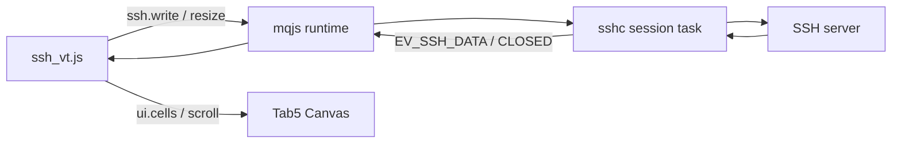

# SSH クライアントと `ssh_vt.js`

Tab5 は、C の wolfSSH client と JS の terminal emulator を組み合わせて SSH
クライアントとして動作します。暗号、socket、session task は C が担当し、
画面、VT parser、タブ、入力処理は更新可能な mqjs app が担当します。

実用 app は [`examples/ssh_vt.js`](../examples/ssh_vt.js) です。

## アーキテクチャ



各 SSH session は独立した task、socket、wolfSSH state、送信 buffer を持ちます。
session data は mqjs event queue を経由して、session を所有する app へ配送されます。

## JavaScript API

現在の API はすべて session ID を第 1 引数に取ります。

| API | 説明 |
|---|---|
| `ssh.connect(host, port, user, passName, hostKeyName[, cols, rows])` | app 専用 Vault の password と host key を使って接続する |
| `ssh.write(id, str)` | server へ送信する |
| `ssh.resize(id, cols, rows)` | pty size を変更する |
| `ssh.close(id)` | session を閉じる |
| `ssh.connected(id)` | shell 接続済みなら true |
| `ssh.onData(id, fn)` | `fn(chunk)` を登録する |
| `ssh.onClose(id, fn)` | `fn(reason)` を登録する |

```js
vault.put("server-password", "password");
var id = ssh.connect("192.168.1.10", 22, "user",
                     "server-password", "server-hostkey", 80, 24);

ssh.onData(id, function (chunk) {
    print(chunk);
});

ssh.onClose(id, function (reason) {
    print("closed:", reason);
});

var wait = setInterval(function () {
    if (ssh.connected(id)) {
        clearInterval(wait);
        ssh.resize(id, 80, 30);
        ssh.write(id, "uname -a\n");
    }
}, 100);
```

session は全 app 合計で最大 3 本です。古い session ID は世代番号で検出され、
別 session を誤操作しません。

## `ssh_vt.js` の機能

- 保存済み host の一覧と接続 form
- 最大 3 session の同時接続と canvas 上のタブ切替
- VT100 系の cursor、erase、SGR 16 色、scroll region など
- `ui.cells()` と `ui.scroll()` による高速な 80 桁描画
- screen size と keyboard 高さから terminal geometry を導出
- pty resize
- Esc、Tab、Ctrl、Alt、Fn、矢印、F1–F12 の control bar
- 長押し選択による clipboard copy
- bracketed paste

背景タブは pixel buffer を持ちません。terminal model と SSH connection だけを
保持し、foreground へ戻ったときに model から再描画します。これは app 全体の
foreground/background ライフサイクルと同じ考え方です。

## 保存とクリップボード

host、port、user は `store` に JSON として保存します。password と承認済み
host key fingerprint は app 単位で隔離された `vault` に保存され、JS へ読み戻す
API はありません。`ssh.connect()` が C 内で直接参照します。

clipboard は system 共有値です。

```js
var clip = clipboard.get();
if (clip && clip.type === "text/plain") {
    ssh.write(id, clip.data);
}
```

`clip_mirror.js` を起動すると clipboard を MQTT 経由で別端末と同期できます。
ブローカーが停止していても、ローカル clipboard と SSH は動き続けます。

## セキュリティ上の制約

- password 認証のみ。
- host key は初回接続時に認証前で拒否し、画面で承認した SHA-256 fingerprint
  を次回以降照合する TOFU 方式。
- Vault は mqjs app 間を隔離するが、NVS / flash 自体の暗号化は別途必要。
- 正当な配布署名鍵で署名された悪意あるコードは脅威モデル外。

公開ネットワークでは初回 fingerprint を必ず別経路で確認してください。

## リソースとバックプレッシャ

- session 上限は全 app 合計 3。
- 各 session は専用 task、socket、wolfSSH state、2 KiB TX buffer を持つ。
- RX event queue が詰まると短時間待ち、terminal output の破損を避ける。
- app が停止すると、その app が所有する session だけを閉じる。
- app が background でも接続と受信は継続する。

## トラブルシュート

| 症状 | 確認する点 |
|---|---|
| `ssh.connect` が失敗する | session 上限、host、port、password、server の host key algorithm |
| terminal が崩れる | server/app が未対応の escape sequence を出していないか |
| 描画が遅い | `ui.text` の per-cell 描画ではなく `ui.cells` を使っているか |
| `stty size` が合わない | `ssh.resize(id, cols, rows)` が呼ばれているか |
| 接続後すぐ閉じる | serial log の wolfSSH handshake/auth reason を確認 |

PC 上で parser だけを確認するときは、`ssh_vt.js` の `SELFTEST` モードを使えます。
