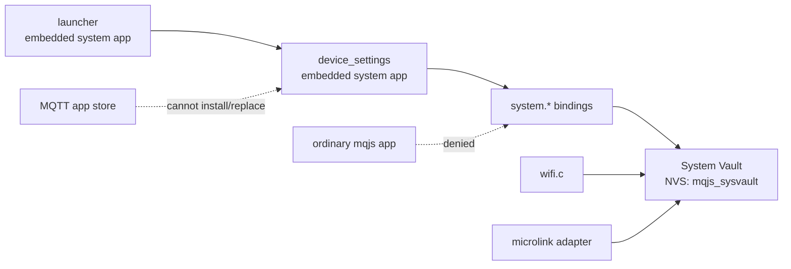

# System Vault とデバイス設定

この文書は、MQTT で配信される通常の mqjs app から分離したデバイス設定、
System Vault、プロビジョニング QR の設計を定める。

## 目的

- Wi-Fi SSID/password と Tailscale auth key を `sdkconfig` ではなく端末上で設定する。
- 秘密値を mqjs app へ読み戻せない System Vault に保存する。
- 設定 UI 自体は既存 Widget API で作るが、MQTT app store から配信しない。
- 初期段階では保存・削除・設定済み表示までを実装し、接続処理は後から接続する。
- 長い値は将来 QR コードから投入できるよう、生成側の wire format を先に固定する。

## 信頼境界



`device_settings` は mquickjs で動くが、通常 app ではない。ソースは
`launcher` と同様に firmware へ埋め込み、embedded registry で system app として
登録する。MQTT、LittleFS、`sys.setAppName()` ではこの信頼属性を取得できない。

## System Vault

App Vault (`vault.put/has/del`) とは namespace と公開 API を分ける。

| 項目 | App Vault | System Vault |
|---|---|---|
| NVS namespace | `mqjs_vault` | `mqjs_sysvault` |
| 所有者 | immutable app source identity | platform services |
| JS write | 所有 app | system app の用途別 API のみ |
| JS read | `has` のみ | configured/status のみ |
| C read | SSH 等の用途別 consumer | Wi-Fi / microlink adapter |

初期キー:

| NVS key | 型 | 上限 | 意味 |
|---|---|---:|---|
| `wifi` | versioned blob | 100 bytes | active SSID/password credential |
| `ts_auth` | string | 255 bytes | Tailscale auth key |

書き込みは値を検証してから行う。Wi-Fi credential は単一 blob として原子的に置換し、
一部だけ更新された状態を作らない。実接続を追加する段階では pending/active の
二段階へ拡張し、接続成功後に active へ昇格する。

秘密値について以下を不変条件とする。

- JS に get API を作らない。
- status、ログ、通知、エラーへ値を含めない。
- C の read API は caller-owned buffer へコピーする。
- consumer は使用後に buffer をゼロクリアする。
- `has` / status は存在だけを返す。
- NVS Encryption、Flash Encryption、Secure Boot は製品 build の別要件とする。

## JS API

グローバル `system` object は全 context に存在するが、呼び出し時に immutable source
kind を検査する。ordinary app からの呼び出しは `TypeError` にする。

```js
system.wifiSet(ssid, password); // bool
system.wifiStatus();            // { configured, ssid, state }
system.wifiForget();            // bool

system.tailscaleSet(authKey);   // bool
system.tailscaleStatus();       // { configured, state }
system.tailscaleForget();       // bool
```

初期実装の `state` は `configured` または `not-configured`。Wi-Fi/microlinkとの接続後は
`connecting`、`connected`、`error`、IP、秘密を含まない `lastError` を追加する。

汎用 `systemVault.set(key, value)` は公開しない。キー追加時に API と validation を
明示的に増やし、通常 app が未知の platform credential を上書きできる面を作らない。

## System app registry

embedded source registry は source と immutable kind を保持する。

```c
mqjs_register_app_source("launcher", source, len);
mqjs_register_system_app_source("device_settings", source, len);
```

`launcher` と `device_settings` は同じ system API を利用できる。`device_settings` は
常駐しないため、開いた時だけ user worker を使う。system kind であることと
KEEP_ALIVE/STOPPABLE policy は別概念であり、初期実装では画面から戻る操作は
`sys.open("launcher")` を使う。worker 不足時は既存 LRU policy に従う。

`device_settings` は `sys.installed()`、store catalog、アンインストール対象に出さない。
ランチャーが固定の「デバイス設定」行から `sys.open("device_settings")` を呼ぶ。

## 設定 UI

トップ画面:

```text
デバイス設定

ネットワーク
  Wi-Fi        未設定 / <SSID>       >
  Tailscale    未設定 / 設定済み     >

この画面は端末ファームウェアに組み込まれています
[ アプリ一覧へ戻る ]
```

Wi-Fi:

```text
Wi-Fi

状態: 未設定
SSID
[                              ]
パスワード
[ •••••••••••••                ]
[ 保存 ]
[ 保存済み設定を削除 ]
[ 戻る ]
```

Tailscale:

```text
Tailscale

状態: 未設定
Auth key
[                              ]
[ 保存 ]
[ 保存済み設定を削除 ]
[ 戻る ]
```

保存済み password/auth key は UI へ戻さない。置換時は新しい値を再入力する。
保存ボタンは空値、長すぎる値を native API 側でも拒否する。初期モックでは「保存済み」
表示までで、接続済みとは表示しない。

## Provisioning QR v1

QR decoder は既存 EAN-13 scanner と別実装になるため初期範囲外。ただし生成・検査
ツールと payload を先に固定する。

QR text:

```text
MQJSP1:<base64url(canonical-json-without-padding)>
```

v1 payload:

```json
{
  "v": 1,
  "id": "setup-20260614-001",
  "exp": 1781395200,
  "device": "tab5-a1b2",
  "wifi": {
    "ssid": "home-wifi",
    "password": "secret"
  },
  "tailscale": {
    "authKey": "tskey-auth-..."
  }
}
```

- UTF-8 JSON を `sort_keys=True`、空白なしで canonicalize する。
- Base64url の `=` padding は除く。
- `v` は必須。未知 version は拒否する。
- `id`、`exp`、`device` は任意。decoder 実装時に再利用、期限、対象端末を検査する。
- `wifi` と `tailscale` は少なくとも一方を含める。
- QR は暗号化ではない。表示・画像・印刷物を credential として扱う。
- QR生成側は最低3 pixel/moduleで表示する。combined payloadは400x300解析面上で
  辺220px以上を目安にする。詳細は
  [`qr-read-performance.md`](qr-read-performance.md)を参照する。

初期 v1 は署名なしで、端末確認画面を必須とする。署名を追加する場合は envelope を
`MQJSP2` とし、既存 v1 の意味を変更しない。CBOR は QR 容量が実測上問題になった時に
v2 の候補とする。JSON v1 は Python と端末側双方の parser/debug を単純にする。

Python tool:

```powershell
uv run tools/mqjs_provision_qr.py create --ssid home-wifi `
  --tailscale-auth-key tskey-auth-... --output provision.png

uv run tools/mqjs_provision_qr.py inspect --text "MQJSP1:..."
```

秘密を shell history に残さないため、password/auth key は引数省略時に `getpass` で
対話入力する。password なしの AP は `--open-wifi` で明示する。PNG/SVG生成は任意
dependency `qrcode` がある場合だけ行い、`--text-out`
では dependency なしで wire text を生成できる。

## 実装フェーズ

### Phase 1: この変更

- System Vault C API と PC fallback
- immutable system source registry と system-only JS API
- embedded `device_settings` app
- launcher の固定導線
- QR v1 の生成・inspect tool
- security/round-trip host tests

### Phase 2: Wi-Fi 実接続

- `sdkconfig` credential 依存を廃止
- boot 時に System Vault から active credential を読む
- 未設定時にも launcher/settings を起動
- scan、pending 接続、成功時 active 昇格、旧設定 rollback
- status/event API

### Phase 3: microlink

- microlink adapter と lifecycle task
- auth key の消費・保持方針を microlink の永続状態仕様に合わせる
- Tailscale IP、hostname、状態、logout/re-auth

### Phase 4: QR 読み取り

- QR decoder component
- system app 専用 one-shot scan API
- v1 parser、期限/対象確認、秘密を伏せた確認画面
- 明示確認後に用途別 API へ投入

## 検証基準

- ordinary app は `system.*` を呼べない。
- `sys.setAppName("device_settings")` でも認可されない。
- `device_settings` は System Vault を set/has/delete できる。
- JS、status、ログに秘密値が戻らない。
- Wi-Fi の片方だけが存在する状態を configured と判定しない。
- QR tool の create/inspect round trip が一致する。
- QR tool は秘密値を通常出力へ表示しない。
- firmware build と既存 PC smoke tests が通る。
