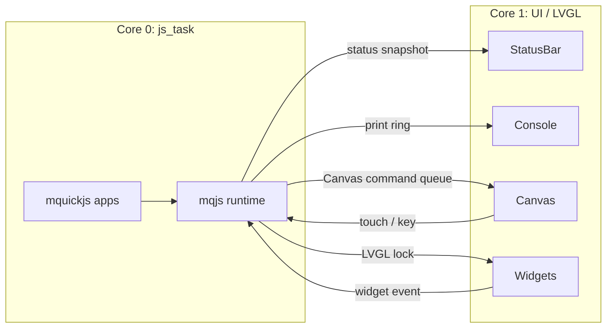

# Tab5 UI アーキテクチャ

この文書は、現在の Tab5 UI 実装の責務、データフロー、拡張時の注意点を説明します。
JS app からの使い方は [`widget-framework-design.md`](widget-framework-design.md) を
参照してください。

## 役割

Tab5 UI は次の 4 層を提供します。

- 常時表示の StatusBar とシステム操作
- `print()` を表示する Console
- JS app が使う Canvas
- JS app が使う LVGL Widget

UI 実装は `components/ui_tab5` に閉じ込め、main と mqjs には C API だけを公開します。
Mooncake は StatusBar、ConsoleApp、CanvasApp の lifecycle/update に使い、
smooth_ui_toolkit は StatusBar のアニメーションなどに限定して使っています。

## タスクとデータフロー

重要な不変条件は、JS context に触れるのが `js_task` だけであることです。UI task
から JS callback を直接呼ばず、必ず mqjs event queue を通します。

## システム UI

StatusBar は LVGL の top layer にあり、app の screen 切替やアニメーションの影響を
受けません。

- Wi-Fi、MQTT、foreground app、直前 app、通知を表示する。
- 長押しで launcher を開く。
- 通知タップから発信 app を開く。
- キーボードを畳むと、同じ領域に stats、clipboard preview、明るさ操作を表示する。

システム UI は C が所有します。app 固有の状態や操作は JS app 側へ置いてください。

## Console

Console は `print()` と runtime error をシリアル出力と画面へ tee します。

- 最大 200 行を保持する。
- UTF-8、日本語、ANSI SGR 16 色を扱う。
- producer は短時間のコピーだけを行い、UI 描画を待たない。
- app ごとの出力は同じ Console に表示される。

## Canvas

Canvas は RGB565 の PSRAM buffer と、深さ 128 の command queue を使います。
Canvas command は UI task がまとめて処理します。

- 論理解像度は `ui.size()` で取得する。
- `rect`、`line`、`pixel` は buffer へ直接描画する。
- `text` は LVGL font renderer を使う。
- `cells` は端末用等幅 font を直接描画する。
- `scroll` は buffer の移動で高速に処理する。

queue が満杯の場合は command を drop し、JS task を待たせません。描画負荷の高い
app は、コマンドをまとめるか複数 tick に分割します。

## Widgets

Widget 操作は同期読み取りが必要なため、command queue ではなく LVGL lock 下で
処理します。screen tree をまとめて破棄できるよう、LVGL C API を直接使います。

app が background へ移ると Widget と Canvas は破棄されます。timer、MQTT、SSH
などの処理は継続するため、foreground 復帰時に JS モデルから UI を再構築します。

## パネル、タッチ、フォント

- 画面はネイティブ縦 720x1280。
- パネル個体差として ST7121、ST7123、ILI9881C を検出する。
- タッチは ST7123 または GT911 を使い、LVGL input device と mqjs event の両方へ渡す。
- 通常 UI は日本語対応 Noto Sans CJK JP font を使う。
- 端末は 80 桁表示用の HackGen Console 等幅 font を使う。
- LVGL の 3 MiB memory pool は PSRAM に置く。

## Stamp-P4 との互換性

Stamp-P4 や UI 無効 build では `ui_tab5` の公開 API は stub になります。
同じ JS app を動かす場合は `ui.size()` が `[0, 0]` か確認し、UI がなくても本体処理が
動くようにします。

## 拡張時の原則

1. JS context を UI task から触らない。
2. task 間で渡す文字列と payload の所有権を明確にする。
3. 高頻度処理は Canvas queue、同期値が必要な操作は LVGL lock を使う。
4. app 固有 UI を system UI へ入れない。
5. background app が UI resource を保持する前提にしない。
6. Stamp-P4 の stub build を壊さない。

## トラブルシュート

| 症状 | 確認する点 |
|---|---|
| app 復帰後に画面が空 | `sys.onForeground()` で再構築しているか |
| Canvas の一部が欠ける | command queue へ一度に送りすぎていないか |
| UI が重い | per-cell `ui.text()` ではなく `ui.cells()` を使えるか |
| タッチが動かない | JS I2C が touch 用 pin 31/32 を奪っていないか |
| Stamp-P4 で app が終了しない | UI callback を画面なし環境でも登録していないか |
| memory が減り続ける | `sys.heap()` と screen/callback の保持を確認 |
