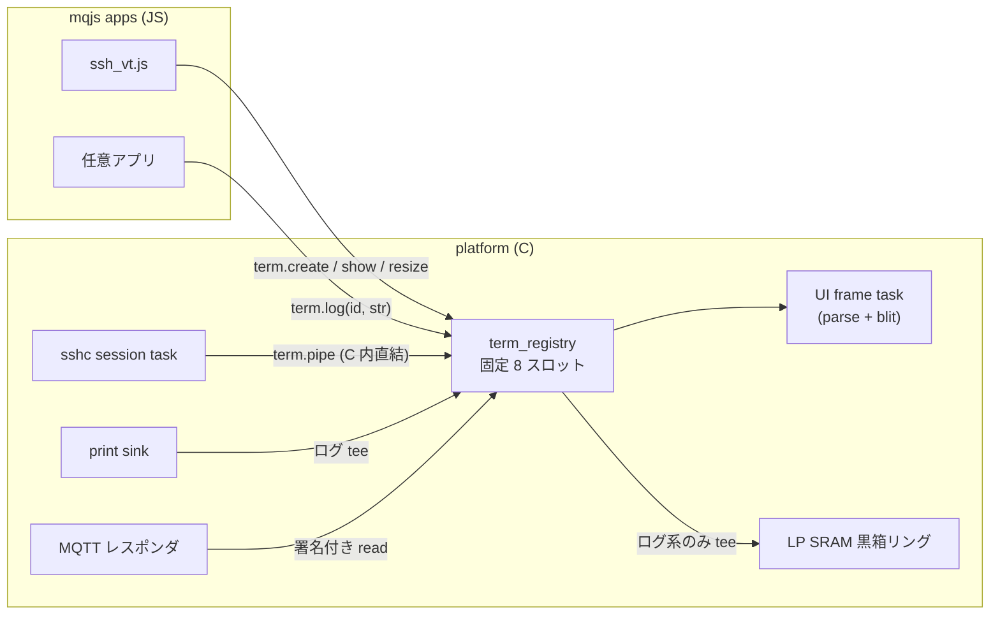

# ネイティブターミナルコンポーネント `term.*` 設計

mqjs アプリが共通で使えるターミナル/コンソール画面を、C のプラットフォーム
コンポーネントとして提供する。`ssh_vt.js` の VT エミュレータ(実機検証済みの
設計図)をネイティブ化し、ログビューとフル VT の両方を 1 つのコアで賄う。

Status: 設計確定・実装前。

## 1. 背景 — 現状は統合されていない

2026-07-29 の調査結果:

- テキスト描画面が 3 系統ある。①システムコンソール(`ConsoleApp`、LVGL
  ラベル積み、プロポーショナルフォント、`print()`/`console.log` のシンク)、
  ②`ui.cells` セルレンダラ(HackGen 等幅 9×24、PPA、描画プリミティブのみ)、
  ③`ui.text`/`ui.overlay`(canvas ラベル)。共有部品は
  `ui_cell_width.h`(60 行)だけ。
- VT エミュレータ本体は JS(`examples/ssh_vt.js` 1,703 行中 ~850 行が端末配管)。
- 重複: ANSI/SGR パーサ ×2(C `sgr_apply` / JS `applySGR`)、16 色パレット
  ×3(ui_tab5.cpp / ssh_vt.js / skk_test.js、16 進値まで同一)、全角 CONT
  折り返し ×2(ssh_vt `feed()` / skk_test `relayoutText()`)、relayout 定型文 ×5。
- mquickjs にモジュール機構が無くアプリは 1 ファイル署名単位のため、JS 側での
  共有は構造的に不可能。共有はコピペ+出典コメントのみ。
- 現行 ssh_vt.js にはスクロールバックが無い(行モデルは画面分のみ)。

## 2. 要件

1. **汎用 console 画面** — どのアプリからも `console.log` 的に使える
2. **ハング隔離** — アプリの JS が無限ループ/例外/ハングしてもロギング・
   描画・プローブは止まらない
3. **メモリ安全** — リーク・オーバーフロー・断片化が構造的に起きない
4. **セッション保存** — アプリ停止/evict を跨いでセッションを保持・再アタッチ
   できる(tmux モデル)
5. **フル VT** — SSH で neovim が動く水準(alt screen、スクロールリージョン、
   SGR 256/truecolor、端末応答)。極端には Wiz やブロック崩しが表現できる
6. **外部プローブ** — MQTT 経由で画面/履歴を実機に触れず読める。
   クラッシュ後も直前のログが読める
7. **L2 SRAM を消費しない** — size-diet で取り返した内部 SRAM に手を付けない

## 3. アーキテクチャ

### 3.1 所有モデル: プラットフォームレジストリ



term はアプリの持ち物ではなく **C 側レジストリの固定スロットオブジェクト**。
アプリは `term.create()` で id を受け取るだけで、実体はアプリの JS ヒープ・
アリーナ・ライフサイクルから完全に分離される。

```c
typedef struct {
    uint8_t  in_use;
    uint32_t generation;      // slot 再利用の ABA 対策(解放ごとに ++、28bit 使用)
    char     name[16];        // persist 再アタッチ用(owner 名前空間内で一意)
    char     owner[16];       // 所有アプリ名(署名済み push 由来 = 信頼可能)
    uint8_t  persist;         // アプリ停止後も生存
    uint8_t  mode;            // TERM_VT / TERM_LOG
    // …grid, scrollback, byte-ring, dirty, viewport, pipe 接続元
} term_t;
```

**id は生スロット番号ではなく `(generation << 3) | slot`(slot 3bit +
generation 28bit、int32 正数に収まる)。** 8bit 世代だと 256 回の
create/close で wrap して ABA 対策が長期運用で崩れるため、28bit を使う
(1 日 100 回の再接続でも wrap まで 7,000 年)。 全 API(read 系
だけでなく `feed`/`log`/`pipe`/`resize`/`close` の書き込み系も)が呼び出しごとに
「generation 一致 + owner 一致」を検証し、不一致は即エラー。これで
(a) 他アプリが id を総当たりして書き込む経路、(b) 解放→再利用後に古い id で
別アプリの term に書き込む ABA、の両方が塞がる。`name` は **owner ごとの
名前空間**(レジストリのキーは `owner+name`)なので、他アプリの同名 create が
先取りで枠を塞ぐ squatting は構造的に起きない。

- **ハング隔離**: ingest(ssh 受信タスク/print シンク)と描画(UI フレーム
  タスク)は全てプラットフォームタスク上。JS バインディングは「コピーして
  即返る」だけで、JS が term のロックを跨いで保持することは無い。
- **VT のスクロールバックも論理行で持つ**: grid の各行に soft-wrap フラグを
  持ち、上端から押し出すときに soft-wrap で繋がった行を 1 本の論理行に結合
  してからスクロールバックへ入れる。表示時に現在幅で再折り返しするのは
  TERM_LOG と同じ経路。これで**回転(cols 変化)後も VT のスクロールバックが
  旧幅の折り返し境界のまま化けない**(旧幅固定で保存すると、シェルに戻って
  履歴を見た瞬間にズレる)。
- **ライフサイクル**: 非 persist の term は app-manager の teardown フック
  (widget retain-stack の掃除と同じ場所)で自動解放。persist は生存し、
  **同一 owner のみ** 同名 `create` で再アタッチできる(別アプリが同名 create
  で他人のセッションを読む穴を塞ぐ)。persist スロット上限は初期値 4
  (実機メモリ実測後に調整)。
- **解放時の quiesce プロトコル**(teardown / `close` 共通、**非同期 2 段**):
  - **第 1 段(呼び出し側、js_task 上)**: スロットを DYING にマークし新規
    ingest を拒否、pipe 接続があれば producer(ssh rx task)へ detach を
    通知(recv ブロック中でも起きるよう **socket を shutdown() して叩き
    起こす** — rapid-reopen UAF 修正 e1928c7 と同じ手)。**ここで一切
    待たずに即 return する。** js_task は全 worker 共有の単一タスクなので、
    ここで join すると term 解放という日常操作が全アプリの JS を止める
    経路になる。
  - **第 2 段(プラットフォーム側 reaper、js_task 外)**: producer の
    detach ack と UI タスクの drain 完了を **タイムアウトキャップ付き
    (3s、microlink 前例と同じ)** で join し、揃ったら generation++ して
    スロットを解放。**タイムアウトした場合は ZOMBIE として放置する** —
    メモリは保持したまま再利用しない(132KB のリークを選び、UAF は選ば
    ない)。ack が遅れて届けば reaper が後から回収する。ZOMBIE 数は
    カウンタで可視化。
  - blind vTaskDelay は使わない(microlink shutdown の教訓)。これで
    「teardown が free した直後に ssh rx が 1 バイト書く」UAF 窓と、
    「join 待ちが js_task を無期限に道連れにする」窓の両方が閉じる。
- **persist の回収経路**: (a) 所有アプリ自身の `term.close`、(b) 署名付き
  管理リクエストによる強制 close(動かなくなったアプリの枠を回収する管理者
  手段)、(c) persist 枠が満杯で新規 create が来たら **最も長くデタッチされて
  いる persist を evict**(LRU)。「二度と起動しないアプリが枠を永久に食う」
  状態から自動回復できる。

### 3.2 2 モード 1 コア

| | TERM_VT | TERM_LOG |
|---|---|---|
| 用途 | ssh_vt、フルスクリーン TUI | 汎用 console、probe ログ |
| 一次ストア | **grid**(カーソルアドレッシング) | **スクロールバック**(論理行) |
| grid の位置づけ | 本体(main+alt の 2 面) | 現在幅で折り返した末尾ビュー |
| 回転時 | pty resize 通知 → リモートが再描画 | 論理行から再折り返し |
| スクロールバック | 上端から押し出された行を**論理行として**格納 | 本体 |
| alt screen | あり(履歴を汚さない) | なし |
| LP 黒箱 tee | **しない**(クラス B データ) | する(クラス A データ) |
| 溢れ時 | consume 停止 → SSH フロー制御で背圧 | 行単位アトミック drop + カウンタ |

## 4. メモリ設計

### 4.1 配置と数値(1 インスタンス)

| 領域 | サイズ | 置き場所 | 備考 |
|---|---|---|---|
| grid(TERM_VT: main+alt 2 面 / TERM_LOG: main 1 面のみ) | 12B × 4,260 セル × 2 ≈ 102KB(LOG は 51KB) | PSRAM | セル数最悪値(縦 80×53 / 横 142×30)で確保 → 回転時 realloc なし。LOG に alt screen は無いので確保しない |
| スクロールバック アリーナ | 48KB | PSRAM | 可変長論理行、リング |
| スクロールバック index | 8B × 1,024 行 = 8KB | PSRAM | |
| 折り返しメモ | ~1KB | PSRAM | relayout 時の逐次読みのみ |
| 入力バイトリング | 8KB | PSRAM | producer → parser |
| パーサ状態 | 数百 B | UI タスク側静的領域 | |

計 ~167KB/インスタンス(VT)× 8 スロット ≈ 1.3MB 上限(PSRAM 32MB に対し
許容)。**L2 SRAM の新規消費は実質ゼロ。** スロット数 8 の根拠: worker 上限
4 に対し、ssh_vt が複数セッション(実績 ×3)を張る + システムコンソール +
予備。

**サイジングの検証条件**: LOG モードの利用が支配的なら実効はこれより軽い。
実機実測(§12)まで 1MB を予算上限として扱う。

セルは 12B 固定:

```c
typedef struct {
    uint32_t cp;       // codepoint(CONT セルは sentinel)
    uint16_t fg, bg;   // RGB565 直値(canvas と同形式)
    uint16_t flags;    // bold/reverse/underline/wide/dirty 等
    uint16_t _pad;
} term_cell_t;         // 12B
```

**色は 256 パレット index ではなく RGB565 直値で持つ。** 最終出力の canvas が
RGB565 である以上、SGR の 16/256 色はパレット→565 展開、truecolor は
565 への丸めを ingest 時に行えば、**表示装置に対して無損失**になる
(`termguicolors` の neovim テーマも、パネルが出せる色は全部出る)。
256 パレットへの量子化(現行 ssh_vt.js の方式)はパネル能力を下回る劣化
だったので採らない。セル 8B→12B の代償は grid +50%(下表)だが PSRAM
予算内。

### 4.2 「起きようがない」ための規則

- **全確保は `term.create()` 時に一回**、PSRAM プールから。実行中の
  malloc/realloc はゼロ → リーク・断片化の経路が存在しない。
- リング(スクロールバック/バイトリング/黒箱)は満杯時に最古を落とすか
  受け入れを止めるかのどちらかで、**書き込み側が境界を越える経路が無い**。
- 解放は app-manager teardown フック(非 persist)と明示 `term.close`
  (persist)の 2 経路のみ。

### 4.3 grid を PSRAM に置く根拠(帯域内訳)

全面再描画の最悪ケース 1 フレーム: grid 読み 51KB、フォントグリフ読み
~460KB、canvas RGB565 書き込み 1.8MB。grid はピクセル書き込みの 3% 未満で
律速はピクセル側(既に PPA で対処済みの領域)。行単位の逐次読み
(142×12B=1,704B 連続)でキャッシュにも素直。一方 L2 に置くと 102KB —
size-diet の獲得分(69KB)とほぼ同額を、効かない場所に使うことになる。
確保は 1 箇所にし、実機プロファイルで grid が見えたら動かす(1 行の変更)。

### 4.4 LP SRAM 黒箱リング(フライトレコーダ)

LP SRAM 32KB は HP コアから遅い(LP バス経由)ため高速バッファには不適だが、
**panic・WDT・ソフトリセットを跨いで内容が残る**(`RTC_NOINIT_ATTR`、
電源断以外)。これを常時稼働のログ末尾リングに使う:

```
LP SRAM 32KB: { magic, boot_seq, head, crc } + 生 UTF-8 ログ末尾リング (~31KB)
```

- ingest がスクロールバックに書くついでに同じバイト列を tee(SGR は除去、
  逐次追記のみなので遅いバスでも数 KB/s は無視できる)
- 対象は**クラス A(ログ系)のみ**。SSH セッション内容(クラス B)は決して
  入れない(量・プライバシー両面)
- 再起動後、magic+CRC 検証済みの前ブート分を署名付き pull で読める
  (`lastboot`)。「WDT が落とす直前に何が出ていたか」が事後に分かる
- 将来の deep sleep 導入でも保持される

#### セキュリティレベルの混在について

黒箱にはシステムアプリとユーザーアプリのログが**意図的に混在する**
(クラッシュ調査で一番読みたいのはハングしたユーザーアプリの直前ログなので、
ユーザーアプリを除外すると機能が骨抜きになる)。その上で:

- **主脅威は追い出し DoS**: 単一リングだと饒舌な/悪意あるアプリのスパムが
  システム側の「最後の言葉」を押し流す。対策として **2 区画に静的分割**:
  システム区画 8KB(プラットフォームイベント・panic 理由・boot マーカー・
  システムアプリ)+ アプリ区画 23KB(ユーザーアプリの print / term.log)。
  書き手ごとの動的クォータは複雑さに見合わないので採らない。
- **レコードヘッダに `{writer_id, class}` の構造的タグ**を持つ(プレフィクス
  文字列のパースはしない)。writer_id はアプリ名 — 署名済み push 由来なので
  信頼できる識別子。将来読み手が多元化(tailnet 越し・複数鍵)したときの
  出所別フィルタの土台。
- **アプリ開発者への契約**: `print()`/`term.log()` はクラス A =
  リセットを跨いで保持され、署名付き pull でアップロードされ得る。秘密
  (vault の値など)を print しないのは書き手側の責務。
- 機密性の面は現状単一信頼ドメイン(読み手 = 単一 Ed25519 鍵 = デバイス
  所有者)なので、区画別暗号化や複数鍵の権限分離は**入れない**
  (タグがあるので後付け可能)。preedit は term 状態に入らず(§10.2)、
  SSH セッションはクラス B で黒箱対象外 — どちらも構造的に遮断済み。

## 5. データパス

```
producers                      consumer (UI frame task)
─────────                      ────────────────────────
ssh rx task ── C 内直結 ──┐
JS term.feed/log ─ copy ──┼─→ byte-ring ─→ [drain] parse → grid 更新
print sink ── ログ tee ───┘                → dirty 行集合 → blit → canvas
```

- **パースは UI フレームタスクの drain 時**に行う。grid が single-writer に
  なりロック不要。neovim の redraw 嵐は「溜まった分を全部パースして 1 回
  描く」= 自然なフレームスキップで常に最新画面。
- producer 側は bounded wait のみ: JS/print は 20ms タイムアウトで
  drop+カウンタ(ロギングが誰かを待たせない)。ssh パイプは満杯なら
  consume を止め SSH ウィンドウで背圧(エスケープ列を千切らない)。
- `term.pipe(id, sshHandle)` 接続時、**バイト列は JS ヒープに一度も入らない**。
  JS は接続とタブ切替の指揮のみ。
- **バイトリングは SPSC を強制する**: VT term の producer は pipe か
  `term.feed` の**どちらか一方**。pipe 中の `feed` はエラー、再 pipe は
  旧接続の detach(ack join、§3.1 の quiesce と同じ手順)を済ませてから
  新接続を張る。producer が常に 1 本なので head/tail 更新の競合が
  存在しない。TERM_LOG への `term.log`/print シンクは行単位アトミックの
  mutex 越し ingest なので複数書き手でも安全(こちらはリング直書きではない)。
- **`term.resize` も UI タスクへの post で実行する**: cols/rows は UI タスク
  だけが書く。パース中に別タスクが寸法を書き換えて境界判定が torn read に
  なる経路を持たない。
- **パーサの実行は共有 UI(LVGL)タスク上なので、暴走は全アプリの描画を
  巻き込む SPOF になる**。よってパーサに以下の hard bound を構造として課す:
  - 1 バイトの処理は必ず O(1)(状態機械にループを持たない)。数量系
    パラメータ(REP・IL/DL・ICH/DCH の反復数、カーソル移動量)は
    **grid 寸法で clamp** — 「2^31 行挿入」は rows 分の仕事にしかならない
  - CSI パラメータは個数 ≤16・値 ≤65535 で打ち切り(実端末と同じ上限)、
    OSC/DCS 本文は長さ上限で捨てる
  - **drain は 1 フレームあたりのバイト予算制**(term ごと)。予算を使い
    切ったら残りは次フレームへ持ち越し、他 term と LVGL の時間を食わない
  - フェーズ 1 のホストテストに**パーサの fuzz**(ランダム/敵対的バイト列で
    無限ループ・領域外・状態崩れが無いこと)を含める。壊れた pty やリモートの
    悪意ある出力は「来るもの」として扱う

## 6. VT 機能範囲

ssh_vt.js が既に持つ範囲を基準に、C 化で追加するものを含めて:

| 機能 | 出典 | 備考 |
|---|---|---|
| ESC/CSI/OSC/DCS ステートマシン | ssh_vt 移植 | GROUND/ESC/CSI/OSC/CHARSET/CSI_IGNORE/DCS |
| カーソル操作・ED/EL・ICH/DCH/IL/DL | ssh_vt 移植 | |
| スクロールリージョン | ssh_vt 移植 | |
| SGR 16/256/truecolor | ssh_vt 移植+改良 | パレットはここに一本化(×3 解消)。格納は RGB565 直値(§4.1)なので truecolor もパネル能力の範囲で無損失 |
| 全角 CONT セル | ssh_vt 移植 | `ui_cell_width.h` を継続使用 |
| bracketed paste (2004) | ssh_vt 移植 | |
| **UTF-8 分割耐性** | **新規** | パケット境界で千切れたマルチバイト列を継続バッファで結合。現行 ssh_vt.js はサロゲート結合のみで未対応 — 日本語ファイル名/vim ステータス行で現実に踏むバグを移植時に直す |
| **alt screen (DECSET 1049)** | **新規** | neovim 必須。grid 2 面の理由 |
| **カーソル表示/非表示 (25)** | 新規 | |
| **端末応答 (DSR 6n / DA)** | **新規** | pipe 時は C 内でチャネルへ直接書き戻し。JS フィード時は `term.onReply` |
| reverse / bold | 新規 | fg/bg スワップ / 明色パレットマップ(blitter 変更なし) |
| underline | 新規 | セル flags + blitter に 1 本線描画(小規模) |
| マウスレポート (1000/1006) | **後回しフェーズ** | `ui.onTouch` からの変換。neovim マウス/ゲーム向け。要件の「ブロック崩し」をタッチ操作で満たすのはこのフェーズ完了時(それまではキー操作ゲームまで) |

## 7. プローブとアクセス制御

### 7.1 データ分類

- **クラス A(ログ系)**: TERM_LOG + print シンク。LP 黒箱に tee され、
  プローブ対象。
- **クラス B(対話セッション)**: ssh パイプ接続の TERM_VT。LP には入らず、
  読み出しは署名ゲート必須。

### 7.2 読み手とゲート

| 読み手 | 対象 | ゲート |
|---|---|---|
| 所有アプリ(`term.read`/`snapshot`) | 自分の term のみ | なし |
| 他アプリ | — | **API 自体が無い**(クロスアプリ読み出し経路ゼロ) |
| MQTT レスポンダ | 任意 term + 黒箱 + lastboot | **Ed25519 署名リクエスト**(app push と同じ鍵) |
| 起動時 lastboot | 黒箱の前ブート分 | 自動 publish しない。署名付き pull のみ |

- 署名リクエストは単調カウンタを含めて署名し、デバイスは最後に受理した値
  より大きいもののみ通す(リプレイ対策。tailnet 越し運用を見据えて最初から
  入れる)。**受理済みカウンタの高水準マークは NVS に保存する — LP SRAM
  には置かない**。LP は電源断で消える(§4.4)ので、そこに置くと電源断 1 回で
  盗聴済みリクエストが再生可能になる。受理は低頻度なので NVS commit を
  受理ごとに同期実行してよい(NVS の遅延 commit に期待値を置かない)。
- スナップショット要求は MQTT タスクから grid を直接読まず、**UI タスクの
  キューに post しフレーム境界でシリアライズして返信**。ロック競合ゼロ・
  常にフレーム一貫。UI タスクはプラットフォーム所有なのでアプリのハングと
  無関係に応答できる。post に載せた id は**実行時点で generation を再検証**し、
  post〜実行の間に teardown/再利用が挟まった場合はエラー返信(古い要求が
  別アプリの新 term を読む誤配信を塞ぐ)。
- フォーマット: 行ごと UTF-8(CONT セルはスキップ、既定で属性なし)。
  画面最大 ~14KB。スクロールバックは `from/n` チャンク取得。読み出しは
  無変異(probe が測定対象を変えない)。
- 永続化(NVS/ファイル書き出し)はシリアライザの出力先変更だけなので
  後付けフェーズ。

## 8. JS API

```js
var id = term.create({name: "ssh0", persist: true, mode: "vt"});
                                   // 同名+同一 owner なら再アタッチ
term.show(id, {x, y, w, h});       // アプリ画面内の表示領域(タブ切替 = show の付け替え)
term.feed(id, bytes);              // JS からの生バイト(VT 解釈あり)
term.log(id, str);                 // 行指向・lossy・改行付き convenience
term.pipe(id, sshHandle);          // ssh チャネル直結(JS 非経由の本命)
term.onReply(id, cb);              // DSR 等の端末応答(pipe 時は不要)
term.resize(id, cols, rows);       // pty への通知は呼び出し側の責務
term.snapshot(id);                 // 画面全体をテキストで
term.read(id, from, n);            // スクロールバックのチャンク読み
term.close(id);
```

エラー規約: 全 API は呼び出しごとに generation + owner を検証し(§3.1)、
close 済み/再利用済み/他アプリの id は例外ではなく **エラー戻り値**で返す
(ターミナルのエラーでアプリを落とさない)。pipe 中の `feed` はエラー(§5)。

追加には ROM ヘッダ regen(`gen/mquickjs_atom.h` / `device_stdlib.h`)が必要。

## 9. 性能: ネイティブ化が効く場所(大きい順)

1. **データパスから JS を排除** — 現行: C(wolfSSH) → JS 文字列 → per-byte
   `charCodeAt` → JS 行配列 → `ui.cells` 文字列組み立て → C(blitter)。
   pipe 後: C 内で完結。
2. **per-byte 処理がインタプリタから C へ** — mquickjs は JIT 無し。1 バイト
   数十〜数百 VM 命令 → C で数サイクル。加えて term コアの TU は
   `-fno-jump-tables` を個別解除する(switch 主体、IRAM 不要、IDF 公認)。
3. **ui_post_bg キュー渋滞の解消** — 描画ランごとの heap 文字列確保+
   キュー投入(深さ 128、溢れ drop)が消える。
4. **JS ヒープ/GC の解放** — 行モデル(イミュータブル文字列)がパック済み
   C 配列へ。

描画は既存 `ui.cells` の blitter(`blit_glyph`/`compose_glyph_a8`、PPA、
`scroll` の memmove)を再利用し、dirty 行だけ blit する。

## 10. IME 設計との整合

[keyboard-ime-unification.md](keyboard-ime-unification.md)(`ime_core` 新設、
案 A = C が IME を全部持つ)と同時期に進むため、境界を最初から揃える。

### 10.1 入力と出力の分離

term は**出力面のみ**。キーの経路は `kbd_core → ime_core → アプリ (ui.onKey)
→ ssh.write` のままで、term はキーに一切関与しない。IME の「キーを渡す順序」
(ESC/矢印は skk より後、`"\x00ime"`/`"\x00rotate"` は前)は `ime_core` の
責務であり、term 側に順序の知識を持ち込まない。

### 10.2 preedit は term の状態に入らない

IME 設計の「preedit を確定前に外へ出さない」のターミナル版として:

- preedit は **grid にもスクロールバックにも LP 黒箱にもスナップショットにも
  入らない**。term が保持するのは確定済みバイト列だけ。プローブが打鍵途中の
  未確定文字列を拾うことも構造的に無くなる。
- preedit の描画は `ime_core` が担う(§6.1 の span 塗り分けを含む)。
  アンカーの配線は IME 設計 §7 の決定(**`ui.caret(x,y,h)` イベント駆動**、
  変化時のみ通知)に**そのまま乗る**: ネイティブ term は drain 中に自分の
  カーソルが動いたら、JS アプリが `ui.caret` を呼ぶのと同じプラットフォーム
  側 caret シンク(`ui_tab5`)へ C-to-C で更新を push する。`ime_core` は
  そのシンクを読むだけで、term を知らないし、term も ime を知らない
  (両者の接点は `ui_tab5` の caret 状態のみ)。問い合わせ型
  (`term_cursor_pos()` を ime がポーリング)は姉妹設計のイベント駆動方針と
  食い違うので**採らない**。現行 3 アプリが各自で書いている `imeFloat()` の
  アンカー計算はこの経路に一本化される。
- 依存方向: term → `ui_tab5`(blitter で既存)、`ime_core` → `ui_tab5`。
  層は `skk_core → ime_core → kbd_core → 入力面` に対し、term は出力側の
  兄弟であり循環しない。

### 10.3 その他の整合点

- **モード表示**: IME 設計 §6.2(制御バー「あ」キーの面で表す)に乗る。
  term はモードセルを予約しない(ssh_vt がタブバー右端 4 セルを取り戻すのと
  同じ判断をネイティブ term でも維持)。
- **bracketed paste**: term の DECSET 2004 対応は「リモートがモードを
  切り替える」側の実装。IME 確定文字列を 2004 で囲まない(vim の insert 中に
  paste が入り切りされる)という既存ルールは入力側(`ime_core`/アプリ)の
  責務で、term は関知しない。
- **canvas アプリの IME opt-in**(IME 設計 §7.2): `term.show` が IME を
  自動で有効にすることは**しない**。端末アプリは IME が欲しいがゲームは
  要らない、という区別はアプリの明示 opt-in のまま。

### 10.4 フェーズの噛み合わせ

**I1(`ime_core` 新設)/ I2(ssh_vt の新契約移行)は、term フェーズ 4
(ssh_vt 移植)より先に済ませる。** さもないと ssh_vt.js の旧 IME 配管
(6 項目)を term 移植時にもう一度触ることになる。逆に term フェーズ 1〜3
(VT コア・ログモード・黒箱/プローブ)は IME と完全に独立で、どちらが先でも
よい。両方が終わった後の ssh_vt.js に残るのは、タブ・セッション管理・
選択/クリップボードだけになる。

## 11. 実装フェーズ

1. **VT コアをホストで単体テスト** — パーサ+grid は I/O 非依存の純ロジック。
   ssh_vt.js の挙動を期待値にしたテストベクタで先に検証(新規プリミティブは
   ホスト → デバイス smoke → UI 統合の順)。
2. **TERM_LOG + `term.*` バインディング + ROM regen** — 汎用 console 画面と
   いう当初動機をここで回収。実機検証は append-only 分のみで済む。
3. **LP 黒箱リング + MQTT レスポンダ(署名ゲート込み)** — lastboot 読み出し
   まで。**前提: LP SRAM の保持特性を先に実機 probe で検証する**(panic /
   task WDT / int WDT / `esp_restart` / brownout の各 reset cause で
   `RTC_NOINIT_ATTR` 領域が残るかを magic+CRC で確認する 30 分級の使い捨て
   probe)。ESP32 系には reset cause によって RTC ドメインごと消える前例が
   あり、黒箱はこの前提の上に建つので、未検証のまま実装しない。消える
   cause があれば「その cause では lastboot 無し」と契約に明記して縮退。
4. **ssh_vt.js の段階移植**(前提: IME 側 I1/I2 完了 — §10.4)— ネイティブ
   path が device-verified になるまで現行 ssh_vt.js は残す。タブ・
   選択/クリップボードの chrome は JS のまま(選択は grid 読み出し API で
   足りる)。IME は `ime_core` に移っている前提なので term 側では扱わない。
5. **後回し** — マウスレポート、スナップショットの NVS/ファイル永続化。

## 12. 未決事項

- persist スロット上限(初期値 4、実機メモリ実測後に確定)
- `term.show` の領域指定と `ui.*` canvas 描画の合成順(term 領域を canvas の
  上に重ねるか、canvas の一部として blit するか — 実装時に既存 CanvasApp の
  dirty 管理を見て決める)
- ~~黒箱リングの SGR 除去をどこでやるか(ingest 時に属性ラン化した後なら
  素のテキストは手元にあるはず — 実装時に確認)~~ → **決着(フェーズ 3)**:
  「属性ラン化」の段階は実装に存在しない(ingest は生バイトをリングへ写すだけで、
  パースは UI タスクで cell を作る)。除去は行指向 ingest の tee 内、
  `term_lp_ring_append()` で行う。SGR だけでなくエスケープ列全部を落とす
  (黒箱は読み手の端末に印字されるので、残せば print() から端末制御を
  注入できてしまう)。詳細は components/term_core/PHASE3_MANIFEST.md §2
