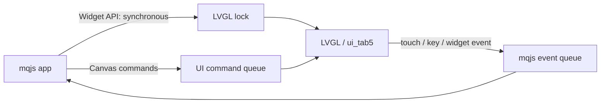

# mqjs Widget UI ガイド

この文書は、Tab5 上で mqjs app の画面を作るための実装済み API とライフサイクルを
説明します。画面構築には LVGL のウィジェットを使い、高頻度描画には別の
キャンバス API を使います。

## どちらを使うか

| UI | 向いている用途 | 主な API |
|---|---|---|
| Widget | 設定、フォーム、一覧、操作パネル | `ui.screen`, `button`, `field`, `list` |
| Canvas | 端末、グラフ、ゲーム、連続描画 | `ui.cells`, `rect`, `line`, `text`, `scroll` |
| Hybrid | 描画画面に設定ページを追加 | 両方 |

Widget は LVGL lock 下で同期的に生成されます。Canvas は Core 1 の UI task へ
描画コマンドを送り、高頻度描画を JS task から分離します。

## Widget API

```js
var screen = ui.screen("Settings");
var label = screen.label("Ready");
var name = screen.field("Name");
var secret = screen.field("Password", { secret: true });
var enabled = screen.toggle("Enabled", 1, function (value) {
    label.setText("enabled = " + value);
});
var speed = screen.slider(0, 100, 50, function (value) {
    label.setText("speed = " + value);
});
var list = screen.list();

list.add("First", function () {
    label.setText("First selected");
});

screen.button("Save", function () {
    store.set("settings", JSON.stringify({
        name: name.value(),
        enabled: enabled.value(),
        speed: speed.value()
    }));
});
```

### Screen

- `ui.screen(title)`: 新しい screen を作り表示する。
- `ui.back()`: 前の screen へ戻る。戻れた場合は true。
- `ui.navigate(fn)`: `fn` を即時実行して画面を構築する補助 API。

### UiScreen

- `screen.label(text)`
- `screen.button(text, onTap)`
- `screen.field(label[, opts])`
- `screen.list()`
- `screen.toggle(label[, initial[, onChange]])`
- `screen.slider(min, max[, initial[, onChange]])`

### UiWidget

- `widget.value()`: field、toggle、slider の現在値を返す。
- `widget.setText(text)`: label、button、list item、field の文字列を更新する。
- `list.add(text, onTap)`: list に行を追加する。

`.canvas()` と `ui.tabview()` はありません。キャンバスやタブが必要な app は、
`ssh_vt.js` のように Canvas API と app 側の状態モデルで実装します。

## 画面ライフサイクル

screen は最大 3 階層まで保持されます。それより古い screen と、その callback は
破棄されます。また、app が background へ移ると、その app の UI 全体が破棄されます。

したがって、画面そのものを状態として扱わず、JS のデータモデルから再構築します。

```js
var items = ["alpha", "beta"];

function buildList() {
    var s = ui.screen("Items");
    var list = s.list();
    items.forEach(function (item) {
        list.add(item, function () {
            showItem(item);
        });
    });
}

sys.onForeground(buildList);
buildList();
```

動的な一覧を更新するときも、行を個別削除するのではなく screen を作り直すのが
単純で確実です。

## Canvas API

Canvas はステータスバーを除いた描画領域を使います。

```js
var size = ui.size();
ui.clear(0x101820);
ui.rect(10, 10, 100, 50, 0x336699);
ui.line(0, 0, size[0] - 1, size[1] - 1, 0xffffff);
ui.text(20, 80, "hello", 0xffffff);
```

端末のような等幅描画では、`ui.cellSize()`、`ui.cells()`、`ui.scroll()` を使うと
コマンド数と描画コストを大きく減らせます。

Canvas command queue の深さは 128 です。大量の描画コマンドを一度に送ると
drop されるため、行単位にまとめるか timer で分割してください。

## 入力

```js
ui.onTouch(function (x, y, kind) {
    // kind: 0=down, 1=move, 2=up
});

ui.onKey(function (key) {
    print("key:", key);
});

var reservedHeight = ui.keyboard(1);
```

`ui.keyboard(mode)` の mode は次のとおりです。

| mode | 表示 |
|---:|---|
| 0 | 非表示 |
| 1 | キーボード |
| 2 | キーボードと端末用 control bar |

Widget screen が開いている間も `ui.onTouch` は届くため、Hybrid UI では app 側で
キャンバス操作を無効化してください。

## 実装上の境界



- Widget の実装は LVGL C API を直接使う。
- smooth_ui_toolkit の lvgl_cpp RAII wrapper は、screen tree の一括破棄と
  所有権が衝突するため Widget 実装には使っていない。
- smooth_ui_toolkit は StatusBar の `AnimateValue` などで利用している。
- handle は世代番号付き。破棄済み Widget handle の操作は no-op になる。
- Widget callback は app ごとに最大 48。
- Stamp-P4 や UI 無効 build では UI API は stub / no-op になる。

## デバッグ

- `sys.heap()` は internal RAM、PSRAM、LVGL pool の空きを返す。
- 画面遷移を繰り返して値が継続的に減る場合は、JS モデルや callback の保持を確認する。
- 画面が戻らない場合は `sys.onForeground()` が画面を再構築しているか確認する。
- 描画欠落は Canvas command queue の drop を疑い、描画をまとめる。

実例は [`examples/settings_demo.js`](../examples/settings_demo.js)、
[`examples/ui_demo.js`](../examples/ui_demo.js)、
[`examples/ssh_vt.js`](../examples/ssh_vt.js) を参照してください。
